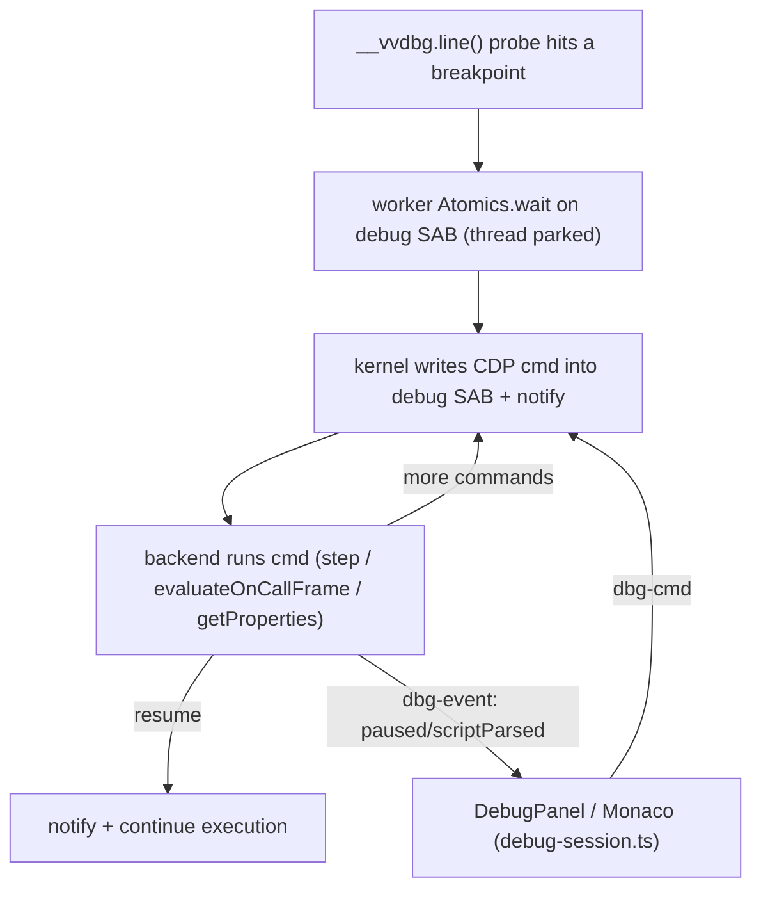
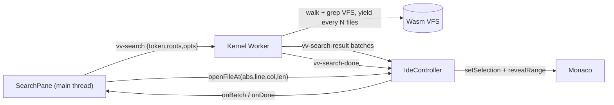
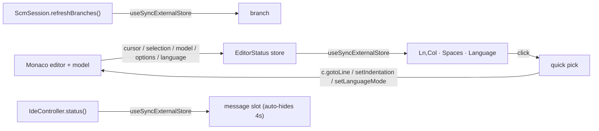

# Vivari — Architecture

This document explains how Vivari works end to end: the core constraint it
solves, the worker topology, the syscall protocol, the filesystem, the process
model, the Node runtime, networking, native code, and the build. It is the
companion to [`AGENTS.md`](./AGENTS.md) (how to work in this repo) and
[`roadmap.md`](./roadmap.md) (chronological status + rationale per feature).

---

## 1. What it is

Vivari is an open-source **WebContainer**: it runs Node-style projects
(Vite dev server + HMR, React, NestJS, Express, `npm install`, `tsc`, …) **100%
inside the browser tab**. There is no backend doing the work — the filesystem,
the Node-compatible runtime, the process/PID model, and even TCP networking are
all emulated client-side across Web Workers.

The design principle throughout is **run the real thing, not a reimplementation**:
we vendor Node's actual `lib/*.js` on top of a small binding layer, run real npm
packages unmodified from disk, and drive real tools (rolldown/Vite, `tsc`,
`@babel/core`) in-VM.

---

## 2. The core constraint (why any of this is hard)

Node's APIs are **synchronous**: `fs.readFileSync`, `require()`, `execSync`, etc.
Browsers do **not** let you block the main thread on async work. The one exception
is a **Web Worker**, where `Atomics.wait()` can genuinely park the thread.

So the load-bearing primitive is a **synchronous bridge over a `SharedArrayBuffer`
(SAB)**:

```
process code (Web Worker thread)
   │  fs.readFileSync("/x")        ← looks synchronous to user code
   ▼
 write request into SAB, Atomics.store(STATE, REQUEST), ring a doorbell
   │
   ▼  Atomics.wait(STATE, REQUEST) — the thread genuinely blocks
 ...another worker services it against the Rust/Wasm VFS...
   ▲
   └─ writes the response into the SAB, Atomics.notify(STATE)
   ▼
 returns bytes — still synchronous, no async leaked to user code
```

`SharedArrayBuffer` + `Atomics` only exist under **cross-origin isolation**, so
every page that hosts Vivari MUST be served with:

```
Cross-Origin-Opener-Policy:   same-origin
Cross-Origin-Embedder-Policy: require-corp
```

(Studio's `vite.config.ts` does this. Without it, `SharedArrayBuffer` is
`undefined` and nothing runs.)

---

## 3. Worker topology

Work is split across several Web Workers so no single thread is on the critical
path of everything. The worker roles below are ES modules; **studio's Vite build
bundles each** (nested module workers + wasm).

```
┌──────────────────────────────────────────────────────────────────────┐
│ Main thread — packages/studio (React 19 + shadcn)                      │
│   • Home (blank / template / import folder / recents) + VS Code IDE:   │
│     multi-root VFS-backed Explorer (abs-path tabs) + Search + tabbed    │
│     Monaco (preview/permanent tabs) + bottom panel with                 │
│     Console / Terminal (INTERACTIVE shells) / Ports + command palette   │
│     + preview (ANSI intact; shells have real stdin — type, Enter runs)  │
│   • src/vv/kernel.ts (KernelBridge) + src/vv/controller.ts (IdeController)│
│   • registers the preview Service Worker                               │
│   • relays SW HTTP requests to the Kernel Worker                       │
│   • NO kernel/user work runs here (keeps the UI responsive)            │
└───────────────┬────────────────────────────────────────────────────────┘
                │ postMessage (spawn worker, init, net nudges, ws relay)
                ▼
┌──────────────────────────────────────────────────────────────────────┐
│ Kernel Worker — packages/core/src/workers/kernel-worker.ts                         │
│   • hosts the Kernel (packages/kernel-host/kernel.js)                  │
│   • PID table, process supervision, spawn/kill/waitpid                 │
│   • virtual network port registry (port → pid) + HTTP request routing  │
│   • spawns the nested workers below                                    │
└───┬───────────────────┬───────────────────────┬──────────────────────┘
    │ nested Worker      │ nested Worker          │ nested Worker(s)
    ▼                    ▼                        ▼
┌─────────────┐   ┌───────────────┐   ┌────────────────────────────────┐
│ Fetcher     │   │ File System   │   │ Process Worker  (one per PID)   │
│ Worker      │   │ Worker        │   │  packages/core/src/workers/process-worker.ts│
│ outbound    │   │ owns the Rust │   │  • runs the vendored Node       │
│ fetch()     │   │ /Wasm VFS     │   │    runtime + the user program   │
│ (npm, etc.) │   │ + OPFS mirror │   │  • its own SAB + event loop     │
└─────────────┘   └───────────────┘   └────────────────────────────────┘
```

Key relationships:

- **Each process** is its own Web Worker with its **own SAB**. `process.pid` is the
  kernel-assigned PID and matches the worker's DevTools name (`Process Worker PID N`).
- **The File System Worker** owns the single VFS. Every client (the kernel and
  every process) registers its SAB with it. It is woken by a **doorbell**: a
  `MessagePort` for processes, a plain postMessage for the kernel's own fs access.
- **The Fetcher Worker** performs all real outbound network (`fetch`), so a big
  npm tarball download/decompress never stalls syscall servicing.
- The Kernel Worker also **spawns each Process Worker** and wires a
  `MessageChannel` between it and the File System Worker (its fs doorbell).

---

## 4. The syscall protocol (`packages/protocol/syscall.js`)

One SAB per client, laid out as:

```
[ control: 4 × Int32 = 16 bytes ][ data region: 1 MiB ]

control[0] = STATE    (Atomics.wait / notify on this word)
control[1] = OPCODE   (which syscall)
control[2] = REQ_LEN  (request bytes in the data region)
control[3] = RES_LEN  (response bytes in the data region)
```

STATE values: `IDLE=0`, `REQUEST=1` (worker→servicer), `RESPONSE_OK=2`,
`RESPONSE_ERR=3` (a UTF-8 errno like `ENOENT`).

Request frame in the data region is self-describing:
`[flags:u32][fieldCount:u32]([len:u32][bytes])*`. Scalars (fds, lengths, file
positions) are packed as little-endian `u32`/`f64` fields; everything else is
UTF-8 or raw bytes.

### 4.1 The 1 MiB window — the single most important invariant

`DATA_BYTES = 1 << 20`. **Every** request and response must fit in this window.
`fs-client.call()` throws `"syscall request too large for the shared data
region"` if a payload exceeds it. Two consequences that have bitten us
repeatedly:

- **Large file I/O is chunked.** `FD_CHUNK = 512 KiB`; `fs.js` loops on short
  reads/writes, so an arbitrarily large file transfers in pieces. `writeLarge`
  bypasses the SAB entirely via a transferred `ArrayBuffer`.
- **Large HTTP responses are chunked.** A big response body (Vite serves ~2.8 MB
  pre-bundled dep files) cannot cross in one `OP_RESPOND`. The body travels as a
  **raw length-prefixed field** (never JSON-stringified — escaping doubles quotes/
  newlines and silently overflows) and is split into sequential frames the kernel
  reassembles by `reqId`. See `fs-client.respond` + `kernel.handleRespond`.
- **Downloads bypass the window.** `OP_FETCH` streams the response body straight
  into the VFS via the Fetcher Worker; the caller then reads it back with normal
  (chunked) fs. So npm tarballs of any size work. `OP_FETCH` is *blocking* (the
  caller parks until the body lands); `OP_FETCH_ASYNC` is the non-blocking twin —
  the kernel ACKs immediately and posts the result back later as a `fetch-done`
  message, so one process can keep many downloads in flight (parallel npm; see §6).

### 4.2 Opcode routing

Opcodes split into two families (`isFsOpcode`):

- **Filesystem** (`OP_READ_FILE`…`OP_READLINK`, `OP_OPEN`…`OP_FTRUNCATE`,
  `OP_WATCH`/`OP_UNWATCH`) → serviced by the **File System Worker** over the
  process's SAB, woken via the fs `MessagePort` doorbell.
- **Everything else** (`OP_SPAWN`/`OP_SPAWN_ASYNC`/`OP_KILL`, `OP_LISTEN`/
  `OP_ACCEPT`/`OP_RESPOND`/`OP_CLOSE_SERVER`, `OP_FETCH`/`OP_FETCH_ASYNC`) →
  serviced by the **Kernel**, woken via a `send("syscall")` postMessage.

Some opcodes are **deferred**: `OP_ACCEPT`, `OP_SPAWN`, `OP_FETCH` keep the caller
parked on `Atomics.wait` until the awaited event (a request, child exit, download)
arrives — this is how blocking `accept()`/`execSync()`/blocking fetch work.
`OP_FETCH_ASYNC` is the opposite: the kernel returns an empty OK immediately and
posts the outcome back as a `{type:'fetch-done', fetchId}` message, so the caller
never parks and many downloads can overlap (§6).

### 4.3 Debug channel (`packages/protocol/debug.js`)

The breakpoint debugger (§7.2) needs to drive a process that is **parked at a
breakpoint** — i.e. not sitting in the syscall loop. So it uses a **second,
independent SAB**, separate from the 1 MiB syscall SAB, allocated per debug target:

```
[ control: Int32 STATE ][ data region: JSON CDP command bytes ]
STATE values: DBG_STATE_EMPTY=0, DBG_STATE_CMD=1
```

A paused worker blocks on `Atomics.wait(STATE, EMPTY)`; the kernel writes a CDP
command into the data region, stores `DBG_STATE_CMD`, and `Atomics.notify`s. This is
only wired when `VV_DEBUG` is set, so non-debug runs never allocate it.

---

## 5. Filesystem

- **VFS core**: `packages/vfs/` is a Rust crate compiled to Wasm (`wasm-pack`,
  `web` + `nodejs` targets; crate `vivari-vfs`). It's an inode table (`HashMap<u64, Inode>`),
  directories map names→inode via `BTreeMap` (sorted readdir for free), symlinks
  with an `ELOOP` guard, `stat`/`lstat`, rename, errno-style errors. Hard links share
  one inode across names (`nlink` refcount; freed on last unlink).
- **VFS memory / compression**: file bodies are a `FileBody { Raw | Zip{data,len} }`.
  Cold files are stored **zlib-compressed** and inflate transparently — whole-file reads
  on demand, chunked `fd_read` once into a bounded (48 MiB) hot-read cache. The first
  write inflates in place; a file is (re)compressed only when its last writable fd closes
  (a `wopen` refcount) or after `write_file`, skipping files < 4 KiB or that don't beat a
  95% ratio. This cuts the FS worker's linear-memory footprint ~70% for a big
  `node_modules` (the largest addressable term in the tab). **On by default**; `?compress=0`
  disables it (plumbed page → kernel worker → FS worker, applied before OPFS restore).
  `mem_bytes()`/`logical_mem_bytes()` back the "Measure Memory" ratio readout.
- **Per-PID memory attribution**: "Measure Memory" also breaks the Process Worker heap
  down by PID. Each worker answers a `proc-mem` query with `runtime.memStats()` — its own JS
  heap (`performance.memory`, unavailable in Chrome Workers so effectively `-1`; the main-thread
  `measureUserAgentSpecificMemory()` per-URL figure is the real heap), guest module-cache size, an
  esbuild-wasm flag, and the **esbuild Go wasm heap byteLength** (`esbuildWasmBytes()`); the kernel
  worker fans the query across a live `pid → worker` registry and relays the rows on `vv-mem`. This
  attributes the dev-server heap (the tab's largest term post-compression) to a specific process,
  and quantifies how much of it is the resident esbuild service vs. guest framework; read-only.
- **Servicing**: `packages/kernel-host/fs-server.js` (`FsServer`) owns the one VFS
  instance and services fs opcodes directly over each client's SAB. It runs inside
  the **File System Worker** (`packages/core/src/workers/fs-worker.ts`).
- **Node contract**: `packages/runtime/node/bindings/fs.js` maps Node's native fs
  binding contract onto the sync bridge (`stat` fills the shared `statValues`
  Float64Array in place; fd layer via `open`→`fstat`→`read`→`close`), so Node's
  real `lib/fs.js` runs unmodified on top.
- **Persistence**: the VFS is mirrored to the **Origin Private File System (OPFS)**
  by `opfs-persistence.js` (write-behind). OPFS sync access handles only exist in a
  Worker — hence this lives in the FS worker. On boot it restores the manifest into
  the VFS **before** serving any syscall. Use `?reset` on the demo URL to wipe it.
  Volatile/re-seeded paths are excluded (`fs-worker.js` `IGNORE`: `/bin /tmp /proc
  /dev /etc /usr /var/cache`). The package-manager caches deliberately live in a
  PERSISTED location (`/home/user/.cache` for npm/yarn/corepack, `/home/user/.local/
  share/pnpm/store` for pnpm), so npm's own content-addressed cache doubles as the
  durable, cross-project "package cache in OPFS" — a dependency downloaded once is
  reused by later projects and after a reload. The kernel's transient outbound-fetch
  buffer (`/var/cache/vv-fetch`) is excluded because its index is rebuilt per session
  and never read back, so npm's cache is the single durable copy.
- **Dependency cache** (`packages/kernel-host/dep-cache.js`, stored under `vv-depcache/` in OPFS):
  layered on top of the mirror. A lockfile-keyed snapshot of a whole `node_modules` tree
  (`dep-cache-{has,save,restore}` messages against the in-worker VFS, exposed to the kernel as
  `kernelFs.fs.depCache{Has,Save,Restore}`). Snapshotted after a clean package-manager install
  (detected in `kernel.onProcExit`) and restored **before** an auto-run install when the lockfile —
  or, for a fresh template with no lockfile yet, `package.json` via an alias key — matches, so a
  second project with the same deps skips `install` entirely. Bounded LRU (512 MiB); also dropped by
  `?reset`. See roadmap "Persistent dependency cache".
- **File watching** (`fs.watch`): `OP_WATCH` registers interest; the FS worker
  **pushes** change events back over the fs doorbell `MessagePort` (never the SAB —
  the process isn't parked on it). Events are bucketed by top-level tree to bound
  fan-out.

---

## 6. Process model

- **Kernel** (`packages/kernel-host/kernel.js`) owns the PID table and all
  supervision. `createProcess` spawns a Process Worker; `finalize` tears one down
  (terminates the worker, releases its ports, fails its in-flight HTTP requests,
  closes its ws tunnels).
- **Spawn**: `OP_SPAWN` blocks the parent until the child exits (`execSync`/
  `spawnSync`): the parent parks on `Atomics.wait` while the kernel drives the
  child. `OP_SPAWN_ASYNC` returns `{pid}` immediately; the child's stdout/stderr/
  exit stream back to the parent worker as postMessages (the model behind
  `child_process.spawn` and a `npm run dev` that launches a long-lived server).
- **Debug**: when `VV_DEBUG` is set (kernel-authoritative `debugMode`), the kernel
  allocates a per-target debug SAB (§4.3), announces the target, and routes CDP
  attach/detach + commands to it — postMessage while running, SAB while paused (§7.2).
- **Naming**: each Process Worker is created with the name `Process Worker PID N`.
  A Worker's name is fixed at creation and can't be changed later, so naming it
  per-PID at spawn (rather than reusing a pre-warmed, PID-less pool) is what keeps
  DevTools' worker list legible — every entry maps to a PID. (A warm pool was tried
  and dropped: it didn't move the needle on the boot numbers — cold start is
  dominated by the FS worker + VFS wasm init — and it left claimed spares
  mislabelled.)
- **Cold-start wins that stuck**: the Fetcher + File System workers are created in
  parallel at boot, and the demo's first shell defers its Process Worker spawn off
  the boot burst (starts on focus/keystroke/idle). Boot narrates its phases with
  timings to the Console.
- **Signals & teardown**: `process.kill(pid, sig)` and `child.kill()` route to the
  kernel (`OP_KILL`); `finalize` **cascades to the whole subtree** (`parentPid`),
  so killing a shell wrapper (`sh -c "node …"`) takes its server down too.
- **stdin (interactive)**: delivered OUT of band, not via a blocking syscall. The
  host terminal's keystrokes → `kernel.sendStdin(pid)` → a `{type:'stdin'}`
  postMessage → the process' real flowing `process.stdin` (a TTY Readable, drained
  in a loop turn). `child.stdin.write()` relays parent→child via `{type:'child-
  stdin'}` → `kernel.handleChildStdin` → the child's own stdin, **byte-for-byte**
  (Buffers/Uint8Arrays pass through unstringified, so binary stdin survives). This
  is what makes the terminal interactive (a live `sh` REPL, `node`, etc.).
- **Coreutils + shell**: `packages/kernel-host/coreutils.js` provides
  `echo/cat/ls/pwd/mkdir/rm/node/npm/npx/bun/bunx/true/false` and a small `sh`. `sh`
  with no args is an **interactive REPL** (prompt, echo, backspace, ↑/↓ **history**
  recall + a `history` builtin, **Tab completion** — first token against builtins +
  PATH, later tokens against the VFS — Ctrl+C→SIGINT the whole foreground job — every
  stage of a pipeline, not just the last, Ctrl+D); with `-c`/a file it runs a batch.
  `ls` colors directories bold-blue, but only under `--color=auto` (default) with an
  interactive terminal attached — signaled by `VV_TTY=1`, which the interactive `sh`
  sets and children inherit — so batch/CI output stays plain. It supports
  sequencing (`;` `&&` `||`), **pipes** (`|`) and **redirects** (`<` `>` `>>` `2>`
  `2>>` `2>&1`) — a quote-aware lexer parses each line into pipelines of stages,
  wiring one stage's stdout into the next's stdin and opening redirect targets as
  fds (a pipeline's exit status is its last stage). `/dev/null` is special-cased
  as a discard sink (there are no VFS device nodes), so `cmd > /dev/null 2>&1`
  works. If `$VV_RUN` is set
  it auto-runs that command line at startup (echoed like you'd typed it) then stays
  interactive — used to run a demo's dev server *inside a terminal tab*. Installed
  into `/bin` by `installCoreutils()`.
- **Demos run like local dev**: the "Run" button opens a dedicated shell tab whose
  `sh` has `VV_RUN="npm install && npm run dev …"` (install skipped once
  `node_modules` exists). The dev server is therefore a child of that tab's shell:
  closing the tab kills the server (preview then 502s), and starting the same
  server again in another shell fails with `EADDRINUSE` — we don't intercept that.
  The kernel worker watches `onListen` on the demo's port to point/reload the
  preview (a re-listen on an already-serving port = a Nest `--watch` restart).
- **npm**: the shell's `npm`/`npx` is the **real, unmodified npm CLI** on Path B
  (the North Star; see roadmap). Real npm@10.9.2 is vendored + packed into one
  gzipped asset (`scripts/vendor-npm.mjs` →
  `packages/studio/public/vendor/npm-pack.bin`); at boot the kernel worker fetches
  it once and `load-real-npm.js` unpacks the tree into the VFS at
  `/usr/lib/node_modules/npm` via a single batched transfer
  (`kernel.writeFilesBatch` → `FsServer.writeBatch`, ~2400 files in one message),
  then writes `/bin/npm.js` + `/bin/npx.js` shims that `require()` the real CLI (so
  `npm` on PATH is real npm; the tree persists in OPFS across reloads). Native
  builds can't run in-browser, so `node-gyp` is a non-fatal no-op via
  `node-gyp-stub.js` (`stubNodeGyp()` overwrites npm's node-gyp shims in the
  vendored tree; a `node-gyp` coreutil is the PATH fallback) — the package's JS /
  `wasm32-wasi` fallback is what loads instead.
  **Downloads are parallel.** npm issues many packument + tarball requests at once,
  but the blocking `OP_FETCH` would serialize them (each parks the worker until its
  body lands). So the fetch-backed transport under `https` (and under `http`'s
  egress path — `node/internal/fetch-transport.js`) prefers a NON-blocking
  fetch: `globalThis.__ocfetchAsync` (wired in `runtime/index.js` over
  `fs-client.fetchAsync` → `OP_FETCH_ASYNC`) returns a Promise and the kernel posts
  each result back as a `fetch-done` message (`dispatchFetch` settles it), so npm's
  own concurrency actually overlaps on the wire. The kernel bounds fan-out to
  `fetchConcurrency` (10) via `_scheduleFetch`/`_drainFetchQueue`, dedupes identical
  in-flight URLs (`_fetchInflight`), and streams each body into the VFS
  (`_fetchIntoVfs`/`_doNetworkFetch`) with the same cache/dedupe as the blocking
  path; the blocking `__ocfetch` remains the fallback.
  The from-scratch installer `packages/kernel-host/programs/npm.js` (semver
  resolution from registry packuments, `OP_FETCH` tarball download, gunzip +
  ustar parser, npm-v3 hoisting, `.bin` symlinks, platform-gated
  `optionalDependencies`) was the temporary "Turbo-analog" — it is now **retired**
  from the shipped product (not in `COREUTILS`) and survives only as an offline
  fixture the `verify-node`/`verify-express` harnesses install themselves.

---

## 7. The Node runtime (inside each Process Worker)

`packages/runtime/` is the vendored Node runtime. The evolution (see roadmap) went
from hand-written builtins (**Path A**, mostly gone) to **Path B**: run Node's
**real `lib/*.js`** on top of a small binding layer. This is why real frameworks
work — it *is* Node's own module code.

- `node/lib/*.js` — Node's actual standard library (fs, net, http, stream, events,
  buffer, zlib, crypto, url, util, path, dns, worker_threads, …), vendored.
- `node/internal/*` — Node's `internal/*` support modules (streams, errors,
  validators, stream_base_commons, …).
- `node/bindings/*.js` — our shims for `internalBinding('fs'|'tcp_wrap'|'zlib'|
  'crypto'|'http_parser'|…)`. These map Node's native C++ contract onto our sync
  bridge / Wasm codecs.
- `node/internal-binding.js`, `node/primordials.js`, `node/loader.js` — the glue
  that lets vendored `lib/` resolve `internalBinding(...)` and `primordials`.
- `builtins/*.js` — the few remaining hand-written modules (`process`, `os`,
  `assert`, `child_process`, and `bun` — a Node-backed `Bun` global + `bun:*`
  modules; see §9.2) that have no clean Node-lib form here.

Module system:

- `module.js` — the **synchronous CommonJS loader**: `require()` with full
  node_modules resolution, `package.json` `exports`/`imports` conditions, builtin
  factories. Everything is sync because the fs under it is sync.
- `esm.js` — an **ESM→CJS transpiler** (via `es-module-lexer`): rewrites
  `import`/`export`/`import.meta`/dynamic `import()` into our sync CJS at load
  time. Generated identifiers are namespaced (`__oc_require`, `__oc_import`,
  `__oc_exports`, `__oc_module`, …) so user code can freely declare its own
  `require`/`module`/`exports`.
- `typescript-transform.js` — a **synchronous, dependency-free TS/JSX transform**
  (type-strip + JSX lowering) the loader applies for zero-config `.ts`/`.tsx`
  execution (Bun; see §9.2). Gated so plain JS is passed through untouched.
  Deciding whether a `<` opens a generic or is a comparison is the delicate part:
  `isGenericOpen` covers the declaration/call sites (previous token is an
  identifier / `)` / `>`), and `isGenericArrowOpen` covers a generic **arrow**,
  which begins an *expression* and so is preceded by `=`, `(`, `,`, `return`, ….
- `index.js` — `createRuntime()`: wires builtins + globals + the HTTP bridge +
  the WebSocket client, and returns `run(entry)`.
- `loop.js` — the **per-process event loop** (see §7.1).
- `boot.js` — process bootstrap shared by the browser and Node worker entries.

### 7.1 The event loop

A real async loop so ordering matches Node
(`nextTick → promise microtasks → timers → setImmediate`), while sync syscalls
still block via `Atomics.wait`. Key ideas (`loop.js`):

- To flush native Promise microtasks it must **yield to the host once per turn**
  (a purely synchronous loop can never drain them) — done via a `MessageChannel`
  macrotask.
- Timers are ours (deterministic order + ref/unref) but the actual sleep is a host
  `setTimeout`, so a 100 ms timer really waits 100 ms.
- **Idle waiting is message-driven**: when a request is queued the kernel
  postMessages the worker and `wakeNet()` resolves the idle wait — so the SAB stays
  free while idle and a timer callback can run a sync fs syscall.
- Each turn also drains queued HTTP requests, async child events, worker_threads
  events, and fs.watch events (`doNet`/`doChildren`/`doThreads`/`doWatch`).

### 7.2 Breakpoint debugger (Node guests)

A full pause / step / inspect / evaluate debugger for guest Node processes, speaking
the **Chrome DevTools Protocol** (`Debugger`/`Runtime` domains). There is no V8
inspector in the browser, so pausing is built from **source instrumentation** plus
the debug SAB (§4.3) — the same "genuinely block the worker thread" trick that makes
sync syscalls work.

Three pieces, all lazy-loaded only when `VV_DEBUG` is set (zero cost otherwise):

- **Instrument** (`packages/runtime/instrument.js`) — `acorn` parses the guest's own
  source (on plain ES, after the TS/JSX strip, before the ESM rewrite in `module.js`,
  so line numbers are preserved) and weaves in `__vvdbg.line/brk/push/pop` probes and
  a per-lexical-block `__vv_ev` eval closure (so `evaluateOnCallFrame` and Variables
  see the exact block scope). Self-heals to the original source on any parse failure.
- **In-guest CDP backend** (`packages/runtime/debugger.js`) — script registry,
  breakpoint binding, call-stack frames, RemoteObject table, and the synchronous pause
  loop. Emits `Debugger.scriptParsed/paused/resumed`.
- **Studio client** (`packages/studio/src/vv/debug-session.ts` + `DebugPanel.tsx`) —
  the CDP client that drives Monaco gutter breakpoints, the paused-line highlight, and
  a VS Code-style Call Stack / Variables / Watch panel, opened from the ActivityBar's
  "Run and Debug" entry.

The pause flow (kernel routing lives in `kernel.js` / `kernel-worker.ts` /
`process-worker.ts`):



A **running** (not-yet-paused) process receives commands via `postMessage` instead of
the SAB; a `--inspect-brk`-style start gate (`waitForStart` in `index.js`) keeps short
scripts from finishing before the frontend attaches. The run shell + package managers
are skipped as debug targets so auto-attach lands on the user's program. The CDP shape
is shared so the same backend can later also feed the chii Sources panel — distinct
from §8.5, which debugs preview **browser** JS via chobitsu.

---

## 8. Networking

There is **no TCP**. Networking is emulated at two seams.

### 8.1 In-process loopback (`node/bindings/net.js`)

The binding beneath Node's real `lib/net.js` implements
`internalBinding('tcp_wrap')` as an **in-process loopback**: a module-level
`port → serverHandle` registry lets a client `connect()` link to a `listen()`ing
handle in the *same* worker, producing a linked pair of endpoints whose writes
appear as the peer's reads. Node's unmodified `lib/net.js` / `lib/_http_*.js` run
end to end on top (real `ClientRequest`/`ServerResponse`/`IncomingMessage`,
chunked bodies, keep-alive). This registry is **per-process** (one worker = one
process). Writes never block — they queue into the peer's inbox and pump on
`nextTick`. The same binding backs `pipe_wrap` (UNIX-domain sockets / named
pipes) with an identical path-keyed loopback.

**Cross-process loopback (TCP + UNIX sockets).** When a `connect()` targets a
port/path that isn't served in *this* process, another in-VM process may own it —
e.g. Nuxt/Nitro's dev server on `:3000` reverse-proxies SSR to its render worker
on an ephemeral port in a *different* process, and `vite-node`/Nitro talk over
`*.sock` UNIX sockets. Both ride the same **kernel byte-relay**: `listen()` also
registers the socket path with the kernel (`OP_PIPE_LISTEN`) — for a TCP server a
synthetic per-port key — and a cross-process `connect()` resolves it
(`OP_PIPE_CONNECT`) to a `connId`; raw bytes then flow **out of band** as
`pipe-*` postMessages the kernel forwards between the two processes (never the
syscall SAB, since neither side is parked on it). `net.js`'s `TCP`/`Pipe` handles
fall back to this **only** when the same-process registry misses, so
single-process loopback and external (Service Worker) routing are unchanged.
Probes: `scripts/probe-xpipe.mjs` (UNIX sockets) and `scripts/probe-xtcp.mjs`
(TCP, the Nitro `:3000`→worker shape), each covering both directions.

**The edge of the loopback, and what is on the other side.** A `connect()` to a
destination that is *not this machine* cannot work here, and is refused —
`EHOSTUNREACH` for a non-loopback IP literal, `ENOTFOUND` for a non-local
hostname (`dns.js` resolves every name to `127.0.0.1`, so the binding judges the
name the caller asked for, kept on the socket as `_host`). It must stay refused:
before, the hostname was ignored and the dial was quietly served by whatever in-VM
server owned that port number, which returns a *wrong* 200 from a *different*
service and surfaces nowhere near its cause. Outbound `http:`/`https:` for those
destinations rides the Fetcher Worker instead (§8.1 egress below); everything else
about `net` is loopback and stays that way.

**Outbound egress (`http:` / `https:`).** There are no real sockets, so an
outbound request goes out as one `fetch` through the Fetcher Worker
(`__ocfetchAsync` / `__ocfetch`). `internal/fetch-transport.js` is that transport
— it buffers the request, issues one fetch, and delivers a standard
`http.IncomingMessage` over the body the kernel materialized in the VFS — and both
protocols share it:
- **`https`** (`node/lib/https.js`) egresses *unconditionally*. There is no in-VM
  TLS socket at all, so there is no loopback alternative and no in-VM https server.
- **`http`** keeps Node's real vendored client for every destination the loopback
  net can serve, and egresses only the rest. `lib/http.js` is Node verbatim, so the
  seam is where the loader builds the module: `internal/http-egress.js` wraps
  `http.request`/`http.get` in place (`loader.js`'s `httpWithEgressFactory`).
  `createServer`, every loopback client, `socketPath`, a caller-supplied
  `createConnection` and any proxy-aware agent all stay on the untouched vendored
  path.

The routing decision is made on the **destination host only**, and by the virtual
network's own predicate: `internalBinding('tcp_wrap').isLocalDestination` is
literally the function `connect()` accepts or refuses a dial with, so a request
egresses exactly when `connect()` would have refused it and the two cannot drift.
It is deliberately *not* made on the port — "we serve this port" would send
`http://api.example.com:3000` to the in-VM dev server (the bug above), and "we do
not serve this port" would send `http://127.0.0.1:9999` out to the internet
instead of reporting `ECONNREFUSED`, which every wait-for-the-server-to-start loop
depends on. Evidence table: `scripts/probe-http-egress.mjs`, which cross-checks
each branch against a real `net.connect()` to the same destination.

**Plain `http://` egress additionally depends on the browser.** The fetch is
issued by a page, so mixed-content rules apply: a studio served over `https://`
may only fetch `http://` URLs whose host is potentially trustworthy
(`localhost`, `127.0.0.0/8`, `::1`) — a LAN or public `http://` host is blocked,
and no amount of runtime work changes that. It *does* work from a locally served
(`http://localhost:…`) studio, which is also the case the
`http://host.vivari.internal:<port>/` alias exists for (the Fetcher Worker rewrites
that host to the studio's own hostname to reach a service on the host machine).
Where the browser refuses, the request fails with an error naming the constraint
rather than a bare `ECONNREFUSED`. A protocol upgrade (WebSocket, `CONNECT`) can
never ride a fetch — there is no socket to hand back — so those fail loudly with
`ERR_VIVARI_UPGRADE_UNSUPPORTED` instead of hanging on a request that "succeeded".

### 8.2 Cross-VM reachability (the kernel port registry)

`listen()` also registers the port with the kernel (`OP_LISTEN` → `port → pid`
map) so **external** requests can be routed to the owning process. When a request
arrives, the kernel pushes it to the process's `serverInbox`; the process drains it
via non-blocking `OP_ACCEPT` and — this is the cross-VM seam — **replays it through
a real in-VM http client into its own server over the loopback**
(`bridgeHttp` in `index.js`), collects the response, and sends it back via
`OP_RESPOND`. The public entry point is `kernel.handleHttpRequest(port, req) →
Promise<{status, headers, body, bodyEncoding}>`; the wire contract is unchanged
whether the caller is the Service Worker (browser) or a headless test.

Bodies cross as JSON metadata + a raw body field. Textual content-types cross as
UTF-8; binary (images/fonts/wasm) crosses base64 with `bodyEncoding: 'base64'`
(the SW decodes it). Large bodies are chunked (§4.1).

### 8.3 Browser preview (Service Worker)

`packages/studio/public/sw.js` is a preview proxy scoped to the whole origin (needs
`Service-Worker-Allowed: /`). It intercepts the preview iframe's `fetch`
(`/preview/<port>/…` and root-absolute subresources like `/@vite/client`,
`/node_modules/…`), posts each to the window (the studio main thread), which forwards to the
Kernel Worker → `handleHttpRequest` → the in-VM server. No real network is
involved. The SW also **precaches** the worker-role bundles in production (keyed by
a per-build id) so a redeploy can't serve stale bundles.

When the SW **strips** the `/preview/<port>` prefix (the default; not keep-prefix,
not mode-C wildcard-root) it forwards an **`X-Forwarded-Prefix: /preview/<port>`**
header, so a path-prefix-aware guest framework can advertise correct absolute URLs
even though it sees clean `/` paths. The Python bridge maps it to the ASGI
`root_path` / WSGI `SCRIPT_NAME` (§9.3) — that's what makes FastAPI's Swagger UI
(`/docs`, the `openapi.json` link, "Try it out") route back through the tunnel.

**Preview iframes start at about:blank, then navigate.** On a fresh page load the
studio document is fetched before the SW takes control, so a brand-new iframe whose
*first* navigation is a direct `/preview/<port>/` URL isn't intercepted — the
request escapes to the network and the studio's own SPA fallback renders its Home
page inside the frame. So `PreviewPanel.tsx`'s `PreviewFrame` mounts each iframe at
`about:blank` (a client the SW already controls) and sets the real `previewSrc`
imperatively in an effect; `registerServiceWorker()` additionally waits for
`controllerchange` when the page isn't yet controlled. Both ensure the SW proxies
the very first preview navigation instead of the app leaking through.

**Separate preview origin (mode B) — opt-in isolation.** By default previews run
*same-origin* with the IDE (the SW is registered on the studio origin; `findKernelClient()`
reaches the kernel via same-origin window clients). A deploy can instead serve previews from a
**second origin** (e.g. `vivari-preview.pages.dev`) so untrusted preview code — and, realistically,
your own npm dependencies — can't touch the IDE's cookies/localStorage/OPFS. It's client-side only:
that origin is **static hosting** for `sw.js` + a hidden `__vv-bridge.html`; the kernel still lives
in the IDE tab. `KernelBridge.setupPreviewBridge()` iframes the bridge doc, which registers the
cross-origin SW and hands back a persistent `MessagePort`; the SW then routes preview HTTP over that
port instead of `findKernelClient()`. Selected at build time by `VITE_PREVIEW_ORIGIN` on the **studio
(main) project** (the preview project needs no env). The embedded preview iframe is cross-origin, so
its ws/SSE/CDP shims already reach the IDE via `parent.postMessage`.

**Wildcard per-port preview origins (mode C).** Instead of one shared preview origin, a deploy can
serve **each port from its own origin** — `<token>--<port>.<domain>` (random per-boot `<token>`),
selected by `VITE_PREVIEW_WILDCARD_DOMAIN` (takes precedence over `VITE_PREVIEW_ORIGIN`). This
isolates previews from the IDE *and* from each other, and restores real `localhost:<port>`
web-platform semantics (own cookies/storage/CORS). The SW reads the port from
`self.location.hostname` (`WILDCARD_MODE` in `sw.js`) and serves the app at `/` — no `/preview/`
path, so keep-prefix templates get their base auto-rewritten to `/` at creation. `KernelBridge`
lazily stands up **one bridge iframe + `MessagePort` per port** (`ensurePreviewBridge`, keyed by
origin) as servers `listen`, and `broadcastToPreviewSWs` fans ws/SSE out across all of them. Because
Cloudflare Pages can't attach a *wildcard* custom domain, a small Cloudflare **Worker** (`worker/`,
route `*.<domain>/*`) serves the static SW runtime and stamps the isolation headers; it needs one
**proxied** wildcard DNS record `*.<domain>`. The route is broader than the host set we serve, so the
Worker gates on `PREVIEW_HOST` and passes any non-`<token>--<port>` host straight through — other
subdomains on the base domain are untouched. A deploy sharing the domain with other apps can instead
set `previewWildcardTag` (e.g. `"vv"`) to get `<token>--<port>-vv.<domain>` and narrow the route to
`*-vv.<domain>/*`; the tag must be a **suffix** because Cloudflare routes only allow the `*` wildcard
at the START of the hostname (an infix `vv-*` is rejected). See `roadmap.md`
("preview origin isolation") + `sites/docs/docs/deployment.md`.

### 8.4 WebSocket tunnel (Vite HMR)

A browser `WebSocket` can't reach an in-process ws server (no TCP, and a SW can't
intercept the WS upgrade). Instead a `WebSocket` polyfill in the preview iframe
tunnels each connection to us as messages (`ws-open`/`ws-in`/`ws-close`); the owning
process opens a genuine **in-VM WebSocket client** (`websocket.js`, over Node's own
http upgrade + the net loopback) to `127.0.0.1:<port>` and relays frames back out
(`ws-out`). This is what makes Vite HMR work live in the preview.

**Cross-service ws (FE ↔ BE).** The shim picks the target port from the ws URL: a
`/preview/<port>/…` URL tunnels to THAT in-VM port (prefix stripped), the same convention
as the HTTP preview proxy — so a frontend on :5173 can open a socket to a backend on :3001
via `/preview/3001/ws`. URLs without the prefix keep the iframe's own port (HMR unchanged).
The kernel routes the `open` by port (`handleWsClient` → `listeners.get(port)`), so this is
a shim-only change. The `ws-demo` template (Express + `ws` backend, Vite frontend, started
together) demonstrates both directions; each server gets its own preview tab (see 8.6).

**"Open in new tab" tunnels ws/SSE through the Service Worker.** The shims relay frames by
`postMessage` to the window that hosts the kernel — the iframe's `parent` when embedded. Opening
a preview in a standalone tab (`controller.openExternalPreview`) makes it a top-level document,
and the studio's `COOP: same-origin` (required for `SharedArrayBuffer`) puts that tab in a
*separate browsing-context group* with `window.opener === null` — there is no host window to
reach. So for a top-level preview the shim falls back to `navigator.serviceWorker.controller`
(the SW is shared across browsing-context groups, exactly how the HTTP proxy reaches the studio
cross-tab): the SW forwards `dir:'out'` frames to the kernel-host client (`findKernelClient`,
shared with `handlePreview`) and broadcasts `dir:'in'` frames to every top-level preview client;
each shim keeps only its own `connId`. The studio's `bridge.ts` forwards SW-relayed `dir:'out'`
frames to the kernel worker, and `controller` relays inbound frames back through the SW
(`KernelBridge.broadcastToPreviewSWs`, which posts to **both** the same-origin controller and, in
modes B/C, every bridge port) alongside the in-app iframes (nested clients, which the SW broadcast
skips, so no duplicates). Vite HMR in a standalone tab now works for the same reason.

**Where the pop-out opens (modes B & C).** `openExternalPreview` opens the pop-out **same-origin by
default** (`/preview/<port>/` on the IDE origin) so it lands in the kernel's storage partition and
"just works". A standalone tab on a *cross-site* preview origin would sit in a different browser
storage partition than the editor tab and couldn't reach the kernel without a Storage-Access grant —
so the mode-B isolated pop-out is opt-in via `VITE_PREVIEW_POPOUT=isolated` (set on the studio
project, only meaningful with `VITE_PREVIEW_ORIGIN`). Whether `isolated` needs that gate hinges on
**same-site vs cross-site**: if the IDE and preview origins are subdomains of the **same registrable
domain** (e.g. `ide.vivari.run` + `preview.vivari.run`, IDE opened at the `vivari.run`
host) they are same-site → **not** storage-partitioned → the pop-out shares the
bridge Service Worker and connects with **no gate** (verified live), while storage stays
origin-isolated. **Mode C is same-site by construction** (its per-port hosts are subdomains of the
IDE's own base domain), so its pop-out is always gate-free. Cross-site deploys (two `*.pages.dev`
projects — `pages.dev` is on the Public Suffix List — or StackBlitz's `stackblitz.com`↔
`webcontainer.io`) are partitioned; the preview SW then serves a StackBlitz-style "connect this tab"
gate (`previewConnectingHtml`), but Chrome's Storage-Access un-partitions cookies only (not Service
Worker registrations), so on `*.pages.dev` the gate can't grant — use `same-origin` pop-out there.
(Trade-off: a same-*site* preview origin can still set/read domain-wide cookies on the IDE; use a
*different* base domain when you need full cross-site isolation, at the cost of the gate.) There is
no isolated-*and*-frictionless standalone tab on a cross-site origin: `same-origin-allow-popups`
(to keep `window.opener`) forfeits `crossOriginIsolated` → no `SharedArrayBuffer`. See `roadmap.md`
("Pop-out behavior").

**Server-Sent Events (same idea, one-way).** A streaming `text/event-stream` response
can't cross the HTTP preview proxy — that path is buffered end-to-end (the SW resolves
ONE complete body via `handleHttpRequest`/`OP_RESPOND`), so a never-ending SSE response
just 504s. So SSE gets its own tunnel, mirroring the ws one minus the client→server leg:
an **`EventSource` polyfill** injected into every preview page (next to the ws shim)
tunnels each connection as `vv-sse` messages (`sub:'open'|'close'`); the kernel binds the
`connId` to the port's process (`handleSseClient`), which opens a genuine **in-VM loopback
GET** to `127.0.0.1:<port><path>` (`Accept: text/event-stream`) and relays each raw stream
chunk back out (`sse-out {sub:'open'|'chunk'|'close'}` → `onSseSend` → iframe). The polyfill
parses the raw bytes into `message`/named events per the SSE spec (`data:`/`event:`/`id:`,
dispatched on a blank line), so `es.onmessage` and `es.addEventListener('foo', …)` both
work. Port routing + the `fallbackPort` heuristic are identical to the ws shim. The `sse`
Showcase template (Express multiplexing a per-second tick + a `metric` gauge + `notice`
log lines onto one stream) demonstrates it. A live SSE relay refs the process event loop
(`sseLiveness`) so it keeps pumping like an open socket handle.

### 8.5 In-browser DevTools + local address bar (studio)

Each `PreviewPanel` tab is a mini-browser. The address bar is **local-only**:
`localhost` / `127.0.0.1` / a bare path loads the in-VM dev server (`navigatePreview`
sets the tab's `path` and bumps a nonce → the iframe reloads via the SW proxy);
external URLs are rejected. Back/forward drive the same-origin iframe's native
`history`; the injected **nav notifier** posts `vv-nav` on every SPA/MPA navigation so
the address bar stays in sync (display-only — it never re-drives the iframe src, which
would loop).

DevTools is the **full chii (Chrome DevTools) frontend**, vendored locally (no CDN, so
COEP holds). The SW injects **chobitsu** (a JS CDP backend) into every preview page.
The `controller` bridges CDP over `window.postMessage`: the chii frontend iframe (loaded
with `#?embedded=<origin>`, which selects chii's postMessage transport) exchanges raw CDP
strings with the controller, which relays them to/from the target tab's chobitsu. One
shared frontend attaches to the **active** tab (per-tab chobitsu backend); switching tabs
reloads the frontend against the new target. Assets are served from `node_modules` in
dev by the `serveDevtools()` Vite plugin and copied into `dist` on build.

**Network panel** shows all three transports coherently. `fetch`/XHR are captured natively
by chobitsu; `WebSocket`/`EventSource` are our postMessage-tunneled polyfills that chobitsu
can't see, so a `NET_SHIM` (`window.__vvNet`) injected next to them **emits synthetic
`Network.*` CDP events** over the same `vv-cdp` bridge — the full ws lifecycle
(`webSocketCreated`/`…FrameSent`/`…FrameReceived`/`…Closed`) and SSE as a long-lived request
with `eventSourceMessageReceived` events. It **registers live connections and replays them**
when a fresh frontend attaches (gated on the panel's `Network.enable` plus the preview's
`init`, guarded by a generation counter to avoid duplicate rows). On a preview reload the
controller remounts the frontend (`onPreviewFrameLoad` bumps `devtoolsNonce`) so the log starts
clean and re-attaches. Outgoing URLs are scrubbed from the proxy form (`/preview/<port>/…`) to
the real in-VM address (`http://localhost:<port>/…`), so ws/SSE/fetch rows all read as the app
actually sees them.

Two non-obvious constraints keep this working:

- **`serveDevtools()` must send fixed-length bodies** (`fs.readFile` + `Content-Length`),
  not `createReadStream().pipe()`. The frontend fires a burst of ~50 concurrent module
  imports; over HTTP/1.1 keep-alive, chunked-transfer responses left many of them
  **pending forever** (spinner never stops), and an unhandled read-stream `error` on a
  client abort could take down the whole dev server.
- **The SW passes `/devtools-host.html` and `/devtools/**` straight to the network**
  (like `/vv-devtools/`). They are our own app assets; routing them through
  `routeByClient` risked a spurious `fetch(event.request)` failure on the iframe
  navigation and could even proxy them into a preview that has no such file.

### 8.6 Multi-root workspace, Home + templates (studio)

The studio is a real workspace, not a two-demo switcher. State (`controller.ts`):
`workspaceFolders: {id,name,rootPath}[]` + `activeFolderId`; **every tab/model/dirty flag is
keyed by ABSOLUTE path** so files from different roots can't collide. Home (`Home.tsx`) is an
overlay over the kept-mounted IDE offering Start-from-blank, Start-from-template (~55 templates
in `vv/templates.ts` across 9 categories — Frontend/Backend/Fullstack/Showcase/Bun/Tooling/Docs/
Creative/Native — spanning most JS frameworks, bundlers, the sqlite/pglite/trpc showcases, and
the **Native** category's Python/Flask/FastAPI (CPython via Pyodide; see §9.3)), and a
`localStorage` recent list. ("Reset everything" also clears that recent list and locks its
dialog while the OPFS wipe runs.) A left ActivityBar toggle switches a **light/dark/system
theme** (next-themes; applied to Monaco and the xterm terminals via `controller.applyUiTheme`);
the file-tree panel is labeled **"Workspace"**, and the editor shows a
`Workspace > project > …path` breadcrumb with a VS Code-blue active-tab accent.

The Explorer reads the **live VFS** rather than a static map. The bridge gained a
request/response channel (`KernelBridge.request()` → reqId → `vv-reply`) backing
`vv-readdir` / `vv-read` / `vv-stat` / `vv-mkdirp` / `vv-create-project`; the worker emits
`vv-fs-changed` after any VFS mutation, which bumps `treeVersion` so the tree + quick-open
index refresh (including after an in-VM `npm install`). Creating a project writes its files in
one `writeFilesBatch` (`vv-create-project`) and registers a run manifest; "Run init script"
opens a shell that runs `install && dev`. A dev server's `listen` is attributed to its project
by walking the pid up to the run shell (`projectDirByTerm` / `terminalForPid`) → `project-ready`
points the preview (the two legacy DEMOS still use the fixed-port `demoForPort` path).
A run shell's **first** listening port is the primary preview (`project-ready` → open folder +
entry). A single dev server's *other* ports are internal infrastructure — Vite's HMR WebSocket
(`:24678`), a framework's SSR/render worker (Nuxt/Nitro's ephemeral port, reached via the main
server's proxy) — and do **not** each open a tab (they'd surface a bare "Upgrade Required" or a
non-interactive SSR page). A template that intentionally runs multiple *user-facing* servers (a
backend API + frontend, e.g. `ws-demo`/`fullstack`/`trpc`) opts in with `manifest.multiPreview`,
and each extra server then gets its own tab (`project-ready {extra}`). All bound ports are still
tracked so a restart reloads the real tab; the set is cleared when the run shell exits so a re-run
re-announces.

### 8.7 TypeScript 7 (tsgo, Go/wasm) + host↔preview bridge

**`tsc`/`tsgo`.** TS 7's compiler is compiled Go. We ship the community `tsgo-wasm` build
(`tsgo.wasm`, ~47 MB + the Go `wasm_exec` glue). It runs on Path B because `wasm_exec` drives
everything through `globalThis.fs` — which IS our real Node `lib/fs.js` over the VFS — plus
`crypto.getRandomValues`/`performance.now`/`TextEncoder`/`WebAssembly`. The only shim: Go writes
program output to fd 1/2 via `fs.writeSync`/`write`, so the runner routes those two fds to
`process.stdout`/`stderr`. Delivery mirrors npm/corepack (`scripts/vendor-tsgo.mjs` → a gzipped
pack; `packages/kernel-host/load-real-tsgo.js` unpacks + installs `/bin/tsc.js` + `/bin/tsgo.js`),
but it loads **lazily in the background after boot** (placeholder shim until then) and persists in
OPFS. Proofs: `scripts/spike-tsgo.mjs`, `scripts/spike-tsgo-studio.mjs`.

**Host ↔ preview.** In-VM code reaches a service on the HOST machine via
`http://host.vivari.internal:<port>/…`, mapped to the studio's own hostname (only reaches
the host when the studio is served locally). Both egress paths honor the alias: `http`/`https`
(and npm) go through the fetcher (`fetcher-worker.js` `rewrite()`); the global `fetch()` is the
host realm's real fetch used directly, so `packages/runtime/index.js` rewrites the alias in its
own `fetch` wrapper (`rewriteHostAlias`). The reverse direction needs no alias: the host hits
`<studio-origin>/preview/<port>/…` (the SW preview proxy). It's addressing convenience, not a
CORS/auth bypass — the target must still allow the studio origin. It is not wired into the
preview tab address bar (that only loads in-VM ports); test it from in-VM code.

### 8.8 Full-text search & replace + quick-open (studio)

The Search pane (`components/ide/SearchPane.tsx`) is a VS Code-style full-text search across
**every open workspace root**, not a filename filter. The search itself runs in the **kernel
worker** (`packages/core/src/workers/kernel-worker.ts`) because that worker is the sole holder of the synchronous
Wasm VFS — grepping from the main thread would mean an `vv-read` round-trip per file. The
worker walks each root (reusing the Explorer skip set: `node_modules`/`.git`/`dist`/…), honors
Match Case / Whole Word / Regex and comma-separated `files to include` / `files to exclude`
globs, skips binary/oversized files, and **streams** per-file matches back as `vv-search-result`
batches followed by a final `vv-search-done {matchCount,fileCount,limitHit}`.



Because that worker also serves preview HTTP + terminal I/O, the walk is **cooperative**: it
`await`s a macrotask every ~40 files and flushes the partial batch, so the UI fills in
progressively and nothing else stalls. A monotonic `currentSearchToken` supersedes an
in-flight search when a newer query (or `vv-search-cancel`) arrives. Heavy result arrays are
delivered to the pane via callbacks (kept out of the global snapshot to avoid re-render
storms). `controller.openFileAt()` opens a hit and reveals/selects the range in Monaco (with a
deferred reveal if the editor is still loading). **Replace** (`vv-replace`) recomputes matches
against the same options and rewrites files — scoped to a single match, one file, or all
files (Replace All) — with VS Code "preserve case" (ALLCAPS/Capitalized) and `$1`/`$&`
expansion; each write posts `vv-fs-changed`, and the controller re-reads any affected open
models from disk. **Quick-open** (`CommandPalette.tsx`, `⌘P`) filters the flat file index by
name and accepts a trailing `:line[:col]` suffix to jump on open; a bare `:line` jumps within
the active editor. `⌘⇧F` focuses the Search pane.

### 8.9 IntelliSense — Monaco's language service, off-main-thread (studio)

The editor runs Monaco's **real** TS/JS language service (completions, hover, signature help,
go-to-definition, diagnostics), not just syntax coloring. `mountEditor` sets `MonacoEnvironment.getWorker`
to Monaco's own workers — the editor worker plus the `typescript` worker (a bundled TS compiler), and
json/css/html — each a Vite `?worker` import so it's bundled **same-origin** (COEP `require-corp` is
satisfied) and runs off the main thread. `configureLanguageService` enables semantic + syntax
diagnostics with `setEagerModelSync(true)` (every model is visible to the worker) and `checkJs: false`
(plain-JS projects aren't flooded with type errors).

**One TS worker, not two (memory).** Monaco runs a *separate* full language service for each of the
`typescript` and `javascript` modes; each parses the whole dependency `.d.ts` payload into ~310 MB, so
naively you pay ~621 MB (measured) for two identical services. The studio runs a single one:
`languageFor` maps `.js/.jsx/.mjs/.cjs` to the `typescript` language (`allowJs` lets the TS service
handle JS), and `javascriptDefaults` is left inert (diagnostics off, no eager sync, no extra libs) so
its worker — created lazily on first JS-model use — never spawns. Extra libs / compiler options are
applied to `typescriptDefaults` only.

The TS worker only "sees" two file sources, so the studio keeps a strict split:


- **The project's own files become models** (`ensureBackgroundModels`, bounded, node_modules excluded),
  so cross-file imports resolve and go-to-definition works before a file is opened; `ensureModel`
  adopts a seeded model when the user opens that file.
- **Dependency typings become extra libs.** Harvesting `node_modules/**/*.d.ts` (+ `package.json` for
  `types`/`exports` resolution) happens in the **kernel worker** (`vv-collect-dts`) — the sole VFS
  holder — as one bulk reply instead of thousands of reads; the project's declared deps (+ their
  `@types`) are harvested first so a budget cap can't drop the packages you import, then the rest of
  `@types`; `typescript`'s own libs are skipped (Monaco ships those). It's debounced and re-runs on
  folder open, fs changes, and after any process exits (an in-VM `npm install` doesn't emit
  `vv-fs-changed`, so a finished process is the cue that `node_modules` may have appeared); a cheap
  `node_modules` fingerprint short-circuits the file reads when nothing changed.
- **Never register a file as both** a model and an extra lib, or the worker sees it twice ("Duplicate
  identifier"). `onDidChangeMarkers` feeds a live error/warning count into the status bar.
- **Only the `typescript` mode has a service.** `.js` is mapped onto it (`allowJs`) so a second
  ~310 MB `ts.worker` never spawns — which is also why the status bar's language picker offers no
  JavaScript entry (§8.12). Every other language in that picker is a bundled Monarch grammar:
  highlighting only, no worker.

### 8.10 Import / export & share (studio)

A project can leave the playground and come back — all client-side, no backend. The codecs live in
`packages/kernel-host/archive.js` (environment-agnostic like `dep-cache.js`: only web primitives that
exist in both a browser and Node — `CompressionStream`/`DecompressionStream`, `DataView`,
`btoa`/`atob` — so **no npm zip/gzip dependency**). ZIP entries are DEFLATE'd with the platform's own
`CompressionStream('deflate-raw')` (STORE fallback when it wouldn't shrink) plus a hand-written CRC-32
+ local/central-directory/EOCD records; the shareable-URL payload is a gzipped JSON manifest (text
inline UTF-8, binary base64) encoded base64url.

Two bulk RPCs keep it off the main thread and off per-file round-trips: **`vv-read-tree`** walks a
project in the kernel worker (sole VFS holder) and returns the whole source tree in one reply
(`node_modules`/`.git` excluded, bounded by file count + bytes) — backing both zip export and the share
payload; **`vv-import-tree`** bulk-writes an imported tree via `writeFilesBatch` — backing both folder
import and shared-link load. The controller (`vv/controller.ts`) exposes `exportProjectZip`,
`importFilesAsProject`, and `shareProject` (source-only, size-capped — a "too big to share" message
beyond the cap), plus an OS folder picker (`<input webkitdirectory>`) and a Home drag-drop zone. A
boot hook (`loadSharedFromUrl`, once the kernel is ready) decodes a `#share=` payload into a new
project and clears the hash so a reload doesn't re-import. A shared link lands straight on the
workspace — never Home, so the user can't accidentally start a new project mid-bootstrap — behind a
full-screen blocking overlay (`ShareLoadingOverlay`, spinner + staged text) that clears once the
project opens; a bottom-left success/error toast then fires. Imported/shared projects with a runnable
`package.json` script get a **synthesized run manifest** so the Run button auto-installs + starts a
dev server. Entry points: Home "Import a folder" card, the command palette (Import/Export/Share), and
the Explorer root context-menu. Proof: `scripts/spike-zip-share.mjs` (re-decodes the ZIP with Node's
`zlib`; round-trips the share codec over a text+binary tree).

**Remote import (GitHub repo / npm package).** The same landing path (`importFilesAsProject` →
`vv-import-tree` → synthesized run manifest) also backs importing from a public GitHub repo or an npm
package — still fully client-side. The studio page is cross-origin-isolated (COEP `require-corp`), and
all the sources send `Access-Control-Allow-Origin: *`, so a plain `cors` `fetch()` from the main thread
both reads and satisfies COEP — no backend/proxy and no Fetcher Worker. `vv/import-remote.ts` does the
fetching: GitHub via `api.github.com` (repo info for the default branch + `git/trees?recursive=1` for
the file list) then `raw.githubusercontent.com` per file with bounded concurrency; npm via
`registry.npmjs.org` (packument → resolve dist-tag/version → `dist.tarball`) then gunzip + parse the
tarball. The tar reader is `packages/kernel-host/tar.js` (env-agnostic ustar reader: `prefix` field,
GNU `L` long names, pax `path`; `stripFirstSegment` drops the `package/` / `<repo>-<ref>/` root),
proven by `scripts/spike-tar.mjs`. Both paths exclude `node_modules`/`.git`, are file-count + byte
capped (surfaced as a "truncated" warning), and land through the shared spine. UI: a Home
"Import from GitHub or npm" card and a command-palette entry open `ImportRemoteDialog` (tabbed
GitHub/npm, snapshot-driven via `importRemoteOpen`, live progress). Public GitHub repos only (no
auth); npm range specifiers fall back to `latest` (no semver-range resolution).

### 8.11 Source Control (git) panel (studio)

A VS Code-style **Source Control** view backed by [`isomorphic-git`](https://isomorphic-git.org),
running entirely in the tab against the VFS. **Local-only** by design: `init`, stage/unstage,
commit, branch/checkout/delete, per-file diff, history, discard — no remote, no clone/push (the git
wire protocol needs an authenticated CORS proxy; out of scope). GitHub *import* (§8.10) covers the
"get code in" case.

The twist is *where* git runs. isomorphic-git runs on the **studio main thread**, but the VFS lives
in the File System Worker and is only reachable synchronously from the **kernel** worker. So:

- `studio/src/vv/git-fs.ts` implements isomorphic-git's `fs` promise API by turning each call into a
  `KernelBridge` request to a **silent `vv-git-fs` RPC** in `kernel-worker.ts`, which dispatches onto
  the kernel's synchronous fs (SAB → FS worker). "Silent" = it never emits `vv-fs-changed`: one commit
  writes hundreds of `.git/objects`, and a change event per write would storm the Explorer/watchers.
- The kernel fs surface gained sync `lstat`/`symlink`/`readlink` (`kernel-fs.js`, mirroring
  `runtime/fs-client.js`) so git has full POSIX metadata; the adapter rebuilds `st_mode` (type | perm)
  from the VFS `kind` so blob filemodes (100644/100755/120000/040000) are correct.
- `studio/src/vv/scm-session.ts` is a `useSyncExternalStore` store (like `DebugSession`). It is
  **multi-repo**: it holds a `RepoState[]` (one entry per open workspace folder, like VS Code), each with
  its own branch/commit-message/status/history. The controller's `syncScmRoots()` reconciles the list as
  folders open/close; every git op takes the target `root`; `headBlobText(abs)` resolves the owning repo
  by longest-prefix root. Status is derived from `git.statusMatrix`; isomorphic-git is **lazy-imported**
  only when a repo exists or the user initializes one. Refresh walks the repos **sequentially**, is
  **coalesced** (never two overlapping walks) and gated to when the panel is shown (a walk floods the
  single-threaded kernel worker that also drives the terminal). `git init` seeds a `.gitignore`.
- The controller adds a `"diff"` tab kind rendered by a read-only **Monaco diff editor** (HEAD ↔
  working tree) and reloads open editors after a checkout/discard rewrites files under them. UI:
  `SourceControlPanel.tsx` renders one collapsible section per repo (branch dropdown, commit box,
  staged/changes/history, or an Initialize button when the folder isn't a repo), an activity-bar entry
  whose badge sums changed files across repos, and `Cmd/Ctrl+Shift+G`.

Because the adapter isolates *all* fs access behind the bridge, the upgrade path (if main-thread status
walks ever jank on a huge repo) is to move isomorphic-git behind its own worker with only the call site
changing.

### 8.12 Status bar (studio)

A VS Code-parity status bar: the active repository's **git branch** and the live **error/warning**
counts on the left; the active editor's **`Ln x, Col y`**, **indentation** (`Spaces: 2` / `Tab Size: 4`)
and **language mode** on the right. Clicking any of the three right-hand cells opens a quick pick
(`StatusBarPickers.tsx`, built on the same `CommandDialog` primitives as ⌘P): Go to Line, the
two-level indentation actions (Indent Using Spaces/Tabs and Change Tab Display Size drill into a
size list; Detect Indentation, the two conversions and Trim Trailing Whitespace run Monaco's own
`editor.action.*`), and Select Language Mode.

Two feed paths, and neither goes through `IdeSnapshot`:



- **`editor-status.ts` is a store of its own** (like `DebugSession`/`ScmSession`) precisely because the
  cursor moves on every keystroke. On `IdeSnapshot` that would notify every `useIde()` consumer in the
  IDE per keypress; here it re-renders the status bar and nothing else. The controller's
  `wireEditorStatus` binds the editor-level listeners once and re-binds the model-level ones on each
  model swap.
- **The branch readout never triggers a status walk.** `refreshBranches()` does a `.git` stat plus
  `git.currentBranch()` and stops; the full `statusMatrix` walk (§8.11) stays gated to the Source
  Control panel. `refreshScm()` picks between them.

A hand-picked language mode is remembered per file (`languageOverrides`) so it survives closing and
reopening the tab.

Between the diagnostics and the right-hand group sits the **message slot** (`status-message.ts`),
VS Code's `setStatusBarMessage` equivalent: the routine "saved / created / imported / running …"
feedback the controller writes through its private `status()`. It is a third small store for the
same reason as `editor-status.ts` — the `demo-status` bridge event fires once per line of
dev-server output, so on `IdeSnapshot` an npm install would re-render the whole IDE a few hundred
times. Messages **auto-hide after 4s**; a readout that has gone stale is worse than an empty slot.

Choosing a channel: routine, high-frequency feedback goes to the status bar, because a save happens
constantly and a toast per Ctrl+S is noise. Failures and anything carrying a second line of detail
stay sonner toasts — they need to survive the 4s window and be dismissed deliberately.

---

## 9. Native code (Wasm)

- `packages/vfs/` — the Rust VFS → Wasm.
- `packages/codec/` — Rust zlib/deflate core beneath `lib/zlib.js`
  (`internalBinding('zlib')`).
- `packages/crypto/` — Rust crypto core beneath `lib/crypto.js` (RustCrypto):
  digests/HMAC/PBKDF2/AES, plus S3 scrypt + asymmetric — ECDSA P-256/P-384 and
  Ed25519 (phase 1) and RSA (phase 2: RS256/384/512 PKCS1v15 + PS256/384/512 PSS
  sign/verify, OAEP/PKCS1v15 `publicEncrypt`/`privateDecrypt`, keygen) over
  PKCS#8/SPKI DER (RSA also reads PKCS#1, EC also reads SEC1), plus X.509
  certificate parsing + signature verify (phase 3, via `x509-cert`) behind
  `new X509Certificate(...)`. Node's crypto is synchronous, so —
  like zlib — the primitives live in Wasm; `lib/crypto.js` does PEM<->DER, padding
  selection and the streaming Sign/Verify shape. Keygen uses getrandom's `js`
  backend (WebCrypto). DH/ECDH and JWK are later phases (throw in JS).
- `packages/wasi-demo/` — a `wasm32-wasip1` CLI used to exercise the WASI layer.
- **WASI + napi-rs**: the runtime ships a WASI preview1 host and runs real N-API
  addons compiled to `wasm32-wasi` (e.g. `@node-rs/crc32-wasm32-wasi`) on the
  vendored `@napi-rs/wasm-runtime` (emnapi). This is also why `rolldown`'s
  `@rolldown/binding-wasm32-wasi` runs, so a real Vite build/dev server works —
  and, on the same path, why **Rspack/Rsbuild** run: `@rspack/core → @rspack/binding`
  has `@rspack/binding-wasm32-wasi` (a `wasm32-wasip1-threads` build, `cpu: wasm32`)
  as an optionalDependency, so npm auto-selects it and the Rust bundler executes
  in-VM (`rspack build`/`rspack serve`/`rsbuild dev` all bind + serve). Proven by
  `scripts/spike-rspack.mjs` and `scripts/spike-rsbuild.mjs`.
  The vendored host normally shadows the project's own copy (it carries a
  loop-liveness patch), but an addon ships a matched binding+host+`@emnapi/*` set
  and the host<->emnapi bridge is a private ABI. emnapi 2 changed it, so
  `module.js` hands the project's own `@napi-rs/wasm-runtime` to trees with
  `@emnapi/runtime` major >= 2 (rolldown >= 1.2.1, so all of Vite 8) and keeps the
  vendored host for emnapi-1 addons. See AGENTS.md for why it isn't "always
  prefer installed".

The codec + crypto Wasm are compiled **once** in the Kernel Worker and the
`WebAssembly.Module`s are handed to each Process Worker, which instantiates them
lazily on first use (a process that never hashes/compresses instantiates neither).

### 9.1 Toolchain shims (esbuild, rollup, worker pools)

`wasm32-wasi` auto-select (above) covers native addons that publish a wasm build
as an optional dependency (rolldown, `@node-rs/*`). Some packages don't fit that
mould — they ship a drop-in under a *different package name* that npm's platform
gating can't reach. The runtime bridges the gap so projects stay vanilla (no
`package.json` "overrides", no per-project launcher) via **two** alias tables in
`packages/runtime/toolchain-shims.js`, imported by the Fetcher Worker and guarded
by `scripts/spike-toolchain.mjs`:

- `NATIVE_WASM_ALIASES` — **lockstep** renames where source+target publish
  identical versions (`esbuild → esbuild-wasm`, `rollup → @rollup/wasm-node`,
  `lightningcss → lightningcss-wasm` — the last is what lets **Tailwind v4** run
  in-VM; `@tailwindcss/oxide` resolves through its own `wasm32-wasi` optional dep).
- `NATIVE_DROPIN_ALIASES` — API-compatible drop-ins whose versions are **not**
  lockstep (`bcrypt → bcryptjs`). Adding a drop-in to either table = one entry;
  the target must be pure-JS/wasm with no native deps and be spike- + browser-proven.

- **Registry aliasing** (`packages/core/src/workers/fetcher-worker.ts`): when npm requests the
  packument for an aliased source, the Fetcher Worker serves the drop-in's packument
  under the source name — **verbatim** for a lockstep rename, or **version-remapped**
  (`synthesizeRemappedPackument`) for a non-lockstep drop-in: the source's version
  list + dist-tags are preserved so any `source@<range>` resolves, but each entry
  points at the target's latest tarball/deps with native-install metadata
  (scripts/optionalDependencies/cpu/os) stripped. npm then downloads the drop-in's
  real tarball straight into `node_modules/<source>`; the remap path fetches both the
  source and target packuments and falls back to the un-aliased fetch on error. This
  realizes the `REGISTRY_PROXY`/`rewrite()` seam.
- **In-process esbuild** (`packages/runtime/esbuild-inproc-patch.js`, applied by
  `module.js` at compile time): esbuild-wasm's Node build spawns a child service
  whose stdio pipe deadlocks the single-threaded kernel against a Piscina/tinypool
  loop. The loader rewrites `lib/main.js` to run the Go service in-thread (fd 0/1/2
  multiplexed onto the protocol). The match is **version-agnostic** (the version
  literal in the spawn block is templated), so a point/minor esbuild-wasm bump keeps
  patching; on a block-shape change it warns loudly rather than silently regressing
  to a deadlock. Idempotent; a strict no-op for native esbuild.
- **Worker-pool default** (`packages/runtime/builtins/process.js`):
  `PISCINA_DISABLE_ATOMICS=1` by default, so pools use async message passing — a
  browser `MessagePort` can't be drained synchronously across a worker boundary, so
  the Atomics fast-path can't work. `worker_threads.receiveMessageOnPort` is still
  implemented (a lazy per-port inbox) for code that polls it directly in manual mode.
- **HTTP parser as Wasm** (`packages/runtime/node/bindings/http_parser.js` +
  `bindings/llhttp/`): the parser beneath Node's real `lib/http` is **llhttp
  compiled to Wasm** — the same upstream llhttp Node ships, vendored from undici's
  prebuilt binary (`scripts/vendor-llhttp.mjs`, base64-embedded so no fetch) rather
  than standing up a wasi-sdk toolchain to rebuild an identical artifact. It is
  instantiated *synchronously* in-worker; the bridge (`llhttp/llhttp-parser.js`)
  mirrors `node_http_parser.cc`, folding llhttp's span callbacks into the numeric
  `kOn*` contract for both requests and responses. The pure-JS parser remains as an
  automatic fallback (main-thread sync-compile cap, or `VV_HTTP_PARSER=js`); when
  the Wasm backend is live it advertises `process.versions.llhttp`.
- **In-VM databases as Wasm** (the `sqlite` and `pglite` Showcase templates): the
  same "Wasm binary in `node_modules`, loaded over the VFS" path lets real SQL
  engines run guest-side with **no native addon and no external server**. sql.js
  resolves its `.wasm` with `locateFile: (f) => require.resolve('sql.js/dist/'+f)`;
  PGlite (real PostgreSQL) uses its **CJS** entry (`require('@electric-sql/pglite')`)
  so it never needs top-level await (only the *entry* module can block on TLA in-VM),
  and its ~16 MB `pglite.wasm`+`pglite.data` load from `node_modules` via
  `__filename` → `new URL('./pglite.wasm', …)` → `fs.readFile`. Both instantiate
  through host `WebAssembly` (kept alive by `hostLiveness` while an async compile is
  pending). libSQL is deliberately excluded — local mode is a native N-API addon and
  the `/web` client is remote-only, so neither is a self-contained in-VM database.

Together these let Angular's stock `@angular/build` (esbuild + Vite) run from an
unmodified `ng new` project, benefit any esbuild/worker-pool tool (Vitest, tsup,
...), and give the whole HTTP stack a spec-grade parser.

- **`class extends Function` subclassing** (`packages/runtime/index.js`): the runtime
  wraps the global `Function` constructor to redirect escape-hatch `new Function('s',
  'return import(s)')` bodies to the loader-backed dynamic import. That wrapper must
  construct via `Reflect.construct(NativeFunction, args, new.target)` (not
  `NativeFunction.apply(this, args)`), or a `super()` from a `class X extends Function`
  builds a bare function with `Function.prototype` instead of `X.prototype` — silently
  dropping the whole subclass prototype chain. `@rsbuild/core`'s config chain
  (rspack-chain) bottoms out at exactly that shape (`class extends Function` returning a
  `Proxy`), so before the fix every chained mixin method vanished
  (`this.extend is not a function`) and `rsbuild dev` died. The wrapper also inherits the
  real `Function`'s statics via `Object.setPrototypeOf`.

- **SAB-backed `Buffer.toString('utf8')`** (`packages/runtime/node/bindings/buffer.js`):
  browsers reject `TextDecoder.decode()` on a view backed by a `SharedArrayBuffer`
  ("The provided ArrayBufferView value must not be shared"); Node allows it, so this is
  invisible headless and only bites in the real studio. Threaded wasm addons create their
  `WebAssembly.Memory` with `shared: true`, so a `Buffer` that views that memory is
  SAB-backed — and `@rspack/binding-wasm32-wasi` is a `wasm32-wasip1-threads` build, so
  decoding a wasm source-map (`JsSourceMap.__from_binding` → `Buffer.toString('utf8')`) in
  the rspack/rsbuild CSS loader threw. `utf8Slice`/`isUtf8` now copy a shared range into a
  fresh non-shared buffer before decoding (`unshare()`); the non-shared path is passed
  through by reference, so writes and the manual latin1/ascii/hex/ucs2 slices are untouched.

- **Defensive `__esModule` marker** (`packages/runtime/esm.js`): every module compiled as
  ESM gets an `__esModule` marker on its exports via the wrapper head. A bare
  `Object.defineProperty(exports,'__esModule',{value:true})` is non-configurable, so if the
  module's own exports object *already* carries an `__esModule` (an accessor, or a
  non-configurable data prop) the redefine throws `Cannot redefine property: __esModule`.
  Rsbuild v2's dev-server middleware chunks hit exactly this, killing `rsbuild dev`. The head
  now defines the marker `configurable: true` (so the module's own later redefine can't clash)
  and falls back to plain assignment inside a `try/catch` when the property is already locked.

- **`util.styleText` color detection** (`packages/runtime/node/internal/util/colors.js`):
  `util.styleText` decides whether to emit ANSI purely via `lazyUtilColors().shouldColorize()`,
  and rslog v2 — the logger behind Rsbuild v2 / Rspack — routes *all* its coloring through
  `styleText`. The old stub hard-returned `shouldColorize: () => false`, so every rslog line
  came out plain (Rsbuild v1 used picocolors, which emits ANSI directly, so it looked colored —
  hence "v1 highlighted, v2 all white"). `shouldColorize` now honors the standard precedence
  (`NO_COLOR`/`TERM=dumb` off → `FORCE_COLOR` on unless `0` → else stream `isTTY`); the studio
  kernel exports `FORCE_COLOR=3`/`TERM=xterm-256color`, so the xterm.js terminal gets color,
  while headless kernels (no `FORCE_COLOR`, non-TTY stdout) stay plain.

### 9.2 Bun (a Node-backed shim, no native binary)

Bun ships no `wasm32` build, so — unlike the real npm/yarn/pnpm/corepack/tsgo, which are
vendored and unpacked into the VFS — Bun is **emulated on top of our Node runtime**, and its
pieces are always on PATH (in `COREUTILS`), not lazily unpacked:

- `packages/runtime/builtins/bun.js` — a Node-backed `Bun` global: `version`/`main`/`env`,
  `escapeHTML`/`deepEquals`/`deepMatch`, `hash`/`crc32`, `Glob`, `FileSystemRouter`,
  `randomUUIDv7`, `gzip`/`gunzip`, password `hash`/`verify`,
  `CryptoHasher`, `Transpiler`, `$`, and **`Bun.serve`** (a fetch handler; `routes` with static
  paths, `:params`, `*` wildcards, `BunRequest.params` and `BunRequest.cookies`; the documented `error(err)` hook,
  `escapeHTML`/`deepEquals`/`deepMatch`, `hash`/`crc32`, `Glob`, `randomUUIDv7`,
  `gzip`/`gunzip`,
  `Transpiler`, `$`, and **`Bun.serve`** (a fetch handler; `routes` with static
  paths, `:params`, `*` wildcards and `BunRequest.params`; the documented `error(err)` hook,
  falling back to a plain 500 when it is absent or declines; server-side **WebSockets** — RFC 6455
  handshake + frame codec + `ServerWebSocket` with pub/sub topics), plus **`bun:*` modules**
  (`bun:test` runner + `expect`, with Bun/Jest `test.only` filtering and `beforeEach`/`afterEach`
  that run at the root and inherit into nested `describe`s).
- `packages/runtime/builtins/bun-test.js` — the whole of **`bun:test`**, split out of `bun.js`.
  The runner (the full `.skip`/`.only`/`.todo`/`.each`/`.if`/`.skipIf`/`.todoIf` family on both
  `describe` and `test`, plus `test.failing`; per-test timeouts from Bun's
  `number | {timeout, retry, repeats}` third argument), `expect` (the asymmetric matchers —
  `expect.any`/`anything`/`objectContaining`/`arrayContaining`/`stringContaining`/
  `stringMatching`/`closeTo`/`not.*`/`extend` — honoured **recursively** inside
  `toEqual`/`toStrictEqual`/`toMatchObject`/`toContainEqual`/`toHaveBeenCalledWith`;
  `.resolves`/`.rejects` carrying the full matcher set with negation; the
  `toHaveBeenCalled*`/`toHaveReturned*` family), the mock/spy surface including a restorable
  `spyOn` and `mock.module()` over the loader's require cache, and **file-backed snapshots in
  Bun's own `.snap` format**.
  Three design points matter architecturally. (1) **The pure halves are exported** — the `.each`
  title formatter, the snapshot serializer, the `.snap` codec and the JUnit writer — so the
  Wasm-free tier pins them byte-for-byte against output captured from a real `bun test` 1.3.6,
  the same rule `bun-hash.js` follows; a `.snap` file written by this code was fed back to the
  real binary and read without complaint, which is what the format claim rests on.
  (2) **Asymmetric matchers do not replace `Bun.deepEquals`** — a cheap pre-pass checks whether
  the *expected* tree contains one at all, and only then walks it by hand, so the
  loose-vs-strict split §9.2 describes stays the single implementation for every ordinary
  comparison. (3) **`.resolves`/`.rejects` return a real Promise and are also tracked by the
  runner**, which drains outstanding async assertions after each test body. Real Bun returns
  `undefined` from them for an already-settled promise (it peeks it synchronously, which no
  browser engine permits — see `Bun.peek`), so returning a promise is forced; tracking is what
  stops a *forgotten* `await` from turning a red test green.
- `packages/runtime/builtins/bun-serve.js` — the **option policy** for `Bun.serve` and the
  **RFC 6455 rules** its handshake and frame reader enforce, kept pure (no sockets, no Node
  builtins) so the Wasm-free spike tier can drive them directly. `Bun.serve` previously accepted
  eight documented options and silently ignored all of them; each now has a written-down answer,
  chosen by one rule. **Implement** where the sandbox genuinely can: `idleTimeout` (Vivari's
  `net.js` is Node's real one, so `socket.setTimeout()` fires), `maxRequestBodySize` (enforced as
  the body arrives, 413), `static` (an exact-path map of pre-built `Response`s, matched before
  `routes`, as Bun does) and `unix` (a real UNIX socket — the net layer's `Pipe` binding works;
  the caveat is discovery, not the socket, since the preview finds servers by TCP port).
  **Degrade loudly** where production is a superset the sandbox cannot reach but serving without
  it is still faithful — `tls` (plaintext; refusing to boot would break every app that merely has
  a certificate configured), `reusePort`, `ipv6Only`. **Throw** where running without the option
  means serving something that is not the protocol the caller asked for — `http3`, since there is
  no QUIC in a tab. Degradations are announced once per process per option, never per request.
  The RFC half fixes three real handshake defects: the server used to echo the client's *first*
  offered subprotocol unconditionally (a §4.2.2 violation, and a divergence from Bun, where you
  select one explicitly via `server.upgrade(req, {headers})`), emit a **duplicate**
  `Sec-WebSocket-Protocol` when both sides named one, and accept any `Sec-WebSocket-Version` and
  a missing key. Frame validation (§5.1 masking, §5.2 RSV bits and reserved opcodes, §5.4
  fragmentation order, §5.5 control-frame limits, plus `maxPayloadLength` → 1009) now closes the
  connection instead of acting on an illegal frame. It is a separate function from the reader on
  purpose: the reader is shared with the client-role codec in `runtime/websocket.js`, and only a
  *server* may reject an unmasked frame. `scripts/spike-bun-offline.mjs` pins all of it to
  RFC 6455's own worked examples — the §1.3 `dGhlIHNhbXBsZSBub25jZQ==` → `s3pPLMBiTxaQ9kYGzzhZRbK+xOo=`
  handshake, and the six §5.7 wire frames — rather than to our own encoder's output.

  **The remaining gap is streaming responses, and it is not a `Bun.serve` gap.** A `Response`
  whose body is a `ReadableStream` is buffered in full before anything is written, and that is
  forced from below: `OP_RESPOND` (§4) carries a `total` byte count that the kernel reassembles
  against before resolving a **one-shot** Promise per `reqId`, and `sw.js` builds a buffered
  `Response` from the single object it gets back. SSE and WebSockets reach the browser only via
  the dedicated `vv-sse` / `vv-ws` **postMessage side channels**, which bypass Service-Worker
  `fetch` interception entirely — so they are not evidence that a streaming `Response` would
  work, and an app doing `fetch()` + `body.getReader()` still buffers today. Lifting this means
  changing the protocol, kernel, host bridge and Service Worker together (golden rule 4) *and*
  designing flow control, which cannot be borrowed from the socket layer because the in-VM
  loopback has none (`node/bindings/net.js` `doWrite` completes every write synchronously;
  measured at 25 MB into an unread socket with `writableLength` never leaving 0 — the same fact
  that makes a `websocket.drain` handler correct but inert here). It is left honestly buffered
  rather than half-implemented, since a response that streams in the sandbox and buffers in
  production is worse than one that always buffers.
- `packages/runtime/builtins/bun-formats.js` — the data-format APIs `Bun.YAML.parse`,
  `Bun.TOML.parse`/`stringify`, `Bun.JSON5.parse`/`stringify`, `Bun.JSONL.parse`/`parseChunk`
  and `Bun.semver.satisfies`/`order`, imported by `bun.js` and spread into the `Bun` literal.
  Pure computation, so it is shimmed at full fidelity rather than approximated — and that means
  **real vendored parsers** (`node/vendor/js-yaml.js`, `json5.js`, `smol-toml.js`, each an
  esbuild CJS bundle in a factory; `Bun.semver` reuses the `semver.js` already bundled for the
  npm program). The libraries are chosen and wrapped for behaviours a stock parser differs on:
  a TOML integer outside ±(2^53−1) throws instead of silently rounding, TOML date/times are
  returned as their source text rather than as `Date`s, YAML is parsed with the 1.2 core schema
  (so a bare date and `yes` stay strings) and multi-document input returns an array, and the two
  JSONL entry points report errors asymmetrically on purpose — `parse` throws only if *no* value
  parsed, `parseChunk` never throws and reports through `{values, read, done, error}`.
- `packages/runtime/builtins/bun-text.js` — the text/terminal APIs `Bun.stringWidth`,
  `Bun.stripANSI`, `Bun.wrapAnsi`, `Bun.color`, `Bun.indexOfLine` and `Bun.inspect.table`/
  `.custom`, imported by `bun.js` and spread into the `Bun` literal. Pure computation, so it is
  shimmed at full fidelity. Width/strip/wrap are **vendored** (`node/vendor/ansi-text.js`, one
  esbuild bundle of string-width + strip-ansi + wrap-ansi) because the correctness is in Unicode
  tables — East Asian widths and the emoji-sequence grammar — that a hand-rolled version gets 95%
  right and then miscounts forever. `Bun.color` is hand-rolled instead: it covers the sRGB
  grammar (names, hex, `rgb`/`hsl`/`hwb`, numbers, objects, arrays) and every documented output
  format, and **throws** on the CSS Color 4 function space rather than returning `null` — `null`
  is Bun's documented "that is not a colour", so reusing it for "we did not implement that space"
  would be silently wrong. The `"ansi"` format's depth detection is a *policy*, not an
  observation, because Vivari's terminal is virtual: it reuses the precedence in
  `node/internal/util/colors.js` (the hook `util.styleText` consults), so under Studio, where the
  kernel exports `FORCE_COLOR=3`, it claims 24-bit, and in a headless kernel it returns the
  documented empty string.
- `packages/runtime/builtins/bun-cookie.js` — `Bun.Cookie`, `Bun.CookieMap` and the
  `req.cookies` hook, imported by `bun.js` and spread into the `Bun` literal. Hand-rolled
  rather than vendored: the npm cookie libraries each differ from Bun at some point that
  changes a cookie's **scope or lifetime**, and a mis-scoped cookie is a session that
  silently fails to come back rather than an error anyone sees. The load-bearing rules are
  that `path: "/"` and `sameSite: "lax"` are defaults *and are always emitted*; that
  `Max-Age` takes precedence over `Expires` in the computed expiry (RFC 6265 §5.3) while
  both attributes are retained and re-serialised, so the result is independent of header
  order; that values are percent-encoded on serialisation and *not* decoded by
  `Cookie.parse`, while a `Cookie:` request header *is* value-decoded and its names never
  are (the `__Host-`/`__Secure-` prefix rules are enforced by browsers on the literal
  name); and that `sameSite: "none"` is emitted **without** an implicit `Secure`, matching
  Bun and leaving the browser to be the thing that rejects it. `CookieMap` keeps arrived
  and changed cookies in two lists so that a handler which only *reads* emits no
  `Set-Cookie` at all, and a deletion is a tombstone — empty value plus a 1970 expiry —
  that is invisible to `get`/`size`/iteration but still serialises. On the response side
  `Bun.serve` collects Set-Cookie via `Headers.getSetCookie()` and passes Node an array,
  because `Headers.forEach` flattens repeats into one comma-joined value that an `Expires`
  date's own comma makes unsplittable.
- `packages/runtime/builtins/bun-file.js` — `Bun.file`, `Bun.write`, the `FileSink` returned
  by `.writer()`, and `Bun.stdout`/`Bun.stderr` as write destinations. A `BunFile` is a lazy
  handle: it holds a path plus an absolute byte window and resolves that window against the
  file **at read time**, so `.slice()` is a view (Bun documents it as not copying or opening
  the file), slices compose, and an open-ended slice follows a file that is still growing.
  The `FileSink` opens its fd on the first write and drains whenever the buffer passes the
  high-water mark, so a long-running writer neither holds the file in memory nor loses
  everything if the process dies before `end()`; `end()` materialises the file even when
  nothing was written. Every write is chunked to 512 KiB (mirroring `FD_CHUNK`) and loops on
  the returned short-write count, and `.stream()` reads 64 KiB per `pull()` — the syscall
  window (§2) is the constraint in both directions. `.stream()` builds its `ReadableStream`
  directly rather than calling `Readable.toWeb(fs.createReadStream(…))`, and the reason is
  laziness plus that bound, not a gap in the stream core: it opens no fd until the consumer
  pulls (so `.stream()` on a lazy `.slice()` stays as lazy as the slice) and enqueues exactly
  one ≤64 KiB chunk per pull, where through a Readable the chunking would follow that stream's
  `highWaterMark` and the adapter would run ahead of the reader. `Readable.toWeb` did throw
  in the VM for most of this file's life while still *being* a function — a `typeof` guard
  does not save you there, and only the kernel spike catches it — but that is fixed
  (`node/internal/webstreams/adapters.js`); it is history, not a live constraint. Divergence:
  a `BunFile` is not a platform
  `Blob` instance, so `new Response(Bun.file(p))` stringifies rather than streaming; making
  it work is not portable between Node's undici and a browser Worker's native `Response`, so
  the gap is documented and pinned instead of papered over.
- `packages/runtime/builtins/bun-bytes.js` — the bytes/streams APIs `Bun.ArrayBufferSink`, the
  seven `Bun.readableStreamTo*` consumers, `Bun.concatArrayBuffers` and `Bun.allocUnsafe`.
  Nothing vendored; these are standard web primitives. Two contracts carry the risk.
  `ArrayBufferSink.flush()` is **polymorphic on what `start()` was given** — an `ArrayBuffer`
  under `{stream:true}`, a `Uint8Array` when `asUint8Array` is added, and otherwise the **number**
  of bytes written since the last flush — and getting it wrong breaks callers far from the
  mistake. `Bun.allocUnsafe` cannot be genuinely uninitialised here, since `new Uint8Array(n)` is
  specified to be zero-filled; it is therefore safer and slower than real Bun, which is a
  performance-contract difference and stays a comment rather than a throw. Async-generator
  `Response` bodies are **inherited, not shimmed**: the platform `Response` accepts any async
  iterable, so the existing `Bun.serve` path already supports both documented forms.
- `packages/runtime/builtins/bun-env.js` — Bun's automatic `.env` loading, which has no Node
  equivalent (Node needs an explicit `--env-file`). Files are read in **decreasing**
  precedence — `.env.{mode}.local`, `.env.local`, `.env.{mode}`, `.env` — and applied without
  overriding a key that is already set, so the first file to define a key wins and a variable
  exported by the shell beats every file. `.env.local` is skipped under `NODE_ENV=test`, and
  `bun test` is test mode even with `NODE_ENV` unset: Bun chooses the file set first and only then
  defaults `NODE_ENV` to `test` ("unless it is already set in the environment or in `.env` files"),
  so the mode is passed in explicitly rather than read back off `NODE_ENV`. `{mode}` is otherwise
  one of exactly three values derived from `BUN_ENV ?? NODE_ENV`, so `NODE_ENV=staging`
  reads `.env.development` rather than a `.env.staging` that does not exist in Bun's model. The
  parser is a port of Bun's (`src/env_loader.zig`) rather than a fresh reading of "dotenv
  format": there is no dotenv specification, only implementations that disagree, and Bun's
  differs in ways that change values — backtick quotes, the `KEY: value` form, `#` ending an
  unquoted value with no space in front of it, and `$VAR`/`${VAR}`/`${VAR:-default}` expansion
  that applies inside single quotes too. Loading is triggered from `__ocInstallBun({dotenv:true})`,
  which only a `bun` process reaches, and only on the paths where Bun itself loads (running a
  file, `-e`, `test`, `build` — not `bun run <script>`, which real Bun leaves to the `bun` the
  script starts, and not the npm/npx delegations).
- `packages/runtime/builtins/bun-sleep.js` — `Bun.sleepSync`, which was a `while (Date.now() <
  end)` spin: right duration, one core held at 100% for it. It now parks on `Atomics.wait`
  through `parkFor` in `packages/protocol/syscall.js` — the same primitive the synchronous
  syscall bridge is built on, now exported without a request attached. `Atomics.wait` is illegal
  on a browser MAIN thread, so `parkFor` reports whether it could park and the spin remains as a
  documented fallback rather than becoming a throw in a context that used to work. Argument
  handling is Bun's, including the i32 coercion and the throw on a negative duration.
- `packages/runtime/builtins/bun-sqlite.js` — **`bun:sqlite`, on real SQLite**. This is the one
  Bun module that could not be shimmed over an existing Node API: there is no SQLite in the
  runtime to delegate to, and `bun:sqlite` is a **synchronous** API (`db.query(sql).all()`
  returns rows, not a Promise), so there is nowhere to await an engine boot. The engine is the
  official `@sqlite.org/sqlite-wasm` build — the same C source SQLite tests, compiled by the
  SQLite authors — **committed** at `packages/runtime/vendor/sqlite/sqlite3.wasm` (844 KiB,
  0.86 MB) alongside a `manifest.json` recording the upstream version and SHA-256, and refreshed
  by `scripts/vendor-sqlite.mjs --refresh`. It is committed rather than vendored under the
  gitignored `packages/studio/public/vendor/` because both spike tiers need it on a bare
  checkout, and a spike that skips when its artifact is missing looks green while proving
  nothing (§AGENTS.md). The vendor script also **validates** the binary — magic, required
  exports, that its imports are a subset of what the loader supplies, and that its declared
  memory minimum still fits — so an upstream build that changed its ABI fails the refresh
  instead of failing at a user's first query.
  - **Emscripten's JS glue is not used.** That glue is async-init (it fetches and
    `WebAssembly.instantiate`s) and routes file I/O through MEMFS/NODEFS, neither of which is
    reachable from here. Instead the loader supplies its 36 imports itself and instantiates with
    a bare `new WebAssembly.Module(bytes)` + `new WebAssembly.Instance(...)`, which are
    **synchronous** — legal in a Worker, which is where all guest code runs — the same trick
    `node/bindings/llhttp/llhttp-wasm.js` uses. `env.memory` is created here (128 pages initial,
    2 GiB max, unshared) because the build **imports** rather than exports it; growth goes
    through `emscripten_resize_heap`, and every cached typed-array view is re-derived whenever
    `memory.buffer` identity changes, since growth detaches the old `ArrayBuffer`.
  - **The VFS is the point.** A `sqlite3_vfs` is registered whose `xOpen`/`xRead`/`xWrite`/
    `xTruncate`/`xFileSize`/`xDelete`/`xAccess`/`xFullPathname` call the runtime's own
    `fs` — i.e. the SharedArrayBuffer syscall bridge (§2) — so a `.sqlite` file is an **ordinary
    VFS file**: it appears in the file tree, survives the process, and is read by the next one.
    `fdRead`/`fdWrite` take explicit offsets, which is exactly the `pread`/`pwrite` a VFS wants,
    and reads are chunked at `FD_CHUNK`. The C function pointers SQLite needs are real ones:
    each JS callback is wrapped in a hand-assembled 40-byte Wasm trampoline module and installed
    into `__indirect_function_table`.
  - **Three honest limits, each a sandbox fact rather than a shortcut.** `xSync` is a no-op
    because the runtime's `fsync`/`fdatasync` are (§4) — the rollback journal is still written
    and replayed, so a crash mid-transaction recovers, but power loss is not survivable the way
    real SQLite promises. There is **no file locking**, so concurrent writers from two processes
    can corrupt a database; this matches what upstream ships rather than being a Vivari
    compromise — the official build's default VFS is literally `unix-none`, SQLite's lock-free
    one. And `journal_mode = WAL` needs shared memory across processes, so it is declined with a
    one-time warning and SQLite stays in `delete` mode, which is SQLite's own documented
    behaviour when a VFS cannot do WAL. ORMs that set WAL opportunistically therefore keep
    working instead of failing to open.
  - **The two semantics that corrupt data if approximated are implemented, not approximated.**
    `safeIntegers` is supported as a constructor option *and* a per-`Database`/per-`Statement`
    toggle, with statements inheriting the database's setting at prepare time; it governs
    *reads* (`true` returns exact `BigInt`s, `false` returns `Number`s, lossily above 2^53 —
    Bun's documented behaviour, and the reason the toggle has to exist at all), and it also
    types `lastInsertRowid`. Binding is exact **either way**: a `bigint` argument goes in as a
    64-bit integer via `sqlite3_bind_int64`, and one outside int64 throws `RangeError` naming
    the value rather than wrapping. `db.transaction()` nests via **SAVEPOINT** — a top-level call
    is `BEGIN`/`COMMIT` (with `.deferred`/`.immediate`/`.exclusive` picking the BEGIN flavour),
    a nested one is `SAVEPOINT`/`RELEASE`, so an inner rollback discards only the inner work.
    Nesting is decided by `sqlite3_get_autocommit`, not a counter we keep, so a hand-written
    `BEGIN` is seen too; rollback is skipped when SQLite already rolled back for us (an
    `ON CONFLICT ROLLBACK`), and a transaction function returning a Promise throws rather than
    committing before the async work finishes.
  - `loadExtension` (needs a `.so`), `fileControl` (a raw pointer ABI) and `setCustomSQLite`
    (needs a system libsqlite3) throw naming the reason. Errors are `SQLiteError` carrying
    SQLite's `code` (`SQLITE_CONSTRAINT_UNIQUE`, …), `errno` (the extended result code) and
    `byteOffset`, as Bun's do.
  - **Loading is lazy** in the sense the constraint means: nothing is fetched, compiled or
    instantiated until the first `new Database()`, and the engine is then cached per realm.
    Bytes come from `VV_SQLITE_WASM_PATH` (a VFS path), else the project's own
    `@sqlite.org/sqlite-wasm` if one is installed, else `VV_SQLITE_WASM_URL` — which the kernel
    points at the same-origin `vendor/sqlite/sqlite3.wasm` and the guest pulls through the
    blocking `OP_FETCH` syscall. **No CDN, ever.** The middle branch needed a fix to be
    reachable at all: the Bun shim's `require` is rooted at `/`, and resolution walks *parent*
    directories, so a package in `<project>/node_modules` was never on the search path.
    `createBunRuntime` now also takes a `makeCwdRequire()` factory rooted at the process's
    working directory — the same thing `__ocImport` does for bare specifiers.
- `packages/runtime/esm.js` — `import.meta`. On top of the Node members (`url`, `filename`,
  `dirname`, `resolve`) the prelude adds Bun's `dir`/`file`/`path`/`env`/`main`/`resolveSync`,
  **gated on the Bun global being installed**. The gate is behavioural, not cosmetic:
  `import.meta.env` is not a Node member, and aliasing it to `process.env` for every module
  would turn a Vite SSR file's `import.meta.env.MODE` from a TypeError the caller can act on
  into a silent `undefined`. `import.meta.main` is answered as `require.main === module` against
  the loader's live entry-module link — an argv[1] path compare would confidently disagree
  whenever a bin shim, symlink or realpath rewrite is involved — and throws, naming itself, if
  that link is absent. `import.meta.resolveSync(id, parent)` takes the importing FILE and resolves
  from its dirname (Bun's typings define it as `Bun.resolveSync(id, path.dirname(parent))`), which
  is the opposite of `Bun.resolveSync(id, root)`, whose second argument is already a directory.
  That one used to accept `root` and drop it, resolving every call from the runtime's own base —
  a real absolute path to the wrong file — and now honours it, or throws when no resolver exists.
- `packages/runtime/builtins/bun-build.js` — **`Bun.build` and `Bun.plugin`**. `bun build` used
  to be a single-file TS/JSX transpile: it emitted the entry with its `import`s rewritten and
  no dependency ever followed, so a two-file project produced an output that could not run.
  This is a real bundler — a graph walk over TS/TSX/JS/JSX/JSON/text, `node_modules` packages
  included, ESM and CJS mixed in one graph, cycles handled — returning Bun's documented
  `{success, outputs: BuildArtifact[], logs}`.

  **It is not esbuild, and the choice is the load-bearing part.** esbuild-wasm runs in-VM
  (§9.x, Bundler Stage 1) and would bundle far better than this file does. But `Bun.build` is
  *inside the Bun binary*: it works with an empty `node_modules`, and Vivari's `esbuild` →
  `esbuild-wasm` alias only rewrites a dependency a project already declares. Requiring
  `bun add esbuild` before `Bun.build` works would be a different API under the same name, and
  failing when it is absent would be worse. So the walk uses the module loader's own
  `resolveFilename` (injected as `resolveFrom` from `packages/runtime/index.js`) and the
  runtime's own transforms — `typescript-transform.js` for TS/JSX, `esm.js` for ESM→CJS. That
  sharing is also what makes the result trustworthy: the bundler cannot disagree with `bun run`
  about what a specifier resolves to, because it is the same resolver. Projects wanting a
  production bundler should still run esbuild, Rollup, Rspack or Vite, all of which work in-VM.

  **The output is NOT byte-identical to real Bun's**, and the docs, the file header and the
  `bun build --help` text all say so, so that nobody files diff-noise bugs. It is a registry of
  CJS-shaped module factories behind a small prelude: no tree shaking, no minifier, different
  ordering, bigger. Tests assert that a bundle *runs and computes the right answer*, never that
  it matches bytes or a hash.

  The **option policy is `bun-serve.js`'s**, applied more strictly, because a build artifact is
  not something one can serve "approximately": `entrypoints`, `outdir`, `target`
  (`bun`/`node`/`browser`, where `browser` refuses a Node builtin by name instead of emitting a
  bundle that dies at run time), `format` (`esm`/`cjs`/`iife`), `external` (exact, prefix and
  glob), `define`, `naming` (`[dir]`/`[name]`/`[ext]`/`[hash]`) and `root` are implemented;
  `minify`, `splitting`, `sourcemap` and `bytecode` **throw**, naming the option and the reason.
  A bundler that returns `success: true` having quietly dropped `minify` ships an unminified
  bundle to production and reports nothing — that is the single outcome this policy exists to
  prevent, and it is why refusing beats degrading here.

  `Bun.plugin` has two tiers. Build-time plugins (`Bun.build({plugins})`) get async
  `onResolve`/`onLoad`. Runtime plugins — `Bun.plugin({setup})` called by a running program —
  are registry state that `module.js` consults inside `resolveFilename` and `compile`, behind a
  `bunPluginsActive()` guard so a process with no plugins pays one boolean per require. They
  must be **synchronous**: that path is sync down to `require()`, so an async `onLoad` throws
  rather than resolving to a promise the loader would hand back as the module's exports.
- `packages/kernel-host/programs/bun.js` — the `bun`/`bunx` CLI (`bun run`, `bunx` → `npx`,
  install delegation). An unrecognised verb reports not-implemented; only a file-shaped argument
  or a `package.json` script name falls through to the run path. `bun upgrade` is not-implemented
  by design — it upgrades the Bun *binary*, which does not exist here — while `bun update`/`up`
  still map to `npm update`. `bun build` is now a thin front door onto `builtins/bun-build.js`:
  it parses flags into `Bun.build` options and lets that engine own every refusal, so a flag
  cannot be honoured by the CLI and dropped by the API (or the reverse). `bun build --compile`
  is still refused, now as that engine's throw: it emits a standalone native executable with the
  Bun runtime embedded, and it used to fall through to the single-file transpile and write
  JAVASCRIPT under the name the caller expected an executable at, then report success. `bun <file>` hands the file to the loader's `runMain` rather than
  `require`ing it, so it becomes the process entry module; with a bare require the launcher
  itself stayed the entry and `require.main === module` / `import.meta.main` were false inside
  the file the user ran.
- **Version identity has one definition**, `BUN_VERSION`/`BUN_REVISION` in `builtins/bun.js`.
  The CLI installs the Bun global and reads them, so `bun --version`/`--revision` and
  `Bun.version`/`Bun.revision` cannot disagree; its embedded fallback literal is asserted equal
  in the offline spike, because `BUN_PROGRAM` is a template literal that cannot import.
- Where the shim has no honest answer it **throws naming the API and the reason** rather than
  returning a placeholder: `Bun.file(fd)` and `Bun.write(fd, …)` (our fds are VFS handles),
  `Bun.file()` with a non-path argument, reading `Bun.stdout`/`Bun.stderr` (write-only sinks
  here — the process's output reaches the kernel by message, not through a readable file),
  the `bun:jsc` heap helpers (no engine
  hook). Same import-safe/call-loud tier as `bun:ffi`.
- `packages/runtime/builtins/bun-transpiler.js` — **`Bun.Transpiler`**, including the scan
  family. `scan`/`scanImports` used to be in that throwing tier, on the honest grounds that
  the transform is a type stripper and builds no import graph. `Bun.build` changed the facts:
  its dependency walk already lexes ESM (the vendored `es-module-lexer`) and already finds
  `require()` calls with a real JS lexer, so the scan family is those two run over the same
  type-stripped source and merged by offset to recover source order.
  **The two methods report different sets, and reproducing that is the point:** `scan()`
  carries `import-statement`, `dynamic-import` and `require-resolve`; `scanImports()` carries
  `import-statement`, `dynamic-import` and `require-call`. A file whose only dependency is
  `require("x")` therefore scans as importing nothing, exactly as under real Bun. Neither
  result is deduplicated, both are in source order, and `exports` is sorted by code unit
  rather than left in source order. Every case is pinned to output captured from a real
  binary (1.3.6) in `scripts/spike-bun-offline.mjs`.
- **`packages/runtime/builtins/bun-unsupported.js` is the catalogue of what a browser tab
  cannot do**, and the one file here with no implementation to read. Roughly twenty of Bun's
  APIs were plain `undefined` — `Bun.listen`/`connect` (raw TCP), `Bun.udpSocket`,
  `Bun.RedisClient`/`Bun.redis`, `Bun.SQL`'s Postgres and MySQL adapters, `Bun.WebView`,
  `Bun.mmap`, `Bun.peek`, `Bun.secrets`, and three quarters of `bun:ffi` (`CFunction`,
  `linkSymbols`, `JSCallback` absent; `CString` an EMPTY CLASS, so `new CString(ptr)` returned
  an object with no string in it). A dependency calling one produced
  `TypeError: Bun.udpSocket is not a function` from deep in a stack, with nothing saying that a
  browser cannot open a UDP socket. They now follow `bun:ffi`'s tier exactly — **the symbol
  exists so an import or a property read cannot crash a project over one unused import, and the
  CALL throws**, naming the API, the specific capability that is missing (no raw socket, no
  `dlopen(3)`, no `mmap(2)`, no OS keychain, no engine hook for promise state) and the
  alternative: `Bun.serve` for a listener, `fetch` for outbound traffic, `bun:sqlite` for the
  TCP-bound database and cache clients. **The wording encodes the classification**: "is not
  supported in Vivari (browser sandbox)" for what can never work, "is not implemented in the
  Vivari shim" for what merely is not written (`terminal: true` on `Bun.spawn` — a pty is
  emulable in JavaScript and simply is not emulated; `Bun.SQL`'s SQLite adapter). Those are
  different instructions to the reader, and conflating them is its own dishonesty.
  `Bun.peek` is deliberately in the FIRST group even though nothing about the sandbox forbids
  it: reading a settled promise's value synchronously needs engine-internal state that no
  JavaScript engine exposes to page code, and the only available fallback — returning the
  argument — is what real Bun does for a *pending* promise, so it would be silently wrong
  exactly when the API is being used for its purpose.
- **The native `.node` addon message is the highest-value one in the shim**, and lives in the
  same file because `require('bcrypt')` from plain Node code hits the identical wall.
  Application code rarely calls Node-API, but `bcrypt`, `sharp`, `better-sqlite3`, `canvas` and
  most database drivers ship prebuilt binaries and hit it transitively at `require()` time.
  Until now the symptom was `SyntaxError: Invalid or unexpected token`: `compile()` read the
  binary as UTF-8 and tried to parse it, and `Module._extensions['.node']` — which did throw a
  one-line message — was never consulted, because `load()` calls `compile()` directly. The
  check therefore sits at the TOP of `compile()`, with the extension entry pointing at the same
  compiler; `process.dlopen` throws the same error, because `node-gyp-build`/`bindings`/
  `node-pre-gyp` resolve the path themselves rather than going through `require`; and the error
  carries Node's `ERR_DLOPEN_FAILED` code so packages that branch on it take their pure-JS
  fallback. `.node` stays OUT of the resolver's `EXTS` on purpose — a package that probes
  `require.resolve` before falling back to pure JS would otherwise conclude a native build
  exists and take the branch that cannot work. The message names the package and, where Vivari
  has PROOF, its substitute (`NATIVE_ADDON_SUBSTITUTES`): `bcrypt`→`bcryptjs` (the registry
  alias in `toolchain-shims.js`), `better-sqlite3`/`sqlite3`→`sql.js`, `pg-native`→
  `@electric-sql/pglite`, `esbuild`/`rollup`/`lightningcss`→their wasm builds, `@next/swc-*`,
  `@tailwindcss/oxide` and `@rspack/binding-*`→their wasm siblings — every entry backed by a
  spike or a shipped template, and named in a comment beside it. Packages with no verified
  answer (`sharp`, `canvas`, `node-sass`) say so instead of guessing: a wrong recommendation
  costs more than a missing one.
- **APIs with an exact answer are ported byte-exact and pinned to an external vector**, because
  the failure mode here is not a missing function but a plausible wrong number. `Bun.hash` is a
  real wyhash (`builtins/bun-hash.js`, alongside xxHash32/64, murmur32v2/v3, murmur64v2 and
  cityHash32/64), returning a `number` for the 32-bit members and a `bigint` for the 64-bit ones
  as documented; it is verified against Bun's own two published digests and the SMHasher
  verification codes from Zig's `std.hash` suite, not against itself. `Bun.deepEquals` implements
  the documented loose/strict split (`strict` was previously accepted and ignored), which matters
  because `expect().toEqual()`/`toStrictEqual()` in `bun:test` are defined in terms of it.
  `Bun.randomUUIDv7` is a real RFC 9562 §5.7 v7 — 48-bit big-endian millisecond prefix plus a
  monotonic 12-bit counter — rather than an alias for `crypto.randomUUID()`, which is a v4 and so
  has none of the time-ordering that is the only reason to choose v7. `Bun.hash.xxHash3` and
  `rapidhash` are documented members left unported, and throw, because there is no reference we
  can pin them against.
- **The cryptographic members live in `builtins/bun-crypto.js` and are real, or they throw.**
  `Bun.CryptoHasher` covers Bun's whole documented 19-algorithm family (md4/md5/sha1/sha2/
  sha3/shake/ripemd160/blake2) with `.copy()`, `.byteLength`, static `.hash()`/`.algorithms`
  and HMAC keying, over `packages/crypto`. Two behaviours are reproduced deliberately because
  the natural implementation gets them wrong in a way that is invisible until the code runs
  under real Bun: a **digested HMAC instance is consumed** — every later `.digest()`/`.update()`/
  `.copy()`/`.byteLength` throws `HMAC has been consumed and is no longer usable`, while a
  plain hasher *is* reset and reusable — and **`blake3` is rejected**, because Bun has no
  blake3 and accepting it would mean sandbox code failing on its first real `bun` run. It is a
  buffering hasher (the crate exposes one-shot digests), so `.copy()` clones buffered input
  rather than a mid-state context; that is observationally identical for every documented
  operation and differs only in memory held until `.digest()`.
  `Bun.password` is genuine **argon2id** (Bun's documented defaults: m=65536 KiB, t=2, p=1,
  32-byte salt and tag) and **bcrypt** (cost 10, `$2b$`), emitting and accepting the standard
  **PHC** and **modular-crypt** strings, so hashes round-trip with real Bun in both directions —
  pinned by hashes Bun itself printed. Inputs longer than **72 bytes are SHA-512 pre-hashed**
  (raw digest bytes, strictly `> 72`) exactly as Bun does, since bcrypt otherwise truncates and
  a long password hashed here would not verify in production. Neither function has a pure-JS
  fallback: without the wasm codec they throw, because a password hash that is not really
  argon2id or bcrypt cannot be verified anywhere. The pre-argon2 `$vv-…` scrypt strings this
  replaced are still accepted by `verify` and never emitted again (§9.2).
- **`Bun.Glob` is hand-rolled (`builtins/bun-glob.js`), not vendored**, because Bun's dialect
  differs from minimatch/picomatch in three documented ways that each change which files a build
  includes: `*` does not cross `/` or `\`, `!` negates only at the very start of a pattern, and
  braces nest at most 10 deep (deeper throws). The pattern compiles to a `RegExp`.
- **`Bun.Glob.scan()`/`.scanSync()` prune, they do not walk-then-filter.** `scan()` is an
  `AsyncIterable` and `scanSync()` an `Iterable` — the asymmetry is the API — and both are
  generators over the same lazy traversal, supporting the documented `cwd`/`dot`/`absolute`/
  `onlyFiles` (**true** by default)/`followSymlinks`/`throwErrorOnBrokenSymlink`. Pruning is not a
  micro-optimisation here: every directory read is a synchronous syscall across the Atomics
  bridge, and `readdirSync(withFileTypes)` costs one MORE per entry because our binding fills
  dirent types with a per-name `lstat` (§4). So the walker reads names only, `lstat`s an entry
  only when the answer can still change, and skips whole subtrees using a small NFA over the
  pattern's path segments (`compileGlobPrefix`): `**` is a state that absorbs any number of
  components, every other segment is a `RegExp` from the SAME compiler `.match()` uses, and an
  ambiguous segment (a `**` glued to other characters, a brace group containing `/`) is widened
  to `**`, which can only widen the search. Membership is always decided by `.match()`, so the
  pruner can only ever cost files, never invent them — the offline spike asserts scan-with-pruning
  equals walk-everything-then-match for a list of patterns. Symlinks are honoured rather than
  flattened: the VFS stores real symlink inodes, so an unfollowed link to a directory is reported
  as a directory (not as a file), a followed one is cycle-checked against its ancestor chain, and
  a broken one is skipped unless `throwErrorOnBrokenSymlink` asks it to throw. The cycle check is
  `realpathSync`-shaped, so `followSymlinks: true` against a filesystem that lacks it throws: with
  no guard the walk does not return a wrong answer, it never returns at all.
- **`Bun.FileSystemRouter` (`builtins/bun-fsrouter.js`) is a sibling matcher, not a
  generalisation of `Bun.serve`'s.** Both map paths to handlers, but they are different grammars
  with different precedence: `Bun.serve`'s `routes` uses `:param`/`*` and a single specificity
  number per route, while Next.js-style routing has `[param]`/`[...catchAll]`/`[[...optional]]`,
  `index` collapsing, and precedence that is **per-segment, left to right** — `/acme/[page]` beats
  `/[org]/settings` for `/acme/settings` even though both hold exactly one dynamic segment, which
  a scalar score cannot express. Teaching one matcher both would put Bun.serve's routing (which
  every previewed Bun app depends on) at risk for the router's sake. The directory scan IS
  `Bun.Glob`'s walker, so there is one traversal implementation. Documented divergences, all
  pinned: catch-all params are the remaining segments joined with `/` (Bun types `params` as
  `Record<string, string>`, not Next.js's array), `pathname` echoes the input including its query
  string (as the documented example prints), `fileExtensions` defaults to the four Next.js
  `pageExtensions` values, and two files claiming the same route name throw naming both rather
  than letting directory order pick a winner. `.match()` on a Request/Response whose `url` is `""`
  (i.e. any locally constructed Response) throws too, since an empty URL parses as the root path
  and would otherwise resolve every one of them to the index route.
- Zero-config `.ts`/`.tsx` runs through the loader's synchronous `typescript-transform.js` (§7).
- The install/run detector (`kernel-worker.ts` `pmFromCmd`) maps `bun`/`bunx` to the `bun` PM,
  and the studio ships a **"Bun" template category** — nine templates: serve / routes /
  websocket / react (servers), plus test / SQLite / shell / bundler / API tour. None are
  `experimental`, because `spike-bun-templates.mjs` runs each one's SHIPPED bytes (below).
- `import { $, file, write } from "bun"` — the bare specifier, registered next to the `bun:*`
  modules and bound to the `Bun` global **itself**: checked against a real binary, the module's
  key set, per-key object identity and lack of a default export all match the global exactly, so
  assigning the namespace is both the faithful implementation and the one that cannot drift.
  (Our loader does add an interop `default`; real Bun has none.)
- Proven by `scripts/spike-bun*.mjs` (the transform, route matcher, WS frame codec, Bun global API,
  the `bun:test` semantics above, and CLI verb dispatch). `spike-bun-offline.mjs` gates every PR;
  the kernel-level `spike-bun.mjs` runs in the `verify` job, the only one that builds the Wasm
  crates it needs. `bun:sqlite` is exercised in both, and by construction: the offline spike
  imports `createBunSqlite` and drives the **shipped** engine over `node:fs`, so the SQL, the
  binding rules and the `SQLiteError` codes are pinned without a kernel, while the kernel spike
  writes a database in one process and reads it back in a **different** one, asserting the file
  is in the VFS and starts with SQLite's documented `"SQLite format 3\0"` header. Neither can
  skip: the engine is a committed artifact, and a missing one fails the assertion.
- `scripts/spike-bun-templates.mjs` closes the gap those two leave: they prove the **APIs**
  against sources written inline in the spike, which says nothing about whether the thing a
  user clicks still boots. This one reads each Bun template's real file map and manifest out
  of `templates.ts`, writes them into the VFS the way `vv-create-project` does, and runs the
  manifest's own `dev` command — a server template gets its routes fetched, a terminal one gets
  its output asserted. The **category** is the input rather than a list kept in the spike, so a
  template added to the Bun tab cannot skip the gate by not being registered, and one with no
  expectation fails loudly rather than passing untested. It skips `install` (offline) and
  asserts instead that no Bun template has a RUNTIME dependency, which is what makes skipping
  sound; the moment one does, that assertion fails and the reasoning gets revisited.
  `bun:test` follows the `Bun.hash` rule rather than the round-trip one: its formatters are
  pinned to strings **captured from a real `bun test`**, not to our own output, because a
  serializer that is self-consistently wrong passes every round-trip. The kernel tier carries
  the four things a pure-JS run cannot reach — CLI flags arriving through a real process,
  `mock.module()` against the real loader (whose resolution, `.ts` handling and ESM→CJS compile
  are not Node's), a `.snap` file written and re-read across **two** processes on the Wasm VFS,
  and the CI guards firing inside a guest. That split earned itself immediately: `require` is
  undefined in an ESM test file, so `mock.module` only works through `await import()` there, and
  no offline check could have shown it.

### 9.3 Python (Pyodide / CPython→WASM) — a lazy plug-in

Python is **CPython compiled to WebAssembly** (Pyodide), booted the FIRST time a
`python`/`python3` process runs — nothing is paid at studio boot, and a `node`/`bun`
process never touches it. This mirrors Bun (§9.2) as a "plug-in runtime", except the
interpreter really is WASM (like the Wasm engines above), not a Node-backed shim.

- `packages/runtime/builtins/python.js` — boots Pyodide, mirrors the project dir into
  its FS, runs scripts / `-c` / a REPL (stdout/stderr → terminal), and auto-loads wheels
  the code imports. Exposed to the VM via a Bun-style `globalThis.__ocInstallPython`.
- `packages/runtime/builtins/python-store.js` — the per-project package store (below),
  and pip's read-only verbs rendered the way real pip renders them.
- `packages/kernel-host/programs/python.js` — the `python`/`python3` CLI (arg parse,
  `-m` module handling incl. `venv`/`uvicorn`/`flask`/`gunicorn`/`pytest`).
- `packages/kernel-host/coreutils.js` — `uvicorn`/`flask`/`gunicorn`/`pytest` PATH shims
  (delegate to `python -m …`).
- `scripts/vendor-pyodide.mjs` — vendors the Pyodide core + selected wheels into
  `packages/studio/public/vendor/pyodide/` and writes a **hybrid `pyodide-lock.json`**:
  successfully vendored packages get relative paths; the rest keep absolute CDN URLs so
  `loadPackagesFromImports` can still fetch them at runtime. Wheel downloads are
  best-effort (a corporate-proxy TLS failure warns, never aborts the build). **Run in CI
  by `scripts/cloudflare-build.sh`** — the studio's `bun run build` doesn't fire the
  root `prebuild:studio` hook, so this must be listed explicitly or the deployed studio
  ships no `python`.

**Packages persist in a `.venv` store, because interpreters do not.** Every `python`
command is a fresh Pyodide boot, so an install has nothing to live in. `pip install`
therefore walks site-packages before and after, and writes the **delta** to
`<project>/.venv/lib/python3.14/site-packages`; `restoreStore()` copies it back into each
later interpreter before user code runs (4 ms out, 37 ms in for 357 KB, against a
~1400 ms boot — the byte snapshot is both simpler and faster than replaying the install
list, which costs ~300 ms per process even with the wheel cached). `python -m venv .venv`
creates the same store, and `pip list`/`freeze`/`show`/`uninstall`/`check` read
`importlib.metadata` out of it.

Three design points, all of which look like mistakes until you know why:

- **`.venv` stays in `SKIP_DIRS`.** The store is restored to the *interpreter's* own
  site-packages path, not to `<cwd>/.venv` where no import would look, so the general
  project mirror must keep its hands off it.
- **The store is version-stamped and discarded whole on a mismatch.** A `vivari-store.json`
  records the Python version, the Pyodide version and a store-format number. A store
  built by an older interpreter is ignored entirely rather than partially loaded — a
  half-restored site-packages fails at an unrelated import, far from the cause.
- **It is a store, not an environment.** There is one interpreter per process and no
  isolation available; `pyvenv.cfg` says `include-system-site-packages = true` because
  that is simply true here, and the docs say the same in prose. Size is capped at 64 MB
  (SciPy is ~13 MB), and an install that would exceed it is refused with the store left
  untouched and a non-zero exit.

**Environment masking.** Our runtime masquerades as Node, but Pyodide has two Node
probes that would each `import("node:module")` (404 in a Worker). Both are masked across
the whole boot: `process.browser = true` (for `pyodide.mjs`) and `process.type =
"renderer"` (for Emscripten's `pyodide.asm.mjs`), then restored.

**Web servers (Flask / FastAPI) — the HTTP bridge.** Pyodide has no real sockets, so a
Python `uvicorn`/Werkzeug server can't bind a port. Instead the `python` launcher — itself
a guest Node program on Vivari's Node runtime — stands up a tiny guest
`http.createServer().listen(port)`, which registers the port with the kernel exactly like
an Express app (opening a preview tab; §8.2/§8.3). Each request the preview tunnel replays
is converted to a **WSGI `environ`** (Flask) or **ASGI `scope`/`receive`/`send`**
(FastAPI), driven through Pyodide, and written back; binary crosses the JS↔Python boundary
as base64 in a JSON string. Two Pyodide-specific fixes:

- **No OS threads.** FastAPI/Starlette's sync-route threadpool
  (`anyio.to_thread.run_sync → threading.Thread`) raises "can't start new thread" in the
  single-threaded WASM VM, so `run_sync` is patched to run the callable inline on the
  event loop (templates also use `async def` idiomatically).
- **Proxy prefix → `root_path`/`SCRIPT_NAME`.** The bridge reads the SW's
  `X-Forwarded-Prefix` (§8.3) and sets the ASGI `root_path` / WSGI `SCRIPT_NAME`, so the
  app emits prefixed absolute URLs that route back through the tunnel. On the **ASGI**
  side the prefix is also prepended back onto `scope["path"]`/`raw_path`, because ASGI
  defines `path` as the full path *including* `root_path`, and Starlette recovers the
  route path by subtracting one from the other. The subtraction that bites is not the
  top-level one — `get_route_path` strips only when `path` actually starts with
  `root_path`, so a pre-stripped path passes through it untouched — it is the one inside
  a mount: `Mount.matches` gives the sub-app `root_path + matched_path` (`/preview/8000`
  + `/static`), and a `path` that never had the prefix cannot have that longer prefix
  removed either. So every `Mount()` — `StaticFiles` above all — 404'd behind the preview
  proxy while top-level routes were unaffected, which is why it went unnoticed. **WSGI** needs no equivalent;
  `SCRIPT_NAME` + `PATH_INFO` is already the split form the spec asks for. This is what
  fixes FastAPI's Swagger UI, and it works across preview modes A/B (prefix
  `/preview/<port>`) and C (served at origin root, no prefix → no header, so the path is
  unchanged). Verified against FastAPI 0.140 / Starlette 1.3.

**The `-m` allowlist is entrypoints, not implementations.** `pip`, `uvicorn`, `flask`,
`gunicorn` and `pytest` are accepted; anything else is refused with an explicit error.
None of them imports the package it is named after. `doUvicorn`/`doFlask`/`doGunicorn`
parse argv and call `serve()`; `gunicorn` is the generic **WSGI** seam, so Django, Flask,
Bottle and Pyramid share one implementation. That is an honest entrypoint rather than a
stub in the sense of §9.2's rule: the contract it advertises — *this app is now served on
this port* — is the one it delivers. What it cannot deliver is gunicorn's **process
model**, so those flags are loud rather than ignored: `--worker-class`/`-k` and uvicorn's
`--factory` are refused, because they change *what* gets served (a worker class selects a
server model; a factory means the named attribute builds the app rather than being it) —
`-k sync` is the exception, since the in-process WSGI bridge *is* the sync worker — while
`--workers`/`--threads`/`--reload`/`-D` warn and continue. A value-taking flag is
consumed even when ignored, or it would be read as the app spec. `doPytest` needs no runtime API at all — it
synthesises `sys.exit(int(pytest.main([...])))` and runs it down the ordinary script path,
which gets wheel auto-loading and exit-code propagation for free. That last part is why
`terminationFromError` reports `SystemExit` the way CPython does (silent for an integer or
bare exit, message-only for `sys.exit("text")`) instead of dumping a WASM traceback.

**Django is WSGI-only.** Its ASGI path goes through `asgiref`, which starts a
`ThreadPoolExecutor` for every request even when the views are `async def`, and the WASM
VM has no OS threads. The `anyio` patch above does not help — different library. It also
needs `DJANGO_ALLOW_ASYNC_UNSAFE=1` (Pyodide always has an event loop, so Django's
`async_unsafe` guard rejects every ORM call) and the `tzdata` package (the WASM stdlib
ships no timezone database). Both are set in the template, not the runtime.

Templates: the **"Native" category** in `templates.ts` — 12 Python templates. Terminal:
Python (stdout), data science (NumPy + pandas), plotting (Matplotlib), SQLite (stdlib
only, fully offline), imaging (Pillow), and testing (pytest). Live preview: FastAPI,
Flask, Flask App (Jinja + static + SQLite), FastAPI CRUD (Pydantic + Swagger), Data
Dashboard (pandas + Matplotlib rendered into the preview), and Django.

Gated by **two** spikes, split along what CI can actually enforce.

`scripts/spike-python-bridge.mjs` is the real proof and runs on the **network tier**. It is
kernel-free by necessity — `bootPyodide` does `import(indexUrl + "pyodide.mjs")`, which
cannot be reached from Node (`import('http://…')` was removed in Node 22, and a `file://`
indexURL then makes the browser-masked boot `fetch()` file URLs) — so it proves Python
semantics and the bridge's protocol conversion, driving the exported `setupSource` against
template files read out of `templates.ts`. It does **not** prove port registration, the SW
tunnel, wheel delivery or terminal rendering, which is why all seven new templates ship
`experimental`.

`scripts/spike-python-offline.mjs` is what gates a PR. Pyodide is ~30 MB that is neither
committed (`public/vendor` is gitignored) nor installed by CI, so the spike above can only
be `net: true` — and that tier is schedule/dispatch-only and `continue-on-error`, so on its
own Python would be enforced by nothing, the same hole §9.2 describes for `spike-bun.mjs`.
Everything provable without an interpreter therefore lives in the offline spike: the argv
contract of all four CLI seams (executed as real Node subprocesses, including the refuse/
warn rules above), CPython-faithful `SystemExit`, the generated dispatch source — the ASGI
`root_path` regression included — and template-registry integrity (entry files, icons, and
`dev`/`install` commands resolving to programs that exist on PATH). It is `net: false` with
no `needsWasm`, so `toolchain-gate`'s unfiltered `run-spikes.mjs --offline` runs it on every
push and PR, and it asserts its own registration so the gate cannot be dropped silently.
Both spikes read the shipped `templates.ts` through `scripts/lib/shipped-templates.mjs` —
which `import`s the file and hands back the real exported objects, Node 22 stripping the
types on the way in. It used to be ~160 lines of hand-written scanner looking for
`manifest: {…}` / `files: {…}` blocks, which could only see inline string literals: a file
built by a helper (`backendDemoHtml("Bun")`) or interpolating a local came back skipped, or
holding the UNEVALUATED `${…}` source. So neither can drift from what ships, and both drive the CLI seams through the one stub-runtime
driver in `scripts/lib/python-drive.mjs`.

**Terminal output is byte-transparent.** `sys.stdout`/`sys.stderr` go through Pyodide's
byte `Writer` (`byteWriter` in `builtins/python.js`) straight onto the guest's
`process.stdout`, so Python alone decides where its newlines fall. The `batched` load
option is deliberately unused: it delivers newline-stripped chunks per flush, which turned
pytest's `...........` into eleven separate lines and silently discarded any final partial
chunk. Because CPython block-buffers a stdout it does not consider a terminal, the runtime
calls `flushStreams()` at each point where the user should already be seeing output — after
a script or `-c` run (before any error report, so ordering holds), after every REPL line so
the result precedes the next `>>> `, and after each request a served app handles so a
`print()` in a view is not held for 8 KB.

Where an assertion has an authority outside this repo, that authority is what it checks
against — a suite that only agrees with itself passes just as happily when both sides share
a mistaken assumption. Concretely: the ASGI scope is read by Starlette's own `Mount.matches`
and `get_route_path`, the WSGI environ runs behind `wsgiref.validate` (CPython's PEP 3333
validator) and must satisfy the spec's `SCRIPT_NAME + PATH_INFO` invariant, `SystemExit`
codes come from `scripts/lib/cpython-exit.mjs` and are re-derived from the machine's real
`python3`, the CLI flag inventory is read off gunicorn's, uvicorn's and Flask's own `--help`,
and `DJANGO_ALLOW_ASYNC_UNSAFE` is checked against Django's source. What has no outside
authority is said to be self-referential rather than dressed up: the template-registry
integrity checks are claims about our own registry, and the `setupSource` string assertions
are a drift guard, not evidence of spec conformance.

---

## 10. Build & run

- **Dev (studio, default)**: `npm run dev` → `cd packages/studio && bun run dev`
  (Vite, default `:5173`). `vite.config.ts` sends COOP/COEP on the dev + preview
  servers, stamps `Service-Worker-Allowed: /` on `/sw.js`, sets `worker.format:'es'`,
  and widens `server.fs.allow` to the repo root so it can read the sibling worker/wasm
  sources. Vite bundles the kernel worker AND — recursively — its nested module
  workers (`new Worker(new URL('./fs-worker.ts'|'./process-worker.ts'|'./fetcher-worker
  .ts', import.meta.url), {type:'module'})`) and every `new URL('../*/pkg/*_bg.wasm',
  import.meta.url)` asset, all emitted same-origin so COEP holds. Monaco + xterm come
  from npm (no vendored bundle); Monaco's own language workers are imported the same
  `?worker` way (also same-origin → COEP-safe) to power real IntelliSense (§8.9).
  `npm run build:studio` / `npm run preview:studio` are the production build + preview.
- **Wasm**: `npm run build` compiles all Rust crates (needs Rust + `wasm-pack`).

---

## 11. Verification

No browser is needed to validate the runtime — the same runtime runs under Node
`worker_threads` via `scripts/process-worker.mjs` + `scripts/fs-worker.mjs`.

- `npm run verify` → `scripts/verify-node.mjs` — headless end-to-end (fs, process,
  shell, http, timers, fs.watch, …).
- `scripts/verify-express.mjs` — installs + runs real Express, esbuild-wasm, Vite
  build, Vite dev + HMR over the ws tunnel, and a real `ws` server (needs network).
- `scripts/probe-*.mjs` — discovery/regression probes for React+Vite+Compiler and
  NestJS. `scripts/spike-next.mjs` proves Next.js 16 (App Router) boots on
  `next dev --webpack` + wasm SWC and serves `GET / → 200`.
- `scripts/spike-rspack.mjs` / `scripts/spike-rsbuild.mjs` — prove the Rust bundler
  (Rspack/Rsbuild) runs in-VM: npm auto-selects `@rspack/binding-wasm32-wasi`,
  `rspack build` emits a bundle, and `rspack serve` / `rsbuild dev` bind + serve
  `GET / → 200` (network-gated, like `verify-express`).

See [`AGENTS.md`](./AGENTS.md) §"Testing & verification" for exactly when to run
each and the network requirement.