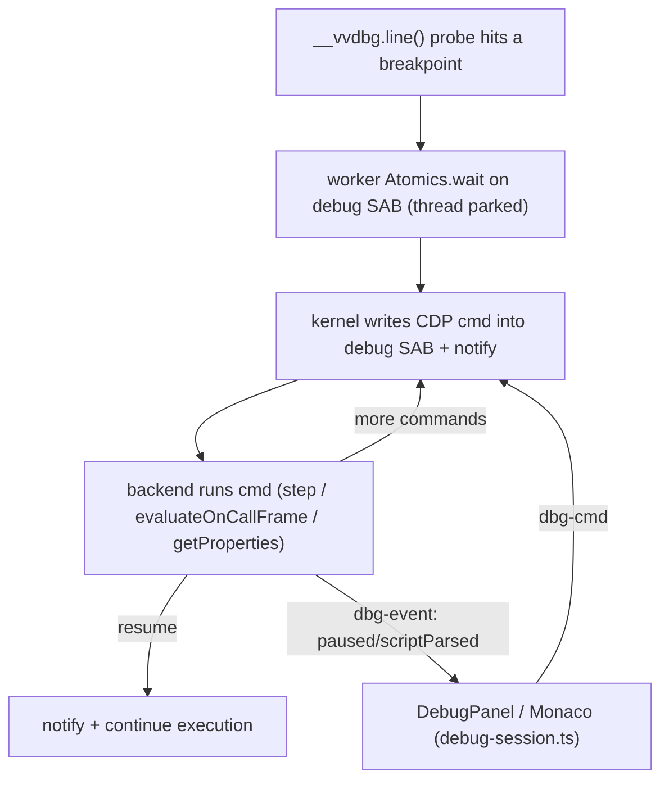
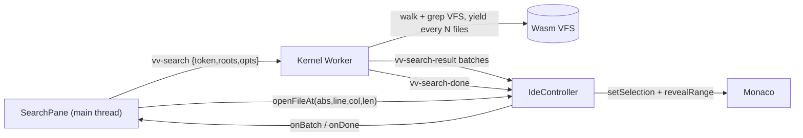

# Vivari — Architecture

This document explains how Vivari works end to end: the core constraint it
solves, the worker topology, the syscall protocol, the filesystem, the process
model, the Node runtime, networking, native code, and the build. It is the
companion to [`AGENTS.md`](./AGENTS.md) (how to work in this repo) and
[`roadmap.md`](./roadmap.md) (chronological status + rationale per feature).

---

## 1. What it is

Vivari is an open-source **WebContainer**: it runs Node-style projects
(Vite dev server + HMR, React, NestJS, Express, `npm install`, `tsc`, …) **100%
inside the browser tab**. There is no backend doing the work — the filesystem,
the Node-compatible runtime, the process/PID model, and even TCP networking are
all emulated client-side across Web Workers.

The design principle throughout is **run the real thing, not a reimplementation**:
we vendor Node's actual `lib/*.js` on top of a small binding layer, run real npm
packages unmodified from disk, and drive real tools (rolldown/Vite, `tsc`,
`@babel/core`) in-VM.

---

## 2. The core constraint (why any of this is hard)

Node's APIs are **synchronous**: `fs.readFileSync`, `require()`, `execSync`, etc.
Browsers do **not** let you block the main thread on async work. The one exception
is a **Web Worker**, where `Atomics.wait()` can genuinely park the thread.

So the load-bearing primitive is a **synchronous bridge over a `SharedArrayBuffer`
(SAB)**:

```
process code (Web Worker thread)
   │  fs.readFileSync("/x")        ← looks synchronous to user code
   ▼
 write request into SAB, Atomics.store(STATE, REQUEST), ring a doorbell
   │
   ▼  Atomics.wait(STATE, REQUEST) — the thread genuinely blocks
 ...another worker services it against the Rust/Wasm VFS...
   ▲
   └─ writes the response into the SAB, Atomics.notify(STATE)
   ▼
 returns bytes — still synchronous, no async leaked to user code
```

`SharedArrayBuffer` + `Atomics` only exist under **cross-origin isolation**, so
every page that hosts Vivari MUST be served with:

```
Cross-Origin-Opener-Policy:   same-origin
Cross-Origin-Embedder-Policy: require-corp
```

(Studio's `vite.config.ts` does this. Without it, `SharedArrayBuffer` is
`undefined` and nothing runs.)

---

## 3. Worker topology

Work is split across several Web Workers so no single thread is on the critical
path of everything. The worker roles below are ES modules; **studio's Vite build
bundles each** (nested module workers + wasm).

```
┌──────────────────────────────────────────────────────────────────────┐
│ Main thread — packages/studio (React 19 + shadcn)                      │
│   • Home (blank / template / import folder / recents) + VS Code IDE:   │
│     multi-root VFS-backed Explorer (abs-path tabs) + Search + tabbed    │
│     Monaco (preview/permanent tabs) + bottom panel with                 │
│     Console / Terminal (INTERACTIVE shells) / Ports + command palette   │
│     + preview (ANSI intact; shells have real stdin — type, Enter runs)  │
│   • src/vv/kernel.ts (KernelBridge) + src/vv/controller.ts (IdeController)│
│   • registers the preview Service Worker                               │
│   • relays SW HTTP requests to the Kernel Worker                       │
│   • NO kernel/user work runs here (keeps the UI responsive)            │
└───────────────┬────────────────────────────────────────────────────────┘
                │ postMessage (spawn worker, init, net nudges, ws relay)
                ▼
┌──────────────────────────────────────────────────────────────────────┐
│ Kernel Worker — packages/core/src/workers/kernel-worker.ts                         │
│   • hosts the Kernel (packages/kernel-host/kernel.js)                  │
│   • PID table, process supervision, spawn/kill/waitpid                 │
│   • virtual network port registry (port → pid) + HTTP request routing  │
│   • spawns the nested workers below                                    │
└───┬───────────────────┬───────────────────────┬──────────────────────┘
    │ nested Worker      │ nested Worker          │ nested Worker(s)
    ▼                    ▼                        ▼
┌─────────────┐   ┌───────────────┐   ┌────────────────────────────────┐
│ Fetcher     │   │ File System   │   │ Process Worker  (one per PID)   │
│ Worker      │   │ Worker        │   │  packages/core/src/workers/process-worker.ts│
│ outbound    │   │ owns the Rust │   │  • runs the vendored Node       │
│ fetch()     │   │ /Wasm VFS     │   │    runtime + the user program   │
│ (npm, etc.) │   │ + OPFS mirror │   │  • its own SAB + event loop     │
└─────────────┘   └───────────────┘   └────────────────────────────────┘
```

Key relationships:

- **Each process** is its own Web Worker with its **own SAB**. `process.pid` is the
  kernel-assigned PID and matches the worker's DevTools name (`Process Worker PID N`).
- **The File System Worker** owns the single VFS. Every client (the kernel and
  every process) registers its SAB with it. It is woken by a **doorbell**: a
  `MessagePort` for processes, a plain postMessage for the kernel's own fs access.
- **The Fetcher Worker** performs all real outbound network (`fetch`), so a big
  npm tarball download/decompress never stalls syscall servicing.
- The Kernel Worker also **spawns each Process Worker** and wires a
  `MessageChannel` between it and the File System Worker (its fs doorbell).

---

## 4. The syscall protocol (`packages/protocol/syscall.js`)

One SAB per client, laid out as:

```
[ control: 4 × Int32 = 16 bytes ][ data region: 1 MiB ]

control[0] = STATE    (Atomics.wait / notify on this word)
control[1] = OPCODE   (which syscall)
control[2] = REQ_LEN  (request bytes in the data region)
control[3] = RES_LEN  (response bytes in the data region)
```

STATE values: `IDLE=0`, `REQUEST=1` (worker→servicer), `RESPONSE_OK=2`,
`RESPONSE_ERR=3` (a UTF-8 errno like `ENOENT`).

Request frame in the data region is self-describing:
`[flags:u32][fieldCount:u32]([len:u32][bytes])*`. Scalars (fds, lengths, file
positions) are packed as little-endian `u32`/`f64` fields; everything else is
UTF-8 or raw bytes.

### 4.1 The 1 MiB window — the single most important invariant

`DATA_BYTES = 1 << 20`. **Every** request and response must fit in this window.
`fs-client.call()` throws `"syscall request too large for the shared data
region"` if a payload exceeds it. Two consequences that have bitten us
repeatedly:

- **Large file I/O is chunked.** `FD_CHUNK = 512 KiB`; `fs.js` loops on short
  reads/writes, so an arbitrarily large file transfers in pieces. `writeLarge`
  bypasses the SAB entirely via a transferred `ArrayBuffer`.
- **Large HTTP responses are chunked.** A big response body (Vite serves ~2.8 MB
  pre-bundled dep files) cannot cross in one `OP_RESPOND`. The body travels as a
  **raw length-prefixed field** (never JSON-stringified — escaping doubles quotes/
  newlines and silently overflows) and is split into sequential frames the kernel
  reassembles by `reqId`. See `fs-client.respond` + `kernel.handleRespond`.
- **Downloads bypass the window.** `OP_FETCH` streams the response body straight
  into the VFS via the Fetcher Worker; the caller then reads it back with normal
  (chunked) fs. So npm tarballs of any size work. `OP_FETCH` is *blocking* (the
  caller parks until the body lands); `OP_FETCH_ASYNC` is the non-blocking twin —
  the kernel ACKs immediately and posts the result back later as a `fetch-done`
  message, so one process can keep many downloads in flight (parallel npm; see §6).

### 4.2 Opcode routing

Opcodes split into two families (`isFsOpcode`):

- **Filesystem** (`OP_READ_FILE`…`OP_READLINK`, `OP_OPEN`…`OP_FTRUNCATE`,
  `OP_WATCH`/`OP_UNWATCH`) → serviced by the **File System Worker** over the
  process's SAB, woken via the fs `MessagePort` doorbell.
- **Everything else** (`OP_SPAWN`/`OP_SPAWN_ASYNC`/`OP_KILL`, `OP_LISTEN`/
  `OP_ACCEPT`/`OP_RESPOND`/`OP_CLOSE_SERVER`, `OP_FETCH`/`OP_FETCH_ASYNC`) →
  serviced by the **Kernel**, woken via a `send("syscall")` postMessage.

Some opcodes are **deferred**: `OP_ACCEPT`, `OP_SPAWN`, `OP_FETCH` keep the caller
parked on `Atomics.wait` until the awaited event (a request, child exit, download)
arrives — this is how blocking `accept()`/`execSync()`/blocking fetch work.
`OP_FETCH_ASYNC` is the opposite: the kernel returns an empty OK immediately and
posts the outcome back as a `{type:'fetch-done', fetchId}` message, so the caller
never parks and many downloads can overlap (§6).

### 4.3 Debug channel (`packages/protocol/debug.js`)

The breakpoint debugger (§7.2) needs to drive a process that is **parked at a
breakpoint** — i.e. not sitting in the syscall loop. So it uses a **second,
independent SAB**, separate from the 1 MiB syscall SAB, allocated per debug target:

```
[ control: Int32 STATE ][ data region: JSON CDP command bytes ]
STATE values: DBG_STATE_EMPTY=0, DBG_STATE_CMD=1
```

A paused worker blocks on `Atomics.wait(STATE, EMPTY)`; the kernel writes a CDP
command into the data region, stores `DBG_STATE_CMD`, and `Atomics.notify`s. This is
only wired when `VV_DEBUG` is set, so non-debug runs never allocate it.

---

## 5. Filesystem

- **VFS core**: `packages/vfs/` is a Rust crate compiled to Wasm (`wasm-pack`,
  `web` + `nodejs` targets; crate `vivari-vfs`). It's an inode table (`HashMap<u64, Inode>`),
  directories map names→inode via `BTreeMap` (sorted readdir for free), symlinks
  with an `ELOOP` guard, `stat`/`lstat`, rename, errno-style errors. Hard links share
  one inode across names (`nlink` refcount; freed on last unlink).
- **VFS memory / compression**: file bodies are a `FileBody { Raw | Zip{data,len} }`.
  Cold files are stored **zlib-compressed** and inflate transparently — whole-file reads
  on demand, chunked `fd_read` once into a bounded (48 MiB) hot-read cache. The first
  write inflates in place; a file is (re)compressed only when its last writable fd closes
  (a `wopen` refcount) or after `write_file`, skipping files < 4 KiB or that don't beat a
  95% ratio. This cuts the FS worker's linear-memory footprint ~70% for a big
  `node_modules` (the largest addressable term in the tab). **On by default**; `?compress=0`
  disables it (plumbed page → kernel worker → FS worker, applied before OPFS restore).
  `mem_bytes()`/`logical_mem_bytes()` back the "Measure Memory" ratio readout.
- **Per-PID memory attribution**: "Measure Memory" also breaks the Process Worker heap
  down by PID. Each worker answers a `proc-mem` query with `runtime.memStats()` — its own JS
  heap (`performance.memory`, unavailable in Chrome Workers so effectively `-1`; the main-thread
  `measureUserAgentSpecificMemory()` per-URL figure is the real heap), guest module-cache size, an
  esbuild-wasm flag, and the **esbuild Go wasm heap byteLength** (`esbuildWasmBytes()`); the kernel
  worker fans the query across a live `pid → worker` registry and relays the rows on `vv-mem`. This
  attributes the dev-server heap (the tab's largest term post-compression) to a specific process,
  and quantifies how much of it is the resident esbuild service vs. guest framework; read-only.
- **Servicing**: `packages/kernel-host/fs-server.js` (`FsServer`) owns the one VFS
  instance and services fs opcodes directly over each client's SAB. It runs inside
  the **File System Worker** (`packages/core/src/workers/fs-worker.ts`).
- **Node contract**: `packages/runtime/node/bindings/fs.js` maps Node's native fs
  binding contract onto the sync bridge (`stat` fills the shared `statValues`
  Float64Array in place; fd layer via `open`→`fstat`→`read`→`close`), so Node's
  real `lib/fs.js` runs unmodified on top.
- **Persistence**: the VFS is mirrored to the **Origin Private File System (OPFS)**
  by `opfs-persistence.js` (write-behind). OPFS sync access handles only exist in a
  Worker — hence this lives in the FS worker. On boot it restores the manifest into
  the VFS **before** serving any syscall. Use `?reset` on the demo URL to wipe it.
  Volatile/re-seeded paths are excluded (`fs-worker.js` `IGNORE`: `/bin /tmp /proc
  /dev /etc /usr /var/cache`). The package-manager caches deliberately live in a
  PERSISTED location (`/home/user/.cache` for npm/yarn/corepack, `/home/user/.local/
  share/pnpm/store` for pnpm), so npm's own content-addressed cache doubles as the
  durable, cross-project "package cache in OPFS" — a dependency downloaded once is
  reused by later projects and after a reload. The kernel's transient outbound-fetch
  buffer (`/var/cache/vv-fetch`) is excluded because its index is rebuilt per session
  and never read back, so npm's cache is the single durable copy.
- **Dependency cache** (`packages/kernel-host/dep-cache.js`, stored under `vv-depcache/` in OPFS):
  layered on top of the mirror. A lockfile-keyed snapshot of a whole `node_modules` tree
  (`dep-cache-{has,save,restore}` messages against the in-worker VFS, exposed to the kernel as
  `kernelFs.fs.depCache{Has,Save,Restore}`). Snapshotted after a clean package-manager install
  (detected in `kernel.onProcExit`) and restored **before** an auto-run install when the lockfile —
  or, for a fresh template with no lockfile yet, `package.json` via an alias key — matches, so a
  second project with the same deps skips `install` entirely. Bounded LRU (512 MiB); also dropped by
  `?reset`. See roadmap "Persistent dependency cache".
- **File watching** (`fs.watch`): `OP_WATCH` registers interest; the FS worker
  **pushes** change events back over the fs doorbell `MessagePort` (never the SAB —
  the process isn't parked on it). Events are bucketed by top-level tree to bound
  fan-out.

---

## 6. Process model

- **Kernel** (`packages/kernel-host/kernel.js`) owns the PID table and all
  supervision. `createProcess` spawns a Process Worker; `finalize` tears one down
  (terminates the worker, releases its ports, fails its in-flight HTTP requests,
  closes its ws tunnels).
- **Spawn**: `OP_SPAWN` blocks the parent until the child exits (`execSync`/
  `spawnSync`): the parent parks on `Atomics.wait` while the kernel drives the
  child. `OP_SPAWN_ASYNC` returns `{pid}` immediately; the child's stdout/stderr/
  exit stream back to the parent worker as postMessages (the model behind
  `child_process.spawn` and a `npm run dev` that launches a long-lived server).
- **Debug**: when `VV_DEBUG` is set (kernel-authoritative `debugMode`), the kernel
  allocates a per-target debug SAB (§4.3), announces the target, and routes CDP
  attach/detach + commands to it — postMessage while running, SAB while paused (§7.2).
- **Naming**: each Process Worker is created with the name `Process Worker PID N`.
  A Worker's name is fixed at creation and can't be changed later, so naming it
  per-PID at spawn (rather than reusing a pre-warmed, PID-less pool) is what keeps
  DevTools' worker list legible — every entry maps to a PID. (A warm pool was tried
  and dropped: it didn't move the needle on the boot numbers — cold start is
  dominated by the FS worker + VFS wasm init — and it left claimed spares
  mislabelled.)
- **Cold-start wins that stuck**: the Fetcher + File System workers are created in
  parallel at boot, and the demo's first shell defers its Process Worker spawn off
  the boot burst (starts on focus/keystroke/idle). Boot narrates its phases with
  timings to the Console.
- **Signals & teardown**: `process.kill(pid, sig)` and `child.kill()` route to the
  kernel (`OP_KILL`); `finalize` **cascades to the whole subtree** (`parentPid`),
  so killing a shell wrapper (`sh -c "node …"`) takes its server down too.
- **stdin (interactive)**: delivered OUT of band, not via a blocking syscall. The
  host terminal's keystrokes → `kernel.sendStdin(pid)` → a `{type:'stdin'}`
  postMessage → the process' real flowing `process.stdin` (a TTY Readable, drained
  in a loop turn). `child.stdin.write()` relays parent→child via `{type:'child-
  stdin'}` → `kernel.handleChildStdin` → the child's own stdin, **byte-for-byte**
  (Buffers/Uint8Arrays pass through unstringified, so binary stdin survives). This
  is what makes the terminal interactive (a live `sh` REPL, `node`, etc.).
- **Coreutils + shell**: `packages/kernel-host/coreutils.js` provides
  `echo/cat/ls/pwd/mkdir/rm/node/npm/npx/bun/bunx/true/false` and a small `sh`. `sh`
  with no args is an **interactive REPL** (prompt, echo, backspace, ↑/↓ **history**
  recall + a `history` builtin, **Tab completion** — first token against builtins +
  PATH, later tokens against the VFS — Ctrl+C→SIGINT the whole foreground job — every
  stage of a pipeline, not just the last, Ctrl+D); with `-c`/a file it runs a batch.
  `ls` colors directories bold-blue, but only under `--color=auto` (default) with an
  interactive terminal attached — signaled by `VV_TTY=1`, which the interactive `sh`
  sets and children inherit — so batch/CI output stays plain. It supports
  sequencing (`;` `&&` `||`), **pipes** (`|`) and **redirects** (`<` `>` `>>` `2>`
  `2>>` `2>&1`) — a quote-aware lexer parses each line into pipelines of stages,
  wiring one stage's stdout into the next's stdin and opening redirect targets as
  fds (a pipeline's exit status is its last stage). `/dev/null` is special-cased
  as a discard sink (there are no VFS device nodes), so `cmd > /dev/null 2>&1`
  works. If `$VV_RUN` is set
  it auto-runs that command line at startup (echoed like you'd typed it) then stays
  interactive — used to run a demo's dev server *inside a terminal tab*. Installed
  into `/bin` by `installCoreutils()`.
- **Demos run like local dev**: the "Run" button opens a dedicated shell tab whose
  `sh` has `VV_RUN="npm install && npm run dev …"` (install skipped once
  `node_modules` exists). The dev server is therefore a child of that tab's shell:
  closing the tab kills the server (preview then 502s), and starting the same
  server again in another shell fails with `EADDRINUSE` — we don't intercept that.
  The kernel worker watches `onListen` on the demo's port to point/reload the
  preview (a re-listen on an already-serving port = a Nest `--watch` restart).
- **npm**: the shell's `npm`/`npx` is the **real, unmodified npm CLI** on Path B
  (the North Star; see roadmap). Real npm@10.9.2 is vendored + packed into one
  gzipped asset (`scripts/vendor-npm.mjs` →
  `packages/studio/public/vendor/npm-pack.bin`); at boot the kernel worker fetches
  it once and `load-real-npm.js` unpacks the tree into the VFS at
  `/usr/lib/node_modules/npm` via a single batched transfer
  (`kernel.writeFilesBatch` → `FsServer.writeBatch`, ~2400 files in one message),
  then writes `/bin/npm.js` + `/bin/npx.js` shims that `require()` the real CLI (so
  `npm` on PATH is real npm; the tree persists in OPFS across reloads). Native
  builds can't run in-browser, so `node-gyp` is a non-fatal no-op via
  `node-gyp-stub.js` (`stubNodeGyp()` overwrites npm's node-gyp shims in the
  vendored tree; a `node-gyp` coreutil is the PATH fallback) — the package's JS /
  `wasm32-wasi` fallback is what loads instead.
  **Downloads are parallel.** npm issues many packument + tarball requests at once,
  but the blocking `OP_FETCH` would serialize them (each parks the worker until its
  body lands). So the `https` shim (`node/lib/https.js`) prefers a NON-blocking
  fetch: `globalThis.__ocfetchAsync` (wired in `runtime/index.js` over
  `fs-client.fetchAsync` → `OP_FETCH_ASYNC`) returns a Promise and the kernel posts
  each result back as a `fetch-done` message (`dispatchFetch` settles it), so npm's
  own concurrency actually overlaps on the wire. The kernel bounds fan-out to
  `fetchConcurrency` (10) via `_scheduleFetch`/`_drainFetchQueue`, dedupes identical
  in-flight URLs (`_fetchInflight`), and streams each body into the VFS
  (`_fetchIntoVfs`/`_doNetworkFetch`) with the same cache/dedupe as the blocking
  path; the blocking `__ocfetch` remains the fallback.
  The from-scratch installer `packages/kernel-host/programs/npm.js` (semver
  resolution from registry packuments, `OP_FETCH` tarball download, gunzip +
  ustar parser, npm-v3 hoisting, `.bin` symlinks, platform-gated
  `optionalDependencies`) was the temporary "Turbo-analog" — it is now **retired**
  from the shipped product (not in `COREUTILS`) and survives only as an offline
  fixture the `verify-node`/`verify-express` harnesses install themselves.

---

## 7. The Node runtime (inside each Process Worker)

`packages/runtime/` is the vendored Node runtime. The evolution (see roadmap) went
from hand-written builtins (**Path A**, mostly gone) to **Path B**: run Node's
**real `lib/*.js`** on top of a small binding layer. This is why real frameworks
work — it *is* Node's own module code.

- `node/lib/*.js` — Node's actual standard library (fs, net, http, stream, events,
  buffer, zlib, crypto, url, util, path, dns, worker_threads, …), vendored.
- `node/internal/*` — Node's `internal/*` support modules (streams, errors,
  validators, stream_base_commons, …).
- `node/bindings/*.js` — our shims for `internalBinding('fs'|'tcp_wrap'|'zlib'|
  'crypto'|'http_parser'|…)`. These map Node's native C++ contract onto our sync
  bridge / Wasm codecs.
- `node/internal-binding.js`, `node/primordials.js`, `node/loader.js` — the glue
  that lets vendored `lib/` resolve `internalBinding(...)` and `primordials`.
- `builtins/*.js` — the few remaining hand-written modules (`process`, `os`,
  `assert`, `child_process`, and `bun` — a Node-backed `Bun` global + `bun:*`
  modules; see §9.2) that have no clean Node-lib form here.

Module system:

- `module.js` — the **synchronous CommonJS loader**: `require()` with full
  node_modules resolution, `package.json` `exports`/`imports` conditions, builtin
  factories. Everything is sync because the fs under it is sync.
- `esm.js` — an **ESM→CJS transpiler** (via `es-module-lexer`): rewrites
  `import`/`export`/`import.meta`/dynamic `import()` into our sync CJS at load
  time. Generated identifiers are namespaced (`__oc_require`, `__oc_import`,
  `__oc_exports`, `__oc_module`, …) so user code can freely declare its own
  `require`/`module`/`exports`.
- `typescript-transform.js` — a **synchronous, dependency-free TS/JSX transform**
  (type-strip + JSX lowering) the loader applies for zero-config `.ts`/`.tsx`
  execution (Bun; see §9.2). Gated so plain JS is passed through untouched.
- `index.js` — `createRuntime()`: wires builtins + globals + the HTTP bridge +
  the WebSocket client, and returns `run(entry)`.
- `loop.js` — the **per-process event loop** (see §7.1).
- `boot.js` — process bootstrap shared by the browser and Node worker entries.

### 7.1 The event loop

A real async loop so ordering matches Node
(`nextTick → promise microtasks → timers → setImmediate`), while sync syscalls
still block via `Atomics.wait`. Key ideas (`loop.js`):

- To flush native Promise microtasks it must **yield to the host once per turn**
  (a purely synchronous loop can never drain them) — done via a `MessageChannel`
  macrotask.
- Timers are ours (deterministic order + ref/unref) but the actual sleep is a host
  `setTimeout`, so a 100 ms timer really waits 100 ms.
- **Idle waiting is message-driven**: when a request is queued the kernel
  postMessages the worker and `wakeNet()` resolves the idle wait — so the SAB stays
  free while idle and a timer callback can run a sync fs syscall.
- Each turn also drains queued HTTP requests, async child events, worker_threads
  events, and fs.watch events (`doNet`/`doChildren`/`doThreads`/`doWatch`).

### 7.2 Breakpoint debugger (Node guests)

A full pause / step / inspect / evaluate debugger for guest Node processes, speaking
the **Chrome DevTools Protocol** (`Debugger`/`Runtime` domains). There is no V8
inspector in the browser, so pausing is built from **source instrumentation** plus
the debug SAB (§4.3) — the same "genuinely block the worker thread" trick that makes
sync syscalls work.

Three pieces, all lazy-loaded only when `VV_DEBUG` is set (zero cost otherwise):

- **Instrument** (`packages/runtime/instrument.js`) — `acorn` parses the guest's own
  source (on plain ES, after the TS/JSX strip, before the ESM rewrite in `module.js`,
  so line numbers are preserved) and weaves in `__vvdbg.line/brk/push/pop` probes and
  a per-lexical-block `__vv_ev` eval closure (so `evaluateOnCallFrame` and Variables
  see the exact block scope). Self-heals to the original source on any parse failure.
- **In-guest CDP backend** (`packages/runtime/debugger.js`) — script registry,
  breakpoint binding, call-stack frames, RemoteObject table, and the synchronous pause
  loop. Emits `Debugger.scriptParsed/paused/resumed`.
- **Studio client** (`packages/studio/src/vv/debug-session.ts` + `DebugPanel.tsx`) —
  the CDP client that drives Monaco gutter breakpoints, the paused-line highlight, and
  a VS Code-style Call Stack / Variables / Watch panel, opened from the ActivityBar's
  "Run and Debug" entry.

The pause flow (kernel routing lives in `kernel.js` / `kernel-worker.ts` /
`process-worker.ts`):



A **running** (not-yet-paused) process receives commands via `postMessage` instead of
the SAB; a `--inspect-brk`-style start gate (`waitForStart` in `index.js`) keeps short
scripts from finishing before the frontend attaches. The run shell + package managers
are skipped as debug targets so auto-attach lands on the user's program. The CDP shape
is shared so the same backend can later also feed the chii Sources panel — distinct
from §8.5, which debugs preview **browser** JS via chobitsu.

---

## 8. Networking

There is **no TCP**. Networking is emulated at two seams.

### 8.1 In-process loopback (`node/bindings/net.js`)

The binding beneath Node's real `lib/net.js` implements
`internalBinding('tcp_wrap')` as an **in-process loopback**: a module-level
`port → serverHandle` registry lets a client `connect()` link to a `listen()`ing
handle in the *same* worker, producing a linked pair of endpoints whose writes
appear as the peer's reads. Node's unmodified `lib/net.js` / `lib/_http_*.js` run
end to end on top (real `ClientRequest`/`ServerResponse`/`IncomingMessage`,
chunked bodies, keep-alive). This registry is **per-process** (one worker = one
process). Writes never block — they queue into the peer's inbox and pump on
`nextTick`. The same binding backs `pipe_wrap` (UNIX-domain sockets / named
pipes) with an identical path-keyed loopback.

**Cross-process loopback (TCP + UNIX sockets).** When a `connect()` targets a
port/path that isn't served in *this* process, another in-VM process may own it —
e.g. Nuxt/Nitro's dev server on `:3000` reverse-proxies SSR to its render worker
on an ephemeral port in a *different* process, and `vite-node`/Nitro talk over
`*.sock` UNIX sockets. Both ride the same **kernel byte-relay**: `listen()` also
registers the socket path with the kernel (`OP_PIPE_LISTEN`) — for a TCP server a
synthetic per-port key — and a cross-process `connect()` resolves it
(`OP_PIPE_CONNECT`) to a `connId`; raw bytes then flow **out of band** as
`pipe-*` postMessages the kernel forwards between the two processes (never the
syscall SAB, since neither side is parked on it). `net.js`'s `TCP`/`Pipe` handles
fall back to this **only** when the same-process registry misses, so
single-process loopback and external (Service Worker) routing are unchanged.
Probes: `scripts/probe-xpipe.mjs` (UNIX sockets) and `scripts/probe-xtcp.mjs`
(TCP, the Nitro `:3000`→worker shape), each covering both directions.

### 8.2 Cross-VM reachability (the kernel port registry)

`listen()` also registers the port with the kernel (`OP_LISTEN` → `port → pid`
map) so **external** requests can be routed to the owning process. When a request
arrives, the kernel pushes it to the process's `serverInbox`; the process drains it
via non-blocking `OP_ACCEPT` and — this is the cross-VM seam — **replays it through
a real in-VM http client into its own server over the loopback**
(`bridgeHttp` in `index.js`), collects the response, and sends it back via
`OP_RESPOND`. The public entry point is `kernel.handleHttpRequest(port, req) →
Promise<{status, headers, body, bodyEncoding}>`; the wire contract is unchanged
whether the caller is the Service Worker (browser) or a headless test.

Bodies cross as JSON metadata + a raw body field. Textual content-types cross as
UTF-8; binary (images/fonts/wasm) crosses base64 with `bodyEncoding: 'base64'`
(the SW decodes it). Large bodies are chunked (§4.1).

### 8.3 Browser preview (Service Worker)

`packages/studio/public/sw.js` is a preview proxy scoped to the whole origin (needs
`Service-Worker-Allowed: /`). It intercepts the preview iframe's `fetch`
(`/preview/<port>/…` and root-absolute subresources like `/@vite/client`,
`/node_modules/…`), posts each to the window (the studio main thread), which forwards to the
Kernel Worker → `handleHttpRequest` → the in-VM server. No real network is
involved. The SW also **precaches** the worker-role bundles in production (keyed by
a per-build id) so a redeploy can't serve stale bundles.

When the SW **strips** the `/preview/<port>` prefix (the default; not keep-prefix,
not mode-C wildcard-root) it forwards an **`X-Forwarded-Prefix: /preview/<port>`**
header, so a path-prefix-aware guest framework can advertise correct absolute URLs
even though it sees clean `/` paths. The Python bridge maps it to the ASGI
`root_path` / WSGI `SCRIPT_NAME` (§9.3) — that's what makes FastAPI's Swagger UI
(`/docs`, the `openapi.json` link, "Try it out") route back through the tunnel.

**Preview iframes start at about:blank, then navigate.** On a fresh page load the
studio document is fetched before the SW takes control, so a brand-new iframe whose
*first* navigation is a direct `/preview/<port>/` URL isn't intercepted — the
request escapes to the network and the studio's own SPA fallback renders its Home
page inside the frame. So `PreviewPanel.tsx`'s `PreviewFrame` mounts each iframe at
`about:blank` (a client the SW already controls) and sets the real `previewSrc`
imperatively in an effect; `registerServiceWorker()` additionally waits for
`controllerchange` when the page isn't yet controlled. Both ensure the SW proxies
the very first preview navigation instead of the app leaking through.

**Separate preview origin (mode B) — opt-in isolation.** By default previews run
*same-origin* with the IDE (the SW is registered on the studio origin; `findKernelClient()`
reaches the kernel via same-origin window clients). A deploy can instead serve previews from a
**second origin** (e.g. `vivari-preview.pages.dev`) so untrusted preview code — and, realistically,
your own npm dependencies — can't touch the IDE's cookies/localStorage/OPFS. It's client-side only:
that origin is **static hosting** for `sw.js` + a hidden `__vv-bridge.html`; the kernel still lives
in the IDE tab. `KernelBridge.setupPreviewBridge()` iframes the bridge doc, which registers the
cross-origin SW and hands back a persistent `MessagePort`; the SW then routes preview HTTP over that
port instead of `findKernelClient()`. Selected at build time by `VITE_PREVIEW_ORIGIN` on the **studio
(main) project** (the preview project needs no env). The embedded preview iframe is cross-origin, so
its ws/SSE/CDP shims already reach the IDE via `parent.postMessage`.

**Wildcard per-port preview origins (mode C).** Instead of one shared preview origin, a deploy can
serve **each port from its own origin** — `<token>--<port>-vv.<domain>` (random per-boot `<token>`),
selected by `VITE_PREVIEW_WILDCARD_DOMAIN` (takes precedence over `VITE_PREVIEW_ORIGIN`). This
isolates previews from the IDE *and* from each other, and restores real `localhost:<port>`
web-platform semantics (own cookies/storage/CORS). The SW reads the port from
`self.location.hostname` (`WILDCARD_MODE` in `sw.js`) and serves the app at `/` — no `/preview/`
path, so keep-prefix templates get their base auto-rewritten to `/` at creation. `KernelBridge`
lazily stands up **one bridge iframe + `MessagePort` per port** (`ensurePreviewBridge`, keyed by
origin) as servers `listen`, and `broadcastToPreviewSWs` fans ws/SSE out across all of them. Because
Cloudflare Pages can't attach a *wildcard* custom domain, a small Cloudflare **Worker** (`worker/`,
route `*-vv.<domain>/*`) serves the static SW runtime and stamps the isolation headers; it needs one
**proxied** wildcard DNS record `*.<domain>`. The `-vv` tag is a **suffix** because Cloudflare routes
only allow the `*` wildcard at the START of the hostname (an infix `vv-*` is rejected); the suffix
also keeps the route narrow so other apps on the base domain are untouched. See `roadmap.md`
("preview origin isolation") + `sites/docs/docs/deployment.md`.

### 8.4 WebSocket tunnel (Vite HMR)

A browser `WebSocket` can't reach an in-process ws server (no TCP, and a SW can't
intercept the WS upgrade). Instead a `WebSocket` polyfill in the preview iframe
tunnels each connection to us as messages (`ws-open`/`ws-in`/`ws-close`); the owning
process opens a genuine **in-VM WebSocket client** (`websocket.js`, over Node's own
http upgrade + the net loopback) to `127.0.0.1:<port>` and relays frames back out
(`ws-out`). This is what makes Vite HMR work live in the preview.

**Cross-service ws (FE ↔ BE).** The shim picks the target port from the ws URL: a
`/preview/<port>/…` URL tunnels to THAT in-VM port (prefix stripped), the same convention
as the HTTP preview proxy — so a frontend on :5173 can open a socket to a backend on :3001
via `/preview/3001/ws`. URLs without the prefix keep the iframe's own port (HMR unchanged).
The kernel routes the `open` by port (`handleWsClient` → `listeners.get(port)`), so this is
a shim-only change. The `ws-demo` template (Express + `ws` backend, Vite frontend, started
together) demonstrates both directions; each server gets its own preview tab (see 8.6).

**"Open in new tab" tunnels ws/SSE through the Service Worker.** The shims relay frames by
`postMessage` to the window that hosts the kernel — the iframe's `parent` when embedded. Opening
a preview in a standalone tab (`controller.openExternalPreview`) makes it a top-level document,
and the studio's `COOP: same-origin` (required for `SharedArrayBuffer`) puts that tab in a
*separate browsing-context group* with `window.opener === null` — there is no host window to
reach. So for a top-level preview the shim falls back to `navigator.serviceWorker.controller`
(the SW is shared across browsing-context groups, exactly how the HTTP proxy reaches the studio
cross-tab): the SW forwards `dir:'out'` frames to the kernel-host client (`findKernelClient`,
shared with `handlePreview`) and broadcasts `dir:'in'` frames to every top-level preview client;
each shim keeps only its own `connId`. The studio's `bridge.ts` forwards SW-relayed `dir:'out'`
frames to the kernel worker, and `controller` relays inbound frames back through the SW
(`KernelBridge.broadcastToPreviewSWs`, which posts to **both** the same-origin controller and, in
modes B/C, every bridge port) alongside the in-app iframes (nested clients, which the SW broadcast
skips, so no duplicates). Vite HMR in a standalone tab now works for the same reason.

**Where the pop-out opens (modes B & C).** `openExternalPreview` opens the pop-out **same-origin by
default** (`/preview/<port>/` on the IDE origin) so it lands in the kernel's storage partition and
"just works". A standalone tab on a *cross-site* preview origin would sit in a different browser
storage partition than the editor tab and couldn't reach the kernel without a Storage-Access grant —
so the mode-B isolated pop-out is opt-in via `VITE_PREVIEW_POPOUT=isolated` (set on the studio
project, only meaningful with `VITE_PREVIEW_ORIGIN`). Whether `isolated` needs that gate hinges on
**same-site vs cross-site**: if the IDE and preview origins are subdomains of the **same registrable
domain** (e.g. `vivari.jamesisme.com` + `vivari-preview.jamesisme.com`, IDE opened at the
`jamesisme.com` host) they are same-site → **not** storage-partitioned → the pop-out shares the
bridge Service Worker and connects with **no gate** (verified live), while storage stays
origin-isolated. **Mode C is same-site by construction** (its per-port hosts are subdomains of the
IDE's own base domain), so its pop-out is always gate-free. Cross-site deploys (two `*.pages.dev`
projects — `pages.dev` is on the Public Suffix List — or StackBlitz's `stackblitz.com`↔
`webcontainer.io`) are partitioned; the preview SW then serves a StackBlitz-style "connect this tab"
gate (`previewConnectingHtml`), but Chrome's Storage-Access un-partitions cookies only (not Service
Worker registrations), so on `*.pages.dev` the gate can't grant — use `same-origin` pop-out there.
(Trade-off: a same-*site* preview origin can still set/read domain-wide cookies on the IDE; use a
*different* base domain when you need full cross-site isolation, at the cost of the gate.) There is
no isolated-*and*-frictionless standalone tab on a cross-site origin: `same-origin-allow-popups`
(to keep `window.opener`) forfeits `crossOriginIsolated` → no `SharedArrayBuffer`. See `roadmap.md`
("Pop-out behavior").

**Server-Sent Events (same idea, one-way).** A streaming `text/event-stream` response
can't cross the HTTP preview proxy — that path is buffered end-to-end (the SW resolves
ONE complete body via `handleHttpRequest`/`OP_RESPOND`), so a never-ending SSE response
just 504s. So SSE gets its own tunnel, mirroring the ws one minus the client→server leg:
an **`EventSource` polyfill** injected into every preview page (next to the ws shim)
tunnels each connection as `vv-sse` messages (`sub:'open'|'close'`); the kernel binds the
`connId` to the port's process (`handleSseClient`), which opens a genuine **in-VM loopback
GET** to `127.0.0.1:<port><path>` (`Accept: text/event-stream`) and relays each raw stream
chunk back out (`sse-out {sub:'open'|'chunk'|'close'}` → `onSseSend` → iframe). The polyfill
parses the raw bytes into `message`/named events per the SSE spec (`data:`/`event:`/`id:`,
dispatched on a blank line), so `es.onmessage` and `es.addEventListener('foo', …)` both
work. Port routing + the `fallbackPort` heuristic are identical to the ws shim. The `sse`
Showcase template (Express multiplexing a per-second tick + a `metric` gauge + `notice`
log lines onto one stream) demonstrates it. A live SSE relay refs the process event loop
(`sseLiveness`) so it keeps pumping like an open socket handle.

### 8.5 In-browser DevTools + local address bar (studio)

Each `PreviewPanel` tab is a mini-browser. The address bar is **local-only**:
`localhost` / `127.0.0.1` / a bare path loads the in-VM dev server (`navigatePreview`
sets the tab's `path` and bumps a nonce → the iframe reloads via the SW proxy);
external URLs are rejected. Back/forward drive the same-origin iframe's native
`history`; the injected **nav notifier** posts `vv-nav` on every SPA/MPA navigation so
the address bar stays in sync (display-only — it never re-drives the iframe src, which
would loop).

DevTools is the **full chii (Chrome DevTools) frontend**, vendored locally (no CDN, so
COEP holds). The SW injects **chobitsu** (a JS CDP backend) into every preview page.
The `controller` bridges CDP over `window.postMessage`: the chii frontend iframe (loaded
with `#?embedded=<origin>`, which selects chii's postMessage transport) exchanges raw CDP
strings with the controller, which relays them to/from the target tab's chobitsu. One
shared frontend attaches to the **active** tab (per-tab chobitsu backend); switching tabs
reloads the frontend against the new target. Assets are served from `node_modules` in
dev by the `serveDevtools()` Vite plugin and copied into `dist` on build.

**Network panel** shows all three transports coherently. `fetch`/XHR are captured natively
by chobitsu; `WebSocket`/`EventSource` are our postMessage-tunneled polyfills that chobitsu
can't see, so a `NET_SHIM` (`window.__vvNet`) injected next to them **emits synthetic
`Network.*` CDP events** over the same `vv-cdp` bridge — the full ws lifecycle
(`webSocketCreated`/`…FrameSent`/`…FrameReceived`/`…Closed`) and SSE as a long-lived request
with `eventSourceMessageReceived` events. It **registers live connections and replays them**
when a fresh frontend attaches (gated on the panel's `Network.enable` plus the preview's
`init`, guarded by a generation counter to avoid duplicate rows). On a preview reload the
controller remounts the frontend (`onPreviewFrameLoad` bumps `devtoolsNonce`) so the log starts
clean and re-attaches. Outgoing URLs are scrubbed from the proxy form (`/preview/<port>/…`) to
the real in-VM address (`http://localhost:<port>/…`), so ws/SSE/fetch rows all read as the app
actually sees them.

Two non-obvious constraints keep this working:

- **`serveDevtools()` must send fixed-length bodies** (`fs.readFile` + `Content-Length`),
  not `createReadStream().pipe()`. The frontend fires a burst of ~50 concurrent module
  imports; over HTTP/1.1 keep-alive, chunked-transfer responses left many of them
  **pending forever** (spinner never stops), and an unhandled read-stream `error` on a
  client abort could take down the whole dev server.
- **The SW passes `/devtools-host.html` and `/devtools/**` straight to the network**
  (like `/vv-devtools/`). They are our own app assets; routing them through
  `routeByClient` risked a spurious `fetch(event.request)` failure on the iframe
  navigation and could even proxy them into a preview that has no such file.

### 8.6 Multi-root workspace, Home + templates (studio)

The studio is a real workspace, not a two-demo switcher. State (`controller.ts`):
`workspaceFolders: {id,name,rootPath}[]` + `activeFolderId`; **every tab/model/dirty flag is
keyed by ABSOLUTE path** so files from different roots can't collide. Home (`Home.tsx`) is an
overlay over the kept-mounted IDE offering Start-from-blank, Start-from-template (~55 templates
in `vv/templates.ts` across 9 categories — Frontend/Backend/Fullstack/Showcase/Bun/Tooling/Docs/
Creative/Native — spanning most JS frameworks, bundlers, the sqlite/pglite/trpc showcases, and
the **Native** category's Python/Flask/FastAPI (CPython via Pyodide; see §9.3)), and a
`localStorage` recent list. ("Reset everything" also clears that recent list and locks its
dialog while the OPFS wipe runs.) A left ActivityBar toggle switches a **light/dark/system
theme** (next-themes; applied to Monaco and the xterm terminals via `controller.applyUiTheme`);
the file-tree panel is labeled **"Workspace"**, and the editor shows a
`Workspace > project > …path` breadcrumb with a VS Code-blue active-tab accent.

The Explorer reads the **live VFS** rather than a static map. The bridge gained a
request/response channel (`KernelBridge.request()` → reqId → `vv-reply`) backing
`vv-readdir` / `vv-read` / `vv-stat` / `vv-mkdirp` / `vv-create-project`; the worker emits
`vv-fs-changed` after any VFS mutation, which bumps `treeVersion` so the tree + quick-open
index refresh (including after an in-VM `npm install`). Creating a project writes its files in
one `writeFilesBatch` (`vv-create-project`) and registers a run manifest; "Run init script"
opens a shell that runs `install && dev`. A dev server's `listen` is attributed to its project
by walking the pid up to the run shell (`projectDirByTerm` / `terminalForPid`) → `project-ready`
points the preview (the two legacy DEMOS still use the fixed-port `demoForPort` path).
A run shell's **first** listening port is the primary preview (`project-ready` → open folder +
entry). A single dev server's *other* ports are internal infrastructure — Vite's HMR WebSocket
(`:24678`), a framework's SSR/render worker (Nuxt/Nitro's ephemeral port, reached via the main
server's proxy) — and do **not** each open a tab (they'd surface a bare "Upgrade Required" or a
non-interactive SSR page). A template that intentionally runs multiple *user-facing* servers (a
backend API + frontend, e.g. `ws-demo`/`fullstack`/`trpc`) opts in with `manifest.multiPreview`,
and each extra server then gets its own tab (`project-ready {extra}`). All bound ports are still
tracked so a restart reloads the real tab; the set is cleared when the run shell exits so a re-run
re-announces.

### 8.7 TypeScript 7 (tsgo, Go/wasm) + host↔preview bridge

**`tsc`/`tsgo`.** TS 7's compiler is compiled Go. We ship the community `tsgo-wasm` build
(`tsgo.wasm`, ~47 MB + the Go `wasm_exec` glue). It runs on Path B because `wasm_exec` drives
everything through `globalThis.fs` — which IS our real Node `lib/fs.js` over the VFS — plus
`crypto.getRandomValues`/`performance.now`/`TextEncoder`/`WebAssembly`. The only shim: Go writes
program output to fd 1/2 via `fs.writeSync`/`write`, so the runner routes those two fds to
`process.stdout`/`stderr`. Delivery mirrors npm/corepack (`scripts/vendor-tsgo.mjs` → a gzipped
pack; `packages/kernel-host/load-real-tsgo.js` unpacks + installs `/bin/tsc.js` + `/bin/tsgo.js`),
but it loads **lazily in the background after boot** (placeholder shim until then) and persists in
OPFS. Proofs: `scripts/spike-tsgo.mjs`, `scripts/spike-tsgo-studio.mjs`.

**Host ↔ preview.** In-VM code reaches a service on the HOST machine via
`http://host.vivari.internal:<port>/…`, mapped to the studio's own hostname (only reaches
the host when the studio is served locally). Both egress paths honor the alias: `http`/`https`
(and npm) go through the fetcher (`fetcher-worker.js` `rewrite()`); the global `fetch()` is the
host realm's real fetch used directly, so `packages/runtime/index.js` rewrites the alias in its
own `fetch` wrapper (`rewriteHostAlias`). The reverse direction needs no alias: the host hits
`<studio-origin>/preview/<port>/…` (the SW preview proxy). It's addressing convenience, not a
CORS/auth bypass — the target must still allow the studio origin. It is not wired into the
preview tab address bar (that only loads in-VM ports); test it from in-VM code.

### 8.8 Full-text search & replace + quick-open (studio)

The Search pane (`components/ide/SearchPane.tsx`) is a VS Code-style full-text search across
**every open workspace root**, not a filename filter. The search itself runs in the **kernel
worker** (`packages/core/src/workers/kernel-worker.ts`) because that worker is the sole holder of the synchronous
Wasm VFS — grepping from the main thread would mean an `vv-read` round-trip per file. The
worker walks each root (reusing the Explorer skip set: `node_modules`/`.git`/`dist`/…), honors
Match Case / Whole Word / Regex and comma-separated `files to include` / `files to exclude`
globs, skips binary/oversized files, and **streams** per-file matches back as `vv-search-result`
batches followed by a final `vv-search-done {matchCount,fileCount,limitHit}`.



Because that worker also serves preview HTTP + terminal I/O, the walk is **cooperative**: it
`await`s a macrotask every ~40 files and flushes the partial batch, so the UI fills in
progressively and nothing else stalls. A monotonic `currentSearchToken` supersedes an
in-flight search when a newer query (or `vv-search-cancel`) arrives. Heavy result arrays are
delivered to the pane via callbacks (kept out of the global snapshot to avoid re-render
storms). `controller.openFileAt()` opens a hit and reveals/selects the range in Monaco (with a
deferred reveal if the editor is still loading). **Replace** (`vv-replace`) recomputes matches
against the same options and rewrites files — scoped to a single match, one file, or all
files (Replace All) — with VS Code "preserve case" (ALLCAPS/Capitalized) and `$1`/`$&`
expansion; each write posts `vv-fs-changed`, and the controller re-reads any affected open
models from disk. **Quick-open** (`CommandPalette.tsx`, `⌘P`) filters the flat file index by
name and accepts a trailing `:line[:col]` suffix to jump on open; a bare `:line` jumps within
the active editor. `⌘⇧F` focuses the Search pane.

### 8.9 IntelliSense — Monaco's language service, off-main-thread (studio)

The editor runs Monaco's **real** TS/JS language service (completions, hover, signature help,
go-to-definition, diagnostics), not just syntax coloring. `mountEditor` sets `MonacoEnvironment.getWorker`
to Monaco's own workers — the editor worker plus the `typescript` worker (a bundled TS compiler), and
json/css/html — each a Vite `?worker` import so it's bundled **same-origin** (COEP `require-corp` is
satisfied) and runs off the main thread. `configureLanguageService` enables semantic + syntax
diagnostics with `setEagerModelSync(true)` (every model is visible to the worker) and `checkJs: false`
(plain-JS projects aren't flooded with type errors).

**One TS worker, not two (memory).** Monaco runs a *separate* full language service for each of the
`typescript` and `javascript` modes; each parses the whole dependency `.d.ts` payload into ~310 MB, so
naively you pay ~621 MB (measured) for two identical services. The studio runs a single one:
`languageFor` maps `.js/.jsx/.mjs/.cjs` to the `typescript` language (`allowJs` lets the TS service
handle JS), and `javascriptDefaults` is left inert (diagnostics off, no eager sync, no extra libs) so
its worker — created lazily on first JS-model use — never spawns. Extra libs / compiler options are
applied to `typescriptDefaults` only.

The TS worker only "sees" two file sources, so the studio keeps a strict split:


- **The project's own files become models** (`ensureBackgroundModels`, bounded, node_modules excluded),
  so cross-file imports resolve and go-to-definition works before a file is opened; `ensureModel`
  adopts a seeded model when the user opens that file.
- **Dependency typings become extra libs.** Harvesting `node_modules/**/*.d.ts` (+ `package.json` for
  `types`/`exports` resolution) happens in the **kernel worker** (`vv-collect-dts`) — the sole VFS
  holder — as one bulk reply instead of thousands of reads; the project's declared deps (+ their
  `@types`) are harvested first so a budget cap can't drop the packages you import, then the rest of
  `@types`; `typescript`'s own libs are skipped (Monaco ships those). It's debounced and re-runs on
  folder open, fs changes, and after any process exits (an in-VM `npm install` doesn't emit
  `vv-fs-changed`, so a finished process is the cue that `node_modules` may have appeared); a cheap
  `node_modules` fingerprint short-circuits the file reads when nothing changed.
- **Never register a file as both** a model and an extra lib, or the worker sees it twice ("Duplicate
  identifier"). `onDidChangeMarkers` feeds a live error/warning count into the status bar.

### 8.10 Import / export & share (studio)

A project can leave the playground and come back — all client-side, no backend. The codecs live in
`packages/kernel-host/archive.js` (environment-agnostic like `dep-cache.js`: only web primitives that
exist in both a browser and Node — `CompressionStream`/`DecompressionStream`, `DataView`,
`btoa`/`atob` — so **no npm zip/gzip dependency**). ZIP entries are DEFLATE'd with the platform's own
`CompressionStream('deflate-raw')` (STORE fallback when it wouldn't shrink) plus a hand-written CRC-32
+ local/central-directory/EOCD records; the shareable-URL payload is a gzipped JSON manifest (text
inline UTF-8, binary base64) encoded base64url.

Two bulk RPCs keep it off the main thread and off per-file round-trips: **`vv-read-tree`** walks a
project in the kernel worker (sole VFS holder) and returns the whole source tree in one reply
(`node_modules`/`.git` excluded, bounded by file count + bytes) — backing both zip export and the share
payload; **`vv-import-tree`** bulk-writes an imported tree via `writeFilesBatch` — backing both folder
import and shared-link load. The controller (`vv/controller.ts`) exposes `exportProjectZip`,
`importFilesAsProject`, and `shareProject` (source-only, size-capped — a "too big to share" message
beyond the cap), plus an OS folder picker (`<input webkitdirectory>`) and a Home drag-drop zone. A
boot hook (`loadSharedFromUrl`, once the kernel is ready) decodes a `#share=` payload into a new
project and clears the hash so a reload doesn't re-import. A shared link lands straight on the
workspace — never Home, so the user can't accidentally start a new project mid-bootstrap — behind a
full-screen blocking overlay (`ShareLoadingOverlay`, spinner + staged text) that clears once the
project opens; a bottom-left success/error toast then fires. Imported/shared projects with a runnable
`package.json` script get a **synthesized run manifest** so the Run button auto-installs + starts a
dev server. Entry points: Home "Import a folder" card, the command palette (Import/Export/Share), and
the Explorer root context-menu. Proof: `scripts/spike-zip-share.mjs` (re-decodes the ZIP with Node's
`zlib`; round-trips the share codec over a text+binary tree).

**Remote import (GitHub repo / npm package).** The same landing path (`importFilesAsProject` →
`vv-import-tree` → synthesized run manifest) also backs importing from a public GitHub repo or an npm
package — still fully client-side. The studio page is cross-origin-isolated (COEP `require-corp`), and
all the sources send `Access-Control-Allow-Origin: *`, so a plain `cors` `fetch()` from the main thread
both reads and satisfies COEP — no backend/proxy and no Fetcher Worker. `vv/import-remote.ts` does the
fetching: GitHub via `api.github.com` (repo info for the default branch + `git/trees?recursive=1` for
the file list) then `raw.githubusercontent.com` per file with bounded concurrency; npm via
`registry.npmjs.org` (packument → resolve dist-tag/version → `dist.tarball`) then gunzip + parse the
tarball. The tar reader is `packages/kernel-host/tar.js` (env-agnostic ustar reader: `prefix` field,
GNU `L` long names, pax `path`; `stripFirstSegment` drops the `package/` / `<repo>-<ref>/` root),
proven by `scripts/spike-tar.mjs`. Both paths exclude `node_modules`/`.git`, are file-count + byte
capped (surfaced as a "truncated" warning), and land through the shared spine. UI: a Home
"Import from GitHub or npm" card and a command-palette entry open `ImportRemoteDialog` (tabbed
GitHub/npm, snapshot-driven via `importRemoteOpen`, live progress). Public GitHub repos only (no
auth); npm range specifiers fall back to `latest` (no semver-range resolution).

---

## 9. Native code (Wasm)

- `packages/vfs/` — the Rust VFS → Wasm.
- `packages/codec/` — Rust zlib/deflate core beneath `lib/zlib.js`
  (`internalBinding('zlib')`).
- `packages/crypto/` — Rust crypto core beneath `lib/crypto.js` (RustCrypto):
  digests/HMAC/PBKDF2/AES, plus S3 scrypt + asymmetric — ECDSA P-256/P-384 and
  Ed25519 (phase 1) and RSA (phase 2: RS256/384/512 PKCS1v15 + PS256/384/512 PSS
  sign/verify, OAEP/PKCS1v15 `publicEncrypt`/`privateDecrypt`, keygen) over
  PKCS#8/SPKI DER (RSA also reads PKCS#1, EC also reads SEC1), plus X.509
  certificate parsing + signature verify (phase 3, via `x509-cert`) behind
  `new X509Certificate(...)`. Node's crypto is synchronous, so —
  like zlib — the primitives live in Wasm; `lib/crypto.js` does PEM<->DER, padding
  selection and the streaming Sign/Verify shape. Keygen uses getrandom's `js`
  backend (WebCrypto). DH/ECDH and JWK are later phases (throw in JS).
- `packages/wasi-demo/` — a `wasm32-wasip1` CLI used to exercise the WASI layer.
- **WASI + napi-rs**: the runtime ships a WASI preview1 host and runs real N-API
  addons compiled to `wasm32-wasi` (e.g. `@node-rs/crc32-wasm32-wasi`) on the
  vendored `@napi-rs/wasm-runtime` (emnapi). This is also why `rolldown`'s
  `@rolldown/binding-wasm32-wasi` runs, so a real Vite build/dev server works —
  and, on the same path, why **Rspack/Rsbuild** run: `@rspack/core → @rspack/binding`
  has `@rspack/binding-wasm32-wasi` (a `wasm32-wasip1-threads` build, `cpu: wasm32`)
  as an optionalDependency, so npm auto-selects it and the Rust bundler executes
  in-VM (`rspack build`/`rspack serve`/`rsbuild dev` all bind + serve). Proven by
  `scripts/spike-rspack.mjs` and `scripts/spike-rsbuild.mjs`.

The codec + crypto Wasm are compiled **once** in the Kernel Worker and the
`WebAssembly.Module`s are handed to each Process Worker, which instantiates them
lazily on first use (a process that never hashes/compresses instantiates neither).

### 9.1 Toolchain shims (esbuild, rollup, worker pools)

`wasm32-wasi` auto-select (above) covers native addons that publish a wasm build
as an optional dependency (rolldown, `@node-rs/*`). Some packages don't fit that
mould — they ship a drop-in under a *different package name* that npm's platform
gating can't reach. The runtime bridges the gap so projects stay vanilla (no
`package.json` "overrides", no per-project launcher) via **two** alias tables in
`packages/runtime/toolchain-shims.js`, imported by the Fetcher Worker and guarded
by `scripts/spike-toolchain.mjs`:

- `NATIVE_WASM_ALIASES` — **lockstep** renames where source+target publish
  identical versions (`esbuild → esbuild-wasm`, `rollup → @rollup/wasm-node`,
  `lightningcss → lightningcss-wasm` — the last is what lets **Tailwind v4** run
  in-VM; `@tailwindcss/oxide` resolves through its own `wasm32-wasi` optional dep).
- `NATIVE_DROPIN_ALIASES` — API-compatible drop-ins whose versions are **not**
  lockstep (`bcrypt → bcryptjs`). Adding a drop-in to either table = one entry;
  the target must be pure-JS/wasm with no native deps and be spike- + browser-proven.

- **Registry aliasing** (`packages/core/src/workers/fetcher-worker.ts`): when npm requests the
  packument for an aliased source, the Fetcher Worker serves the drop-in's packument
  under the source name — **verbatim** for a lockstep rename, or **version-remapped**
  (`synthesizeRemappedPackument`) for a non-lockstep drop-in: the source's version
  list + dist-tags are preserved so any `source@<range>` resolves, but each entry
  points at the target's latest tarball/deps with native-install metadata
  (scripts/optionalDependencies/cpu/os) stripped. npm then downloads the drop-in's
  real tarball straight into `node_modules/<source>`; the remap path fetches both the
  source and target packuments and falls back to the un-aliased fetch on error. This
  realizes the `REGISTRY_PROXY`/`rewrite()` seam.
- **In-process esbuild** (`packages/runtime/esbuild-inproc-patch.js`, applied by
  `module.js` at compile time): esbuild-wasm's Node build spawns a child service
  whose stdio pipe deadlocks the single-threaded kernel against a Piscina/tinypool
  loop. The loader rewrites `lib/main.js` to run the Go service in-thread (fd 0/1/2
  multiplexed onto the protocol). The match is **version-agnostic** (the version
  literal in the spawn block is templated), so a point/minor esbuild-wasm bump keeps
  patching; on a block-shape change it warns loudly rather than silently regressing
  to a deadlock. Idempotent; a strict no-op for native esbuild.
- **Worker-pool default** (`packages/runtime/builtins/process.js`):
  `PISCINA_DISABLE_ATOMICS=1` by default, so pools use async message passing — a
  browser `MessagePort` can't be drained synchronously across a worker boundary, so
  the Atomics fast-path can't work. `worker_threads.receiveMessageOnPort` is still
  implemented (a lazy per-port inbox) for code that polls it directly in manual mode.
- **HTTP parser as Wasm** (`packages/runtime/node/bindings/http_parser.js` +
  `bindings/llhttp/`): the parser beneath Node's real `lib/http` is **llhttp
  compiled to Wasm** — the same upstream llhttp Node ships, vendored from undici's
  prebuilt binary (`scripts/vendor-llhttp.mjs`, base64-embedded so no fetch) rather
  than standing up a wasi-sdk toolchain to rebuild an identical artifact. It is
  instantiated *synchronously* in-worker; the bridge (`llhttp/llhttp-parser.js`)
  mirrors `node_http_parser.cc`, folding llhttp's span callbacks into the numeric
  `kOn*` contract for both requests and responses. The pure-JS parser remains as an
  automatic fallback (main-thread sync-compile cap, or `VV_HTTP_PARSER=js`); when
  the Wasm backend is live it advertises `process.versions.llhttp`.
- **In-VM databases as Wasm** (the `sqlite` and `pglite` Showcase templates): the
  same "Wasm binary in `node_modules`, loaded over the VFS" path lets real SQL
  engines run guest-side with **no native addon and no external server**. sql.js
  resolves its `.wasm` with `locateFile: (f) => require.resolve('sql.js/dist/'+f)`;
  PGlite (real PostgreSQL) uses its **CJS** entry (`require('@electric-sql/pglite')`)
  so it never needs top-level await (only the *entry* module can block on TLA in-VM),
  and its ~16 MB `pglite.wasm`+`pglite.data` load from `node_modules` via
  `__filename` → `new URL('./pglite.wasm', …)` → `fs.readFile`. Both instantiate
  through host `WebAssembly` (kept alive by `hostLiveness` while an async compile is
  pending). libSQL is deliberately excluded — local mode is a native N-API addon and
  the `/web` client is remote-only, so neither is a self-contained in-VM database.

Together these let Angular's stock `@angular/build` (esbuild + Vite) run from an
unmodified `ng new` project, benefit any esbuild/worker-pool tool (Vitest, tsup,
...), and give the whole HTTP stack a spec-grade parser.

- **`class extends Function` subclassing** (`packages/runtime/index.js`): the runtime
  wraps the global `Function` constructor to redirect escape-hatch `new Function('s',
  'return import(s)')` bodies to the loader-backed dynamic import. That wrapper must
  construct via `Reflect.construct(NativeFunction, args, new.target)` (not
  `NativeFunction.apply(this, args)`), or a `super()` from a `class X extends Function`
  builds a bare function with `Function.prototype` instead of `X.prototype` — silently
  dropping the whole subclass prototype chain. `@rsbuild/core`'s config chain
  (rspack-chain) bottoms out at exactly that shape (`class extends Function` returning a
  `Proxy`), so before the fix every chained mixin method vanished
  (`this.extend is not a function`) and `rsbuild dev` died. The wrapper also inherits the
  real `Function`'s statics via `Object.setPrototypeOf`.

- **SAB-backed `Buffer.toString('utf8')`** (`packages/runtime/node/bindings/buffer.js`):
  browsers reject `TextDecoder.decode()` on a view backed by a `SharedArrayBuffer`
  ("The provided ArrayBufferView value must not be shared"); Node allows it, so this is
  invisible headless and only bites in the real studio. Threaded wasm addons create their
  `WebAssembly.Memory` with `shared: true`, so a `Buffer` that views that memory is
  SAB-backed — and `@rspack/binding-wasm32-wasi` is a `wasm32-wasip1-threads` build, so
  decoding a wasm source-map (`JsSourceMap.__from_binding` → `Buffer.toString('utf8')`) in
  the rspack/rsbuild CSS loader threw. `utf8Slice`/`isUtf8` now copy a shared range into a
  fresh non-shared buffer before decoding (`unshare()`); the non-shared path is passed
  through by reference, so writes and the manual latin1/ascii/hex/ucs2 slices are untouched.

- **Defensive `__esModule` marker** (`packages/runtime/esm.js`): every module compiled as
  ESM gets an `__esModule` marker on its exports via the wrapper head. A bare
  `Object.defineProperty(exports,'__esModule',{value:true})` is non-configurable, so if the
  module's own exports object *already* carries an `__esModule` (an accessor, or a
  non-configurable data prop) the redefine throws `Cannot redefine property: __esModule`.
  Rsbuild v2's dev-server middleware chunks hit exactly this, killing `rsbuild dev`. The head
  now defines the marker `configurable: true` (so the module's own later redefine can't clash)
  and falls back to plain assignment inside a `try/catch` when the property is already locked.

- **`util.styleText` color detection** (`packages/runtime/node/internal/util/colors.js`):
  `util.styleText` decides whether to emit ANSI purely via `lazyUtilColors().shouldColorize()`,
  and rslog v2 — the logger behind Rsbuild v2 / Rspack — routes *all* its coloring through
  `styleText`. The old stub hard-returned `shouldColorize: () => false`, so every rslog line
  came out plain (Rsbuild v1 used picocolors, which emits ANSI directly, so it looked colored —
  hence "v1 highlighted, v2 all white"). `shouldColorize` now honors the standard precedence
  (`NO_COLOR`/`TERM=dumb` off → `FORCE_COLOR` on unless `0` → else stream `isTTY`); the studio
  kernel exports `FORCE_COLOR=3`/`TERM=xterm-256color`, so the xterm.js terminal gets color,
  while headless kernels (no `FORCE_COLOR`, non-TTY stdout) stay plain.

### 9.2 Bun (a Node-backed shim, no native binary)

Bun ships no `wasm32` build, so — unlike the real npm/yarn/pnpm/corepack/tsgo, which are
vendored and unpacked into the VFS — Bun is **emulated on top of our Node runtime**, and its
pieces are always on PATH (in `COREUTILS`), not lazily unpacked:

- `packages/runtime/builtins/bun.js` — a Node-backed `Bun` global: `version`/`main`/`env`,
  `escapeHTML`/`deepEquals`, `hash`/`crc32`, `gzip`/`gunzip`, password `hash`/`verify`,
  `CryptoHasher`, `Transpiler`, `$`, and **`Bun.serve`** (a fetch handler; `routes` with static
  paths, `:params`, `*` wildcards and `BunRequest.params`; server-side **WebSockets** — RFC 6455
  handshake + frame codec + `ServerWebSocket` with pub/sub topics), plus **`bun:*` modules**
  (`bun:test` runner + `expect`).
- `packages/kernel-host/programs/bun.js` — the `bun`/`bunx` CLI (`bun run`, `bunx` → `npx`,
  install delegation).
- Zero-config `.ts`/`.tsx` runs through the loader's synchronous `typescript-transform.js` (§7).
- The install/run detector (`kernel-worker.ts` `pmFromCmd`) maps `bun`/`bunx` to the `bun` PM,
  and the studio ships a **"Bun" template category** (serve / routes / websocket / react).
- Proven by `scripts/spike-bun*.mjs` (the transform, route matcher, WS frame codec, Bun global API).

### 9.3 Python (Pyodide / CPython→WASM) — a lazy plug-in

Python is **CPython compiled to WebAssembly** (Pyodide), booted the FIRST time a
`python`/`python3` process runs — nothing is paid at studio boot, and a `node`/`bun`
process never touches it. This mirrors Bun (§9.2) as a "plug-in runtime", except the
interpreter really is WASM (like the Wasm engines above), not a Node-backed shim.

- `packages/runtime/builtins/python.js` — boots Pyodide, mirrors the project dir into
  its FS, runs scripts / `-c` / a REPL (stdout/stderr → terminal), and auto-loads wheels
  the code imports. Exposed to the VM via a Bun-style `globalThis.__ocInstallPython`.
- `packages/kernel-host/programs/python.js` — the `python`/`python3` CLI (arg parse,
  `-m` module handling incl. `uvicorn`/`flask`).
- `packages/kernel-host/coreutils.js` — `uvicorn`/`flask` PATH shims (delegate to
  `python -m …`).
- `scripts/vendor-pyodide.mjs` — vendors the Pyodide core + selected wheels into
  `packages/studio/public/vendor/pyodide/` and writes a **hybrid `pyodide-lock.json`**:
  successfully vendored packages get relative paths; the rest keep absolute CDN URLs so
  `loadPackagesFromImports` can still fetch them at runtime. Wheel downloads are
  best-effort (a corporate-proxy TLS failure warns, never aborts the build). **Run in CI
  by `scripts/cloudflare-build.sh`** — the studio's `bun run build` doesn't fire the
  root `prebuild:studio` hook, so this must be listed explicitly or the deployed studio
  ships no `python`.

**Environment masking.** Our runtime masquerades as Node, but Pyodide has two Node
probes that would each `import("node:module")` (404 in a Worker). Both are masked across
the whole boot: `process.browser = true` (for `pyodide.mjs`) and `process.type =
"renderer"` (for Emscripten's `pyodide.asm.mjs`), then restored.

**Web servers (Flask / FastAPI) — the HTTP bridge.** Pyodide has no real sockets, so a
Python `uvicorn`/Werkzeug server can't bind a port. Instead the `python` launcher — itself
a guest Node program on Vivari's Node runtime — stands up a tiny guest
`http.createServer().listen(port)`, which registers the port with the kernel exactly like
an Express app (opening a preview tab; §8.2/§8.3). Each request the preview tunnel replays
is converted to a **WSGI `environ`** (Flask) or **ASGI `scope`/`receive`/`send`**
(FastAPI), driven through Pyodide, and written back; binary crosses the JS↔Python boundary
as base64 in a JSON string. Two Pyodide-specific fixes:

- **No OS threads.** FastAPI/Starlette's sync-route threadpool
  (`anyio.to_thread.run_sync → threading.Thread`) raises "can't start new thread" in the
  single-threaded WASM VM, so `run_sync` is patched to run the callable inline on the
  event loop (templates also use `async def` idiomatically).
- **Proxy prefix → `root_path`/`SCRIPT_NAME`.** The bridge reads the SW's
  `X-Forwarded-Prefix` (§8.3) and sets the ASGI `root_path` / WSGI `SCRIPT_NAME`, so the
  app emits prefixed absolute URLs that route back through the tunnel. Route matching is
  unaffected (paths are already stripped). This is what fixes FastAPI's Swagger UI, and it
  works across preview modes A/B (prefix `/preview/<port>`) and C (served at origin root,
  no prefix → no header). Verified against FastAPI 0.140 / Starlette 1.3.

Templates: the **"Native" category** in `templates.ts` — Python (stdout), Python data
science (NumPy + pandas), Python plotting (Matplotlib), FastAPI, and Flask (both with a
live preview).

---

## 10. Build & run

- **Dev (studio, default)**: `npm run dev` → `cd packages/studio && bun run dev`
  (Vite, default `:5173`). `vite.config.ts` sends COOP/COEP on the dev + preview
  servers, stamps `Service-Worker-Allowed: /` on `/sw.js`, sets `worker.format:'es'`,
  and widens `server.fs.allow` to the repo root so it can read the sibling worker/wasm
  sources. Vite bundles the kernel worker AND — recursively — its nested module
  workers (`new Worker(new URL('./fs-worker.ts'|'./process-worker.ts'|'./fetcher-worker
  .ts', import.meta.url), {type:'module'})`) and every `new URL('../*/pkg/*_bg.wasm',
  import.meta.url)` asset, all emitted same-origin so COEP holds. Monaco + xterm come
  from npm (no vendored bundle); Monaco's own language workers are imported the same
  `?worker` way (also same-origin → COEP-safe) to power real IntelliSense (§8.9).
  `npm run build:studio` / `npm run preview:studio` are the production build + preview.
- **Wasm**: `npm run build` compiles all Rust crates (needs Rust + `wasm-pack`).

---

## 11. Verification

No browser is needed to validate the runtime — the same runtime runs under Node
`worker_threads` via `scripts/process-worker.mjs` + `scripts/fs-worker.mjs`.

- `npm run verify` → `scripts/verify-node.mjs` — headless end-to-end (fs, process,
  shell, http, timers, fs.watch, …).
- `scripts/verify-express.mjs` — installs + runs real Express, esbuild-wasm, Vite
  build, Vite dev + HMR over the ws tunnel, and a real `ws` server (needs network).
- `scripts/probe-*.mjs` — discovery/regression probes for React+Vite+Compiler and
  NestJS. `scripts/spike-next.mjs` proves Next.js 16 (App Router) boots on
  `next dev --webpack` + wasm SWC and serves `GET / → 200`.
- `scripts/spike-rspack.mjs` / `scripts/spike-rsbuild.mjs` — prove the Rust bundler
  (Rspack/Rsbuild) runs in-VM: npm auto-selects `@rspack/binding-wasm32-wasi`,
  `rspack build` emits a bundle, and `rspack serve` / `rsbuild dev` bind + serve
  `GET / → 200` (network-gated, like `verify-express`).

See [`AGENTS.md`](./AGENTS.md) §"Testing & verification" for exactly when to run
each and the network requirement.