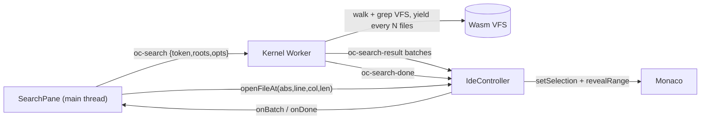
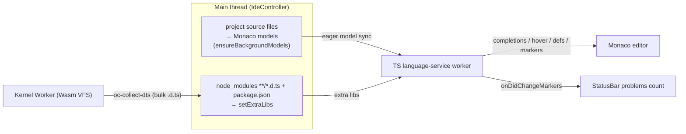

# OpenContainer — Architecture

This document explains how OpenContainer works end to end: the core constraint it
solves, the worker topology, the syscall protocol, the filesystem, the process
model, the Node runtime, networking, native code, and the build. It is the
companion to [`AGENTS.md`](./AGENTS.md) (how to work in this repo) and
[`roadmap.md`](./roadmap.md) (chronological status + rationale per feature).

---

## 1. What it is

OpenContainer is an open-source **WebContainer**: it runs Node-style projects
(Vite dev server + HMR, React, NestJS, Express, `npm install`, `tsc`, …) **100%
inside the browser tab**. There is no backend doing the work — the filesystem,
the Node-compatible runtime, the process/PID model, and even TCP networking are
all emulated client-side across Web Workers.

The design principle throughout is **run the real thing, not a reimplementation**:
we vendor Node's actual `lib/*.js` on top of a small binding layer, run real npm
packages unmodified from disk, and drive real tools (rolldown/Vite, `tsc`,
`@babel/core`) in-VM.

---

## 2. The core constraint (why any of this is hard)

Node's APIs are **synchronous**: `fs.readFileSync`, `require()`, `execSync`, etc.
Browsers do **not** let you block the main thread on async work. The one exception
is a **Web Worker**, where `Atomics.wait()` can genuinely park the thread.

So the load-bearing primitive is a **synchronous bridge over a `SharedArrayBuffer`
(SAB)**:

```
process code (Web Worker thread)
   │  fs.readFileSync("/x")        ← looks synchronous to user code
   ▼
 write request into SAB, Atomics.store(STATE, REQUEST), ring a doorbell
   │
   ▼  Atomics.wait(STATE, REQUEST) — the thread genuinely blocks
 ...another worker services it against the Rust/Wasm VFS...
   ▲
   └─ writes the response into the SAB, Atomics.notify(STATE)
   ▼
 returns bytes — still synchronous, no async leaked to user code
```

`SharedArrayBuffer` + `Atomics` only exist under **cross-origin isolation**, so
every page that hosts OpenContainer MUST be served with:

```
Cross-Origin-Opener-Policy:   same-origin
Cross-Origin-Embedder-Policy: require-corp
```

(`server.mjs` does this. Without it, `SharedArrayBuffer` is `undefined` and
nothing runs — `host.js` checks and bails early.)

---

## 3. Worker topology

Work is split across several Web Workers so no single thread is on the critical
path of everything. The worker roles below are ES modules; **studio's Vite build
bundles each** (nested module workers + wasm), while the legacy demo loads them raw
in dev and esbuild-bundles them for production (§10).

```
┌──────────────────────────────────────────────────────────────────────┐
│ Main thread — packages/studio (React 19 + shadcn)                      │
│   (legacy: packages/demo/host.js — same protocol, plain-JS UI)         │
│   • Home screen (blank / template / recents) + VS Code-style IDE:      │
│     multi-root VFS-backed Explorer (abs-path tabs) + Search + tabbed    │
│     Monaco (preview/permanent tabs) + bottom panel with                 │
│     Console / Terminal (INTERACTIVE shells) / Ports + command palette   │
│     + preview (ANSI intact; shells have real stdin — type, Enter runs)  │
│   • src/oc/kernel.ts (KernelBridge) + src/oc/controller.ts (IdeController)│
│   • registers the preview Service Worker                               │
│   • relays SW HTTP requests to the Kernel Worker                       │
│   • NO kernel/user work runs here (keeps the UI responsive)            │
└───────────────┬────────────────────────────────────────────────────────┘
                │ postMessage (spawn worker, init, net nudges, ws relay)
                ▼
┌──────────────────────────────────────────────────────────────────────┐
│ Kernel Worker — packages/demo/kernel-worker.js                         │
│   • hosts the Kernel (packages/kernel-host/kernel.js)                  │
│   • PID table, process supervision, spawn/kill/waitpid                 │
│   • virtual network port registry (port → pid) + HTTP request routing  │
│   • spawns the nested workers below                                    │
└───┬───────────────────┬───────────────────────┬──────────────────────┘
    │ nested Worker      │ nested Worker          │ nested Worker(s)
    ▼                    ▼                        ▼
┌─────────────┐   ┌───────────────┐   ┌────────────────────────────────┐
│ Fetcher     │   │ File System   │   │ Process Worker  (one per PID)   │
│ Worker      │   │ Worker        │   │  packages/demo/process-worker.js│
│ outbound    │   │ owns the Rust │   │  • runs the vendored Node       │
│ fetch()     │   │ /Wasm VFS     │   │    runtime + the user program   │
│ (npm, etc.) │   │ + OPFS mirror │   │  • its own SAB + event loop     │
└─────────────┘   └───────────────┘   └────────────────────────────────┘
```

Key relationships:

- **Each process** is its own Web Worker with its **own SAB**. `process.pid` is the
  kernel-assigned PID and matches the worker's DevTools name (`Process Worker PID N`).
- **The File System Worker** owns the single VFS. Every client (the kernel and
  every process) registers its SAB with it. It is woken by a **doorbell**: a
  `MessagePort` for processes, a plain postMessage for the kernel's own fs access.
- **The Fetcher Worker** performs all real outbound network (`fetch`), so a big
  npm tarball download/decompress never stalls syscall servicing.
- The Kernel Worker also **spawns each Process Worker** and wires a
  `MessageChannel` between it and the File System Worker (its fs doorbell).

---

## 4. The syscall protocol (`packages/protocol/syscall.js`)

One SAB per client, laid out as:

```
[ control: 4 × Int32 = 16 bytes ][ data region: 1 MiB ]

control[0] = STATE    (Atomics.wait / notify on this word)
control[1] = OPCODE   (which syscall)
control[2] = REQ_LEN  (request bytes in the data region)
control[3] = RES_LEN  (response bytes in the data region)
```

STATE values: `IDLE=0`, `REQUEST=1` (worker→servicer), `RESPONSE_OK=2`,
`RESPONSE_ERR=3` (a UTF-8 errno like `ENOENT`).

Request frame in the data region is self-describing:
`[flags:u32][fieldCount:u32]([len:u32][bytes])*`. Scalars (fds, lengths, file
positions) are packed as little-endian `u32`/`f64` fields; everything else is
UTF-8 or raw bytes.

### 4.1 The 1 MiB window — the single most important invariant

`DATA_BYTES = 1 << 20`. **Every** request and response must fit in this window.
`fs-client.call()` throws `"syscall request too large for the shared data
region"` if a payload exceeds it. Two consequences that have bitten us
repeatedly:

- **Large file I/O is chunked.** `FD_CHUNK = 512 KiB`; `fs.js` loops on short
  reads/writes, so an arbitrarily large file transfers in pieces. `writeLarge`
  bypasses the SAB entirely via a transferred `ArrayBuffer`.
- **Large HTTP responses are chunked.** A big response body (Vite serves ~2.8 MB
  pre-bundled dep files) cannot cross in one `OP_RESPOND`. The body travels as a
  **raw length-prefixed field** (never JSON-stringified — escaping doubles quotes/
  newlines and silently overflows) and is split into sequential frames the kernel
  reassembles by `reqId`. See `fs-client.respond` + `kernel.handleRespond`.
- **Downloads bypass the window.** `OP_FETCH` streams the response body straight
  into the VFS via the Fetcher Worker; the caller then reads it back with normal
  (chunked) fs. So npm tarballs of any size work. `OP_FETCH` is *blocking* (the
  caller parks until the body lands); `OP_FETCH_ASYNC` is the non-blocking twin —
  the kernel ACKs immediately and posts the result back later as a `fetch-done`
  message, so one process can keep many downloads in flight (parallel npm; see §6).

### 4.2 Opcode routing

Opcodes split into two families (`isFsOpcode`):

- **Filesystem** (`OP_READ_FILE`…`OP_READLINK`, `OP_OPEN`…`OP_FTRUNCATE`,
  `OP_WATCH`/`OP_UNWATCH`) → serviced by the **File System Worker** over the
  process's SAB, woken via the fs `MessagePort` doorbell.
- **Everything else** (`OP_SPAWN`/`OP_SPAWN_ASYNC`/`OP_KILL`, `OP_LISTEN`/
  `OP_ACCEPT`/`OP_RESPOND`/`OP_CLOSE_SERVER`, `OP_FETCH`/`OP_FETCH_ASYNC`) →
  serviced by the **Kernel**, woken via a `send("syscall")` postMessage.

Some opcodes are **deferred**: `OP_ACCEPT`, `OP_SPAWN`, `OP_FETCH` keep the caller
parked on `Atomics.wait` until the awaited event (a request, child exit, download)
arrives — this is how blocking `accept()`/`execSync()`/blocking fetch work.
`OP_FETCH_ASYNC` is the opposite: the kernel returns an empty OK immediately and
posts the outcome back as a `{type:'fetch-done', fetchId}` message, so the caller
never parks and many downloads can overlap (§6).

---

## 5. Filesystem

- **VFS core**: `packages/vfs/` is a Rust crate compiled to Wasm (`wasm-pack`,
  `web` + `nodejs` targets; crate `open-webcontainer-vfs`). It's an inode table (`HashMap<u64, Inode>`),
  directories map names→inode via `BTreeMap` (sorted readdir for free), symlinks
  with an `ELOOP` guard, `stat`/`lstat`, rename, errno-style errors. Hard links share
  one inode across names (`nlink` refcount; freed on last unlink).
- **VFS memory / compression**: file bodies are a `FileBody { Raw | Zip{data,len} }`.
  Cold files are stored **zlib-compressed** and inflate transparently — whole-file reads
  on demand, chunked `fd_read` once into a bounded (48 MiB) hot-read cache. The first
  write inflates in place; a file is (re)compressed only when its last writable fd closes
  (a `wopen` refcount) or after `write_file`, skipping files < 4 KiB or that don't beat a
  95% ratio. This cuts the FS worker's linear-memory footprint ~70% for a big
  `node_modules` (the largest addressable term in the tab). **On by default**; `?compress=0`
  disables it (plumbed page → kernel worker → FS worker, applied before OPFS restore).
  `mem_bytes()`/`logical_mem_bytes()` back the "Measure Memory" ratio readout.
- **Per-PID memory attribution**: "Measure Memory" also breaks the Process Worker heap
  down by PID. Each worker answers a `proc-mem` query with `runtime.memStats()` — its own JS
  heap (`performance.memory`, unavailable in Chrome Workers so effectively `-1`; the main-thread
  `measureUserAgentSpecificMemory()` per-URL figure is the real heap), guest module-cache size, an
  esbuild-wasm flag, and the **esbuild Go wasm heap byteLength** (`esbuildWasmBytes()`); the kernel
  worker fans the query across a live `pid → worker` registry and relays the rows on `oc-mem`. This
  attributes the dev-server heap (the tab's largest term post-compression) to a specific process,
  and quantifies how much of it is the resident esbuild service vs. guest framework; read-only.
- **Servicing**: `packages/kernel-host/fs-server.js` (`FsServer`) owns the one VFS
  instance and services fs opcodes directly over each client's SAB. It runs inside
  the **File System Worker** (`packages/demo/fs-worker.js`).
- **Node contract**: `packages/runtime/node/bindings/fs.js` maps Node's native fs
  binding contract onto the sync bridge (`stat` fills the shared `statValues`
  Float64Array in place; fd layer via `open`→`fstat`→`read`→`close`), so Node's
  real `lib/fs.js` runs unmodified on top.
- **Persistence**: the VFS is mirrored to the **Origin Private File System (OPFS)**
  by `opfs-persistence.js` (write-behind). OPFS sync access handles only exist in a
  Worker — hence this lives in the FS worker. On boot it restores the manifest into
  the VFS **before** serving any syscall. Use `?reset` on the demo URL to wipe it.
  Volatile/re-seeded paths are excluded (`fs-worker.js` `IGNORE`: `/bin /tmp /proc
  /dev /etc /usr /var/cache`). The package-manager caches deliberately live in a
  PERSISTED location (`/home/user/.cache` for npm/yarn/corepack, `/home/user/.local/
  share/pnpm/store` for pnpm), so npm's own content-addressed cache doubles as the
  durable, cross-project "package cache in OPFS" — a dependency downloaded once is
  reused by later projects and after a reload. The kernel's transient outbound-fetch
  buffer (`/var/cache/oc-fetch`) is excluded because its index is rebuilt per session
  and never read back, so npm's cache is the single durable copy.
- **File watching** (`fs.watch`): `OP_WATCH` registers interest; the FS worker
  **pushes** change events back over the fs doorbell `MessagePort` (never the SAB —
  the process isn't parked on it). Events are bucketed by top-level tree to bound
  fan-out.

---

## 6. Process model

- **Kernel** (`packages/kernel-host/kernel.js`) owns the PID table and all
  supervision. `createProcess` spawns a Process Worker; `finalize` tears one down
  (terminates the worker, releases its ports, fails its in-flight HTTP requests,
  closes its ws tunnels).
- **Spawn**: `OP_SPAWN` blocks the parent until the child exits (`execSync`/
  `spawnSync`): the parent parks on `Atomics.wait` while the kernel drives the
  child. `OP_SPAWN_ASYNC` returns `{pid}` immediately; the child's stdout/stderr/
  exit stream back to the parent worker as postMessages (the model behind
  `child_process.spawn` and a `npm run dev` that launches a long-lived server).
- **Naming**: each Process Worker is created with the name `Process Worker PID N`.
  A Worker's name is fixed at creation and can't be changed later, so naming it
  per-PID at spawn (rather than reusing a pre-warmed, PID-less pool) is what keeps
  DevTools' worker list legible — every entry maps to a PID. (A warm pool was tried
  and dropped: it didn't move the needle on the boot numbers — cold start is
  dominated by the FS worker + VFS wasm init — and it left claimed spares
  mislabelled.)
- **Cold-start wins that stuck**: the Fetcher + File System workers are created in
  parallel at boot, and the demo's first shell defers its Process Worker spawn off
  the boot burst (starts on focus/keystroke/idle). Boot narrates its phases with
  timings to the Console.
- **Signals & teardown**: `process.kill(pid, sig)` and `child.kill()` route to the
  kernel (`OP_KILL`); `finalize` **cascades to the whole subtree** (`parentPid`),
  so killing a shell wrapper (`sh -c "node …"`) takes its server down too.
- **stdin (interactive)**: delivered OUT of band, not via a blocking syscall. The
  host terminal's keystrokes → `kernel.sendStdin(pid)` → a `{type:'stdin'}`
  postMessage → the process' real flowing `process.stdin` (a TTY Readable, drained
  in a loop turn). `child.stdin.write()` relays parent→child via `{type:'child-
  stdin'}` → `kernel.handleChildStdin` → the child's own stdin. This is what makes
  the terminal interactive (a live `sh` REPL, `node`, etc.).
- **Coreutils + shell**: `packages/kernel-host/coreutils.js` provides
  `echo/cat/ls/pwd/mkdir/rm/node/npm/npx/true/false` and a small `sh`. `sh` with
  no args is an **interactive REPL** (prompt, echo, backspace, Ctrl+C→SIGINT the
  foreground child, Ctrl+D); with `-c`/a file it runs a batch. If `$OC_RUN` is set
  it auto-runs that command line at startup (echoed like you'd typed it) then stays
  interactive — used to run a demo's dev server *inside a terminal tab*. Installed
  into `/bin` by `installCoreutils()`.
- **Demos run like local dev**: the "Run" button opens a dedicated shell tab whose
  `sh` has `OC_RUN="npm install && npm run dev …"` (install skipped once
  `node_modules` exists). The dev server is therefore a child of that tab's shell:
  closing the tab kills the server (preview then 502s), and starting the same
  server again in another shell fails with `EADDRINUSE` — we don't intercept that.
  The kernel worker watches `onListen` on the demo's port to point/reload the
  preview (a re-listen on an already-serving port = a Nest `--watch` restart).
- **npm**: the shell's `npm`/`npx` is the **real, unmodified npm CLI** on Path B
  (the North Star; see roadmap). Real npm@10.9.2 is vendored + packed into one
  gzipped asset (`scripts/vendor-npm.mjs` →
  `packages/studio/public/vendor/npm-pack.bin`); at boot the kernel worker fetches
  it once and `load-real-npm.js` unpacks the tree into the VFS at
  `/usr/lib/node_modules/npm` via a single batched transfer
  (`kernel.writeFilesBatch` → `FsServer.writeBatch`, ~2400 files in one message),
  then writes `/bin/npm.js` + `/bin/npx.js` shims that `require()` the real CLI (so
  `npm` on PATH is real npm; the tree persists in OPFS across reloads). Native
  builds can't run in-browser, so `node-gyp` is a non-fatal no-op via
  `node-gyp-stub.js` (`stubNodeGyp()` overwrites npm's node-gyp shims in the
  vendored tree; a `node-gyp` coreutil is the PATH fallback) — the package's JS /
  `wasm32-wasi` fallback is what loads instead.
  **Downloads are parallel.** npm issues many packument + tarball requests at once,
  but the blocking `OP_FETCH` would serialize them (each parks the worker until its
  body lands). So the `https` shim (`node/lib/https.js`) prefers a NON-blocking
  fetch: `globalThis.__ocfetchAsync` (wired in `runtime/index.js` over
  `fs-client.fetchAsync` → `OP_FETCH_ASYNC`) returns a Promise and the kernel posts
  each result back as a `fetch-done` message (`dispatchFetch` settles it), so npm's
  own concurrency actually overlaps on the wire. The kernel bounds fan-out to
  `fetchConcurrency` (10) via `_scheduleFetch`/`_drainFetchQueue`, dedupes identical
  in-flight URLs (`_fetchInflight`), and streams each body into the VFS
  (`_fetchIntoVfs`/`_doNetworkFetch`) with the same cache/dedupe as the blocking
  path; the blocking `__ocfetch` remains the fallback.
  The from-scratch installer `packages/kernel-host/programs/npm.js` (semver
  resolution from registry packuments, `OP_FETCH` tarball download, gunzip +
  ustar parser, npm-v3 hoisting, `.bin` symlinks, platform-gated
  `optionalDependencies`) was the temporary "Turbo-analog" — it is now **retired**
  from the shipped product (not in `COREUTILS`) and survives only as an offline
  fixture the `verify-node`/`verify-express` harnesses install themselves.

---

## 7. The Node runtime (inside each Process Worker)

`packages/runtime/` is the vendored Node runtime. The evolution (see roadmap) went
from hand-written builtins (**Path A**, mostly gone) to **Path B**: run Node's
**real `lib/*.js`** on top of a small binding layer. This is why real frameworks
work — it *is* Node's own module code.

- `node/lib/*.js` — Node's actual standard library (fs, net, http, stream, events,
  buffer, zlib, crypto, url, util, path, dns, worker_threads, …), vendored.
- `node/internal/*` — Node's `internal/*` support modules (streams, errors,
  validators, stream_base_commons, …).
- `node/bindings/*.js` — our shims for `internalBinding('fs'|'tcp_wrap'|'zlib'|
  'crypto'|'http_parser'|…)`. These map Node's native C++ contract onto our sync
  bridge / Wasm codecs.
- `node/internal-binding.js`, `node/primordials.js`, `node/loader.js` — the glue
  that lets vendored `lib/` resolve `internalBinding(...)` and `primordials`.
- `builtins/*.js` — the few remaining hand-written modules (`process`, `os`,
  `assert`, `child_process`) that have no clean Node-lib form here.

Module system:

- `module.js` — the **synchronous CommonJS loader**: `require()` with full
  node_modules resolution, `package.json` `exports`/`imports` conditions, builtin
  factories. Everything is sync because the fs under it is sync.
- `esm.js` — an **ESM→CJS transpiler** (via `es-module-lexer`): rewrites
  `import`/`export`/`import.meta`/dynamic `import()` into our sync CJS at load
  time. Generated identifiers are namespaced (`__oc_require`, `__oc_import`,
  `__oc_exports`, `__oc_module`, …) so user code can freely declare its own
  `require`/`module`/`exports`.
- `index.js` — `createRuntime()`: wires builtins + globals + the HTTP bridge +
  the WebSocket client, and returns `run(entry)`.
- `loop.js` — the **per-process event loop** (see §7.1).
- `boot.js` — process bootstrap shared by the browser and Node worker entries.

### 7.1 The event loop

A real async loop so ordering matches Node
(`nextTick → promise microtasks → timers → setImmediate`), while sync syscalls
still block via `Atomics.wait`. Key ideas (`loop.js`):

- To flush native Promise microtasks it must **yield to the host once per turn**
  (a purely synchronous loop can never drain them) — done via a `MessageChannel`
  macrotask.
- Timers are ours (deterministic order + ref/unref) but the actual sleep is a host
  `setTimeout`, so a 100 ms timer really waits 100 ms.
- **Idle waiting is message-driven**: when a request is queued the kernel
  postMessages the worker and `wakeNet()` resolves the idle wait — so the SAB stays
  free while idle and a timer callback can run a sync fs syscall.
- Each turn also drains queued HTTP requests, async child events, worker_threads
  events, and fs.watch events (`doNet`/`doChildren`/`doThreads`/`doWatch`).

---

## 8. Networking

There is **no TCP**. Networking is emulated at two seams.

### 8.1 In-process loopback (`node/bindings/net.js`)

The binding beneath Node's real `lib/net.js` implements
`internalBinding('tcp_wrap')` as an **in-process loopback**: a module-level
`port → serverHandle` registry lets a client `connect()` link to a `listen()`ing
handle in the *same* worker, producing a linked pair of endpoints whose writes
appear as the peer's reads. Node's unmodified `lib/net.js` / `lib/_http_*.js` run
end to end on top (real `ClientRequest`/`ServerResponse`/`IncomingMessage`,
chunked bodies, keep-alive). This registry is **per-process** (one worker = one
process). Writes never block — they queue into the peer's inbox and pump on
`nextTick`. The same binding backs `pipe_wrap` (UNIX-domain sockets / named
pipes) with an identical path-keyed loopback.

**Cross-process loopback (TCP + UNIX sockets).** When a `connect()` targets a
port/path that isn't served in *this* process, another in-VM process may own it —
e.g. Nuxt/Nitro's dev server on `:3000` reverse-proxies SSR to its render worker
on an ephemeral port in a *different* process, and `vite-node`/Nitro talk over
`*.sock` UNIX sockets. Both ride the same **kernel byte-relay**: `listen()` also
registers the socket path with the kernel (`OP_PIPE_LISTEN`) — for a TCP server a
synthetic per-port key — and a cross-process `connect()` resolves it
(`OP_PIPE_CONNECT`) to a `connId`; raw bytes then flow **out of band** as
`pipe-*` postMessages the kernel forwards between the two processes (never the
syscall SAB, since neither side is parked on it). `net.js`'s `TCP`/`Pipe` handles
fall back to this **only** when the same-process registry misses, so
single-process loopback and external (Service Worker) routing are unchanged.
Probes: `scripts/probe-xpipe.mjs` (UNIX sockets) and `scripts/probe-xtcp.mjs`
(TCP, the Nitro `:3000`→worker shape), each covering both directions.

### 8.2 Cross-VM reachability (the kernel port registry)

`listen()` also registers the port with the kernel (`OP_LISTEN` → `port → pid`
map) so **external** requests can be routed to the owning process. When a request
arrives, the kernel pushes it to the process's `serverInbox`; the process drains it
via non-blocking `OP_ACCEPT` and — this is the cross-VM seam — **replays it through
a real in-VM http client into its own server over the loopback**
(`bridgeHttp` in `index.js`), collects the response, and sends it back via
`OP_RESPOND`. The public entry point is `kernel.handleHttpRequest(port, req) →
Promise<{status, headers, body, bodyEncoding}>`; the wire contract is unchanged
whether the caller is the Service Worker (browser) or a headless test.

Bodies cross as JSON metadata + a raw body field. Textual content-types cross as
UTF-8; binary (images/fonts/wasm) crosses base64 with `bodyEncoding: 'base64'`
(the SW decodes it). Large bodies are chunked (§4.1).

### 8.3 Browser preview (Service Worker)

`packages/demo/sw.js` is a preview proxy scoped to the whole origin (needs
`Service-Worker-Allowed: /`). It intercepts the preview iframe's `fetch`
(`/preview/<port>/…` and root-absolute subresources like `/@vite/client`,
`/node_modules/…`), posts each to the window (`host.js`), which forwards to the
Kernel Worker → `handleHttpRequest` → the in-VM server. No real network is
involved. The SW also **precaches** the worker-role bundles in production (keyed by
a per-build id) so a redeploy can't serve stale bundles.

**Preview iframes start at about:blank, then navigate.** On a fresh page load the
studio document is fetched before the SW takes control, so a brand-new iframe whose
*first* navigation is a direct `/preview/<port>/` URL isn't intercepted — the
request escapes to the network and the studio's own SPA fallback renders its Home
page inside the frame. So `PreviewPanel.tsx`'s `PreviewFrame` mounts each iframe at
`about:blank` (a client the SW already controls) and sets the real `previewSrc`
imperatively in an effect; `registerServiceWorker()` additionally waits for
`controllerchange` when the page isn't yet controlled. Both ensure the SW proxies
the very first preview navigation instead of the app leaking through.

### 8.4 WebSocket tunnel (Vite HMR)

A browser `WebSocket` can't reach an in-process ws server (no TCP, and a SW can't
intercept the WS upgrade). Instead a `WebSocket` polyfill in the preview iframe
tunnels each connection to us as messages (`ws-open`/`ws-in`/`ws-close`); the owning
process opens a genuine **in-VM WebSocket client** (`websocket.js`, over Node's own
http upgrade + the net loopback) to `127.0.0.1:<port>` and relays frames back out
(`ws-out`). This is what makes Vite HMR work live in the preview.

**Cross-service ws (FE ↔ BE).** The shim picks the target port from the ws URL: a
`/preview/<port>/…` URL tunnels to THAT in-VM port (prefix stripped), the same convention
as the HTTP preview proxy — so a frontend on :5173 can open a socket to a backend on :3001
via `/preview/3001/ws`. URLs without the prefix keep the iframe's own port (HMR unchanged).
The kernel routes the `open` by port (`handleWsClient` → `listeners.get(port)`), so this is
a shim-only change. The `ws-demo` template (Express + `ws` backend, Vite frontend, started
together) demonstrates both directions; each server gets its own preview tab (see 8.6).

**Server-Sent Events (same idea, one-way).** A streaming `text/event-stream` response
can't cross the HTTP preview proxy — that path is buffered end-to-end (the SW resolves
ONE complete body via `handleHttpRequest`/`OP_RESPOND`), so a never-ending SSE response
just 504s. So SSE gets its own tunnel, mirroring the ws one minus the client→server leg:
an **`EventSource` polyfill** injected into every preview page (next to the ws shim)
tunnels each connection as `oc-sse` messages (`sub:'open'|'close'`); the kernel binds the
`connId` to the port's process (`handleSseClient`), which opens a genuine **in-VM loopback
GET** to `127.0.0.1:<port><path>` (`Accept: text/event-stream`) and relays each raw stream
chunk back out (`sse-out {sub:'open'|'chunk'|'close'}` → `onSseSend` → iframe). The polyfill
parses the raw bytes into `message`/named events per the SSE spec (`data:`/`event:`/`id:`,
dispatched on a blank line), so `es.onmessage` and `es.addEventListener('foo', …)` both
work. Port routing + the `fallbackPort` heuristic are identical to the ws shim. The `sse`
Showcase template (Express multiplexing a per-second tick + a `metric` gauge + `notice`
log lines onto one stream) demonstrates it. A live SSE relay refs the process event loop
(`sseLiveness`) so it keeps pumping like an open socket handle.

### 8.5 In-browser DevTools + local address bar (studio)

Each `PreviewPanel` tab is a mini-browser. The address bar is **local-only**:
`localhost` / `127.0.0.1` / a bare path loads the in-VM dev server (`navigatePreview`
sets the tab's `path` and bumps a nonce → the iframe reloads via the SW proxy);
external URLs are rejected. Back/forward drive the same-origin iframe's native
`history`; the injected **nav notifier** posts `oc-nav` on every SPA/MPA navigation so
the address bar stays in sync (display-only — it never re-drives the iframe src, which
would loop).

DevTools is the **full chii (Chrome DevTools) frontend**, vendored locally (no CDN, so
COEP holds). The SW injects **chobitsu** (a JS CDP backend) into every preview page.
The `controller` bridges CDP over `window.postMessage`: the chii frontend iframe (loaded
with `#?embedded=<origin>`, which selects chii's postMessage transport) exchanges raw CDP
strings with the controller, which relays them to/from the target tab's chobitsu. One
shared frontend attaches to the **active** tab (per-tab chobitsu backend); switching tabs
reloads the frontend against the new target. Assets are served from `node_modules` in
dev by the `serveDevtools()` Vite plugin and copied into `dist` on build.

**Network panel** shows all three transports coherently. `fetch`/XHR are captured natively
by chobitsu; `WebSocket`/`EventSource` are our postMessage-tunneled polyfills that chobitsu
can't see, so a `NET_SHIM` (`window.__ocNet`) injected next to them **emits synthetic
`Network.*` CDP events** over the same `oc-cdp` bridge — the full ws lifecycle
(`webSocketCreated`/`…FrameSent`/`…FrameReceived`/`…Closed`) and SSE as a long-lived request
with `eventSourceMessageReceived` events. It **registers live connections and replays them**
when a fresh frontend attaches (gated on the panel's `Network.enable` plus the preview's
`init`, guarded by a generation counter to avoid duplicate rows). On a preview reload the
controller remounts the frontend (`onPreviewFrameLoad` bumps `devtoolsNonce`) so the log starts
clean and re-attaches. Outgoing URLs are scrubbed from the proxy form (`/preview/<port>/…`) to
the real in-VM address (`http://localhost:<port>/…`), so ws/SSE/fetch rows all read as the app
actually sees them.

Two non-obvious constraints keep this working:

- **`serveDevtools()` must send fixed-length bodies** (`fs.readFile` + `Content-Length`),
  not `createReadStream().pipe()`. The frontend fires a burst of ~50 concurrent module
  imports; over HTTP/1.1 keep-alive, chunked-transfer responses left many of them
  **pending forever** (spinner never stops), and an unhandled read-stream `error` on a
  client abort could take down the whole dev server.
- **The SW passes `/devtools-host.html` and `/devtools/**` straight to the network**
  (like `/oc-devtools/`). They are our own app assets; routing them through
  `routeByClient` risked a spurious `fetch(event.request)` failure on the iframe
  navigation and could even proxy them into a preview that has no such file.

### 8.6 Multi-root workspace, Home + templates (studio)

The studio is a real workspace, not a two-demo switcher. State (`controller.ts`):
`workspaceFolders: {id,name,rootPath}[]` + `activeFolderId`; **every tab/model/dirty flag is
keyed by ABSOLUTE path** so files from different roots can't collide. Home (`Home.tsx`) is an
overlay over the kept-mounted IDE offering Start-from-blank, Start-from-template (12 templates
in `oc/templates.ts`: React/Vue/Svelte/Express/Nest/Next × TS/JS), and a `localStorage` recent
list.

The Explorer reads the **live VFS** rather than a static map. The bridge gained a
request/response channel (`KernelBridge.request()` → reqId → `oc-reply`) backing
`oc-readdir` / `oc-read` / `oc-stat` / `oc-mkdirp` / `oc-create-project`; the worker emits
`oc-fs-changed` after any VFS mutation, which bumps `treeVersion` so the tree + quick-open
index refresh (including after an in-VM `npm install`). Creating a project writes its files in
one `writeFilesBatch` (`oc-create-project`) and registers a run manifest; "Run init script"
opens a shell that runs `install && dev`. A dev server's `listen` is attributed to its project
by walking the pid up to the run shell (`projectDirByTerm` / `terminalForPid`) → `project-ready`
points the preview (the two legacy DEMOS still use the fixed-port `demoForPort` path).
A run shell's **first** listening port is the primary preview (`project-ready` → open folder +
entry). A single dev server's *other* ports are internal infrastructure — Vite's HMR WebSocket
(`:24678`), a framework's SSR/render worker (Nuxt/Nitro's ephemeral port, reached via the main
server's proxy) — and do **not** each open a tab (they'd surface a bare "Upgrade Required" or a
non-interactive SSR page). A template that intentionally runs multiple *user-facing* servers (a
backend API + frontend, e.g. `ws-demo`/`fullstack`/`trpc`) opts in with `manifest.multiPreview`,
and each extra server then gets its own tab (`project-ready {extra}`). All bound ports are still
tracked so a restart reloads the real tab; the set is cleared when the run shell exits so a re-run
re-announces.

### 8.7 TypeScript 7 (tsgo, Go/wasm) + host↔preview bridge

**`tsc`/`tsgo`.** TS 7's compiler is compiled Go. We ship the community `tsgo-wasm` build
(`tsgo.wasm`, ~47 MB + the Go `wasm_exec` glue). It runs on Path B because `wasm_exec` drives
everything through `globalThis.fs` — which IS our real Node `lib/fs.js` over the VFS — plus
`crypto.getRandomValues`/`performance.now`/`TextEncoder`/`WebAssembly`. The only shim: Go writes
program output to fd 1/2 via `fs.writeSync`/`write`, so the runner routes those two fds to
`process.stdout`/`stderr`. Delivery mirrors npm/corepack (`scripts/vendor-tsgo.mjs` → a gzipped
pack; `packages/kernel-host/load-real-tsgo.js` unpacks + installs `/bin/tsc.js` + `/bin/tsgo.js`),
but it loads **lazily in the background after boot** (placeholder shim until then) and persists in
OPFS. Proofs: `scripts/spike-tsgo.mjs`, `scripts/spike-tsgo-studio.mjs`.

**Host ↔ preview.** In-VM code reaches a service on the HOST machine via
`http://host.opencontainer.internal:<port>/…`, mapped to the studio's own hostname (only reaches
the host when the studio is served locally). Both egress paths honor the alias: `http`/`https`
(and npm) go through the fetcher (`fetcher-worker.js` `rewrite()`); the global `fetch()` is the
host realm's real fetch used directly, so `packages/runtime/index.js` rewrites the alias in its
own `fetch` wrapper (`rewriteHostAlias`). The reverse direction needs no alias: the host hits
`<studio-origin>/preview/<port>/…` (the SW preview proxy). It's addressing convenience, not a
CORS/auth bypass — the target must still allow the studio origin. It is not wired into the
preview tab address bar (that only loads in-VM ports); test it from in-VM code.

### 8.8 Full-text search & replace + quick-open (studio)

The Search pane (`components/ide/SearchPane.tsx`) is a VS Code-style full-text search across
**every open workspace root**, not a filename filter. The search itself runs in the **kernel
worker** (`demo/kernel-worker.js`) because that worker is the sole holder of the synchronous
Wasm VFS — grepping from the main thread would mean an `oc-read` round-trip per file. The
worker walks each root (reusing the Explorer skip set: `node_modules`/`.git`/`dist`/…), honors
Match Case / Whole Word / Regex and comma-separated `files to include` / `files to exclude`
globs, skips binary/oversized files, and **streams** per-file matches back as `oc-search-result`
batches followed by a final `oc-search-done {matchCount,fileCount,limitHit}`.



Because that worker also serves preview HTTP + terminal I/O, the walk is **cooperative**: it
`await`s a macrotask every ~40 files and flushes the partial batch, so the UI fills in
progressively and nothing else stalls. A monotonic `currentSearchToken` supersedes an
in-flight search when a newer query (or `oc-search-cancel`) arrives. Heavy result arrays are
delivered to the pane via callbacks (kept out of the global snapshot to avoid re-render
storms). `controller.openFileAt()` opens a hit and reveals/selects the range in Monaco (with a
deferred reveal if the editor is still loading). **Replace** (`oc-replace`) recomputes matches
against the same options and rewrites files — scoped to a single match, one file, or all
files (Replace All) — with VS Code "preserve case" (ALLCAPS/Capitalized) and `$1`/`$&`
expansion; each write posts `oc-fs-changed`, and the controller re-reads any affected open
models from disk. **Quick-open** (`CommandPalette.tsx`, `⌘P`) filters the flat file index by
name and accepts a trailing `:line[:col]` suffix to jump on open; a bare `:line` jumps within
the active editor. `⌘⇧F` focuses the Search pane.

### 8.9 IntelliSense — Monaco's language service, off-main-thread (studio)

The editor runs Monaco's **real** TS/JS language service (completions, hover, signature help,
go-to-definition, diagnostics), not just syntax coloring. `mountEditor` sets `MonacoEnvironment.getWorker`
to Monaco's own workers — the editor worker plus the `typescript` worker (a bundled TS compiler), and
json/css/html — each a Vite `?worker` import so it's bundled **same-origin** (COEP `require-corp` is
satisfied) and runs off the main thread. `configureLanguageService` enables semantic + syntax
diagnostics with `setEagerModelSync(true)` (every model is visible to the worker) and `checkJs: false`
(plain-JS projects aren't flooded with type errors).

**One TS worker, not two (memory).** Monaco runs a *separate* full language service for each of the
`typescript` and `javascript` modes; each parses the whole dependency `.d.ts` payload into ~310 MB, so
naively you pay ~621 MB (measured) for two identical services. The studio runs a single one:
`languageFor` maps `.js/.jsx/.mjs/.cjs` to the `typescript` language (`allowJs` lets the TS service
handle JS), and `javascriptDefaults` is left inert (diagnostics off, no eager sync, no extra libs) so
its worker — created lazily on first JS-model use — never spawns. Extra libs / compiler options are
applied to `typescriptDefaults` only.

The TS worker only "sees" two file sources, so the studio keeps a strict split:



- **The project's own files become models** (`ensureBackgroundModels`, bounded, node_modules excluded),
  so cross-file imports resolve and go-to-definition works before a file is opened; `ensureModel`
  adopts a seeded model when the user opens that file.
- **Dependency typings become extra libs.** Harvesting `node_modules/**/*.d.ts` (+ `package.json` for
  `types`/`exports` resolution) happens in the **kernel worker** (`oc-collect-dts`) — the sole VFS
  holder — as one bulk reply instead of thousands of reads; the project's declared deps (+ their
  `@types`) are harvested first so a budget cap can't drop the packages you import, then the rest of
  `@types`; `typescript`'s own libs are skipped (Monaco ships those). It's debounced and re-runs on
  folder open, fs changes, and after any process exits (an in-VM `npm install` doesn't emit
  `oc-fs-changed`, so a finished process is the cue that `node_modules` may have appeared); a cheap
  `node_modules` fingerprint short-circuits the file reads when nothing changed.
- **Never register a file as both** a model and an extra lib, or the worker sees it twice ("Duplicate
  identifier"). `onDidChangeMarkers` feeds a live error/warning count into the status bar.

---

## 9. Native code (Wasm)

- `packages/vfs/` — the Rust VFS → Wasm.
- `packages/codec/` — Rust zlib/deflate core beneath `lib/zlib.js`
  (`internalBinding('zlib')`).
- `packages/crypto/` — Rust crypto core beneath `lib/crypto.js`.
- `packages/wasi-demo/` — a `wasm32-wasip1` CLI used to exercise the WASI layer.
- **WASI + napi-rs**: the runtime ships a WASI preview1 host and runs real N-API
  addons compiled to `wasm32-wasi` (e.g. `@node-rs/crc32-wasm32-wasi`) on the
  vendored `@napi-rs/wasm-runtime` (emnapi). This is also why `rolldown`'s
  `@rolldown/binding-wasm32-wasi` runs, so a real Vite build/dev server works.

The codec + crypto Wasm are compiled **once** in the Kernel Worker and the
`WebAssembly.Module`s are handed to each Process Worker, which instantiates them
lazily on first use (a process that never hashes/compresses instantiates neither).

### 9.1 Toolchain shims (esbuild, rollup, worker pools)

`wasm32-wasi` auto-select (above) covers native addons that publish a wasm build
as an optional dependency (rolldown, `@node-rs/*`). Two toolchain packages don't
fit that mould — **esbuild** and **rollup** ship their WASM builds under a
*different package name* (`esbuild-wasm`, `@rollup/wasm-node`), which npm's
platform gating can't reach. The runtime bridges the gap so projects stay vanilla
(no `package.json` "overrides", no per-project launcher). The native→wasm mapping
is a single source of truth in `packages/runtime/toolchain-shims.js`
(`NATIVE_WASM_ALIASES`), imported by the Fetcher Worker and guarded by
`scripts/spike-toolchain.mjs`. Adding a drop-in = one entry there (source+target
must be published in lockstep and the target must be pure-JS/wasm).

- **Registry aliasing** (`packages/demo/fetcher-worker.js`): when npm requests the
  packument for `esbuild`/`rollup`, the Fetcher Worker serves the drop-in's
  packument rewritten under the source name; npm resolves a lockstep version and
  downloads the drop-in's real tarball (its own `dist`/integrity) straight into
  `node_modules/<source>`. Tarballs need no interception. This realizes the
  `REGISTRY_PROXY`/`rewrite()` seam.
- **In-process esbuild** (`packages/runtime/esbuild-inproc-patch.js`, applied by
  `module.js` at compile time): esbuild-wasm's Node build spawns a child service
  whose stdio pipe deadlocks the single-threaded kernel against a Piscina/tinypool
  loop. The loader rewrites `lib/main.js` to run the Go service in-thread (fd 0/1/2
  multiplexed onto the protocol). The match is **version-agnostic** (the version
  literal in the spawn block is templated), so a point/minor esbuild-wasm bump keeps
  patching; on a block-shape change it warns loudly rather than silently regressing
  to a deadlock. Idempotent; a strict no-op for native esbuild.
- **Worker-pool default** (`packages/runtime/builtins/process.js`):
  `PISCINA_DISABLE_ATOMICS=1` by default, so pools use async message passing — a
  browser `MessagePort` can't be drained synchronously across a worker boundary, so
  the Atomics fast-path can't work. `worker_threads.receiveMessageOnPort` is still
  implemented (a lazy per-port inbox) for code that polls it directly in manual mode.
- **HTTP parser as Wasm** (`packages/runtime/node/bindings/http_parser.js` +
  `bindings/llhttp/`): the parser beneath Node's real `lib/http` is **llhttp
  compiled to Wasm** — the same upstream llhttp Node ships, vendored from undici's
  prebuilt binary (`scripts/vendor-llhttp.mjs`, base64-embedded so no fetch) rather
  than standing up a wasi-sdk toolchain to rebuild an identical artifact. It is
  instantiated *synchronously* in-worker; the bridge (`llhttp/llhttp-parser.js`)
  mirrors `node_http_parser.cc`, folding llhttp's span callbacks into the numeric
  `kOn*` contract for both requests and responses. The pure-JS parser remains as an
  automatic fallback (main-thread sync-compile cap, or `OC_HTTP_PARSER=js`); when
  the Wasm backend is live it advertises `process.versions.llhttp`.
- **In-VM databases as Wasm** (the `sqlite` and `pglite` Showcase templates): the
  same "Wasm binary in `node_modules`, loaded over the VFS" path lets real SQL
  engines run guest-side with **no native addon and no external server**. sql.js
  resolves its `.wasm` with `locateFile: (f) => require.resolve('sql.js/dist/'+f)`;
  PGlite (real PostgreSQL) uses its **CJS** entry (`require('@electric-sql/pglite')`)
  so it never needs top-level await (only the *entry* module can block on TLA in-VM),
  and its ~16 MB `pglite.wasm`+`pglite.data` load from `node_modules` via
  `__filename` → `new URL('./pglite.wasm', …)` → `fs.readFile`. Both instantiate
  through host `WebAssembly` (kept alive by `hostLiveness` while an async compile is
  pending). libSQL is deliberately excluded — local mode is a native N-API addon and
  the `/web` client is remote-only, so neither is a self-contained in-VM database.

Together these let Angular's stock `@angular/build` (esbuild + Vite) run from an
unmodified `ng new` project, benefit any esbuild/worker-pool tool (Vitest, tsup,
...), and give the whole HTTP stack a spec-grade parser.

---

## 10. Build & run

- **Dev (studio, default)**: `npm run dev` → `cd packages/studio && bun run dev`
  (Vite, default `:5173`). `vite.config.ts` sends COOP/COEP on the dev + preview
  servers, stamps `Service-Worker-Allowed: /` on `/sw.js`, sets `worker.format:'es'`,
  and widens `server.fs.allow` to the repo root so it can read the sibling worker/wasm
  sources. Vite bundles the kernel worker AND — recursively — its nested module
  workers (`new Worker(new URL('./fs-worker.js'|'./process-worker.js'|'./fetcher-worker
  .js', import.meta.url), {type:'module'})`) and every `new URL('../*/pkg/*_bg.wasm',
  import.meta.url)` asset, all emitted same-origin so COEP holds. Monaco + xterm come
  from npm (no vendored bundle); Monaco's own language workers are imported the same
  `?worker` way (also same-origin → COEP-safe) to power real IntelliSense (§8.9).
  `npm run build:studio` / `npm run preview:studio` are the production build + preview.
- **Dev (legacy demo)**: `npm run dev:legacy` → `server.mjs` on `:8080` with COOP/COEP.
  Open `http://localhost:8080/packages/demo/index.html`. Loads the runtime as ~120
  individual ES modules per worker (readable, debuggable, diffable against upstream Node).
- **Legacy production bundle**: `npm run build:demo` → `scripts/build-demo.mjs` bundles
  **one esbuild file per worker role** into `packages/demo-dist/` (host, kernel-worker,
  process-worker, fs-worker, fetcher-worker, sw). `demo-dist` is a gitignored build
  artifact and a **sibling** of `demo/` so the `new URL(x, import.meta.url)` worker/wasm
  refs still resolve. Each build stamps a `BUILD_ID` into the SW to version its precache.
  The editor vendor is kept **external** here and shipped as its own cache-first file.
- **Editor vendor (legacy only)**: `scripts/build-editor-vendor.mjs` bundles Monaco +
  xterm into a committed, same-origin `packages/demo/vendor/editor/editor.{js,css}`. It
  must be same-origin (not a CDN) because the page is cross-origin isolated. Studio does
  not use it (Vite bundles Monaco/xterm from npm).
- **Wasm**: `npm run build` compiles all Rust crates (needs Rust + `wasm-pack`).

---

## 11. Verification

No browser is needed to validate the runtime — the same runtime runs under Node
`worker_threads` via `scripts/process-worker.mjs` + `scripts/fs-worker.mjs`.

- `npm run verify` → `scripts/verify-node.mjs` — headless end-to-end (fs, process,
  shell, http, timers, fs.watch, …).
- `scripts/verify-express.mjs` — installs + runs real Express, esbuild-wasm, Vite
  build, Vite dev + HMR over the ws tunnel, and a real `ws` server (needs network).
- `scripts/probe-*.mjs` — discovery/regression probes for React+Vite+Compiler and
  NestJS. `scripts/spike-next.mjs` proves Next.js 16 (App Router) boots on
  `next dev --webpack` + wasm SWC and serves `GET / → 200`.

See [`AGENTS.md`](./AGENTS.md) §"Testing & verification" for exactly when to run
each and the network requirement.
